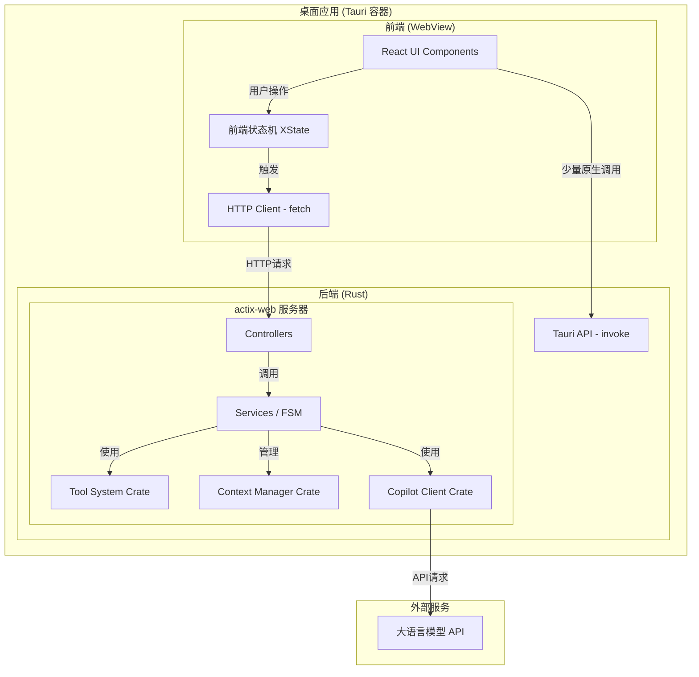
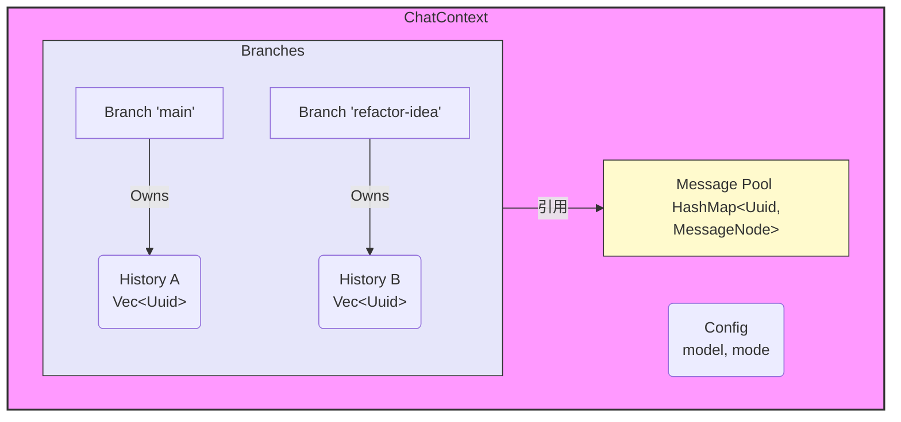
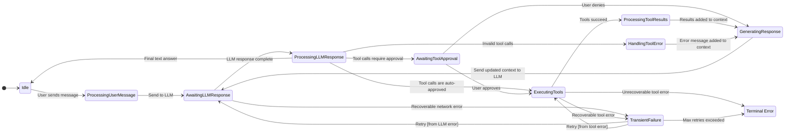
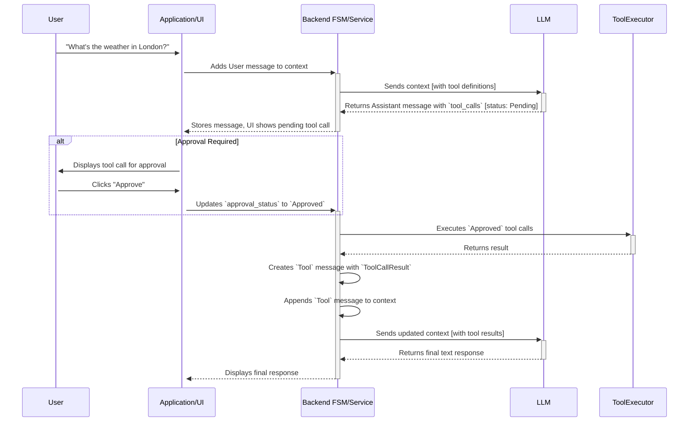
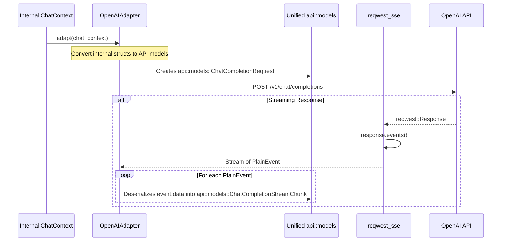

# 系统架构

## 1. 架构概述

本应用采用一种**混合架构模式**，将前端的 Web 技术与后端的原生能力深度结合，并通过 [Tauri](https://tauri.app/) 进行打包，成为一个跨平台的桌面应用程序。

其核心思想是将**业务逻辑**与**桌面UI框架**解耦。项目架构的核心是将所有复杂的业务逻辑（如聊天交互、工具执行、状态管理）迁移到后端 Rust 服务中，前端仅作为视图层和用户交互的入口。

-   **前端 (React/TypeScript)**: 作为一个标准的单页面应用 (SPA)，负责所有用户界面的渲染和客户端状态管理。它通过 HTTP 请求与后端服务通信。
-   **后端 (Rust)**:
    -   **Web 服务 (`actix-web`)**: 在 Tauri 应用的子进程中启动一个独立的、轻量级的本地 HTTP 服务器。这个服务器是所有核心业务逻辑的宿主，包括与大语言模型 (LLM) 的交互、工具的执行、上下文管理等。
    -   **Tauri 原生桥**: 对于少数需要直接与操作系统底层交互的功能（例如全局快捷键、文件对话框），仍然保留使用 Tauri 的 JS-Rust 互操作桥 (`invoke`)。

这种架构带来了几个关键优势：
1.  **解耦与可移植性**: 核心业务逻辑（`web_service` crate）不依赖于 Tauri，可以独立测试、运行，甚至部署为标准的 Web 服务。
2.  **开发效率**: 前端开发者可以使用熟悉的 Web 工具链（Vite, HMR）进行快速开发，而无需频繁重启整个 Tauri 应用。
3.  **稳定与安全**: Rust 负责处理所有复杂的、有副作用的操作，利用其内存安全和并发优势，保证了应用的稳定性和安全性。

## 2. 高层组件交互图



## 3. 后端核心：上下文与状态管理 (`context_manager`)

这是整个后端架构的基石，负责以高性能和逻辑清晰的方式管理复杂的多轮、多分支对话。

### 3.1. 核心数据模型

`ChatContext` 是对话的中央单元，它通过一个扁平化的 `message_pool` 和轻量级的 `Branch` 结构，实现了高效的消息管理。



**关键数据结构:**

-   **`ChatContext`**: 代表一个完整的对话会话。它包含配置、所有分支以及作为“单一事实来源”的 `message_pool`。
-   **`Branch`**: 代表一条连贯的对话线。它仅包含一个 `Vec<Uuid>`（消息ID列表）和一个可选的 `SystemPrompt`，结构非常轻量。
-   **`MessageNode`**: 存储在 `message_pool` 中的消息单元，包含 `InternalMessage` 和父节点ID。
-   **`message_pool: HashMap<Uuid, MessageNode>`**: 提供了对任何消息的 O(1) 快速查找，彻底取代了低效的链表或树遍历。

### 3.2. 对话生命周期：有限状态机 (FSM)

`context_manager` 内置一个正式的有限状态机，用于明确管理对话生命周期，确保在工具调用、流式响应、错误处理和重试等复杂场景下的健壮性。

**`ContextState` 枚举** 定义了所有可能的状态，例如：
-   `Idle`
-   `AwaitingLLMResponse`
-   `AwaitingToolApproval`
-   `ExecutingTools`
-   `TransientFailure` (可重试的临时错误)
-   `Failed` (不可恢复的终端错误)

**FSM 状态转换图:**



## 4. 后端核心：工具系统 (`tool_system`)

工具系统被设计为高度解耦的模块，负责工具的定义、注册和执行。

### 4.1. 工具定义与参数

-   **`Tool` Trait**: 所有工具都必须实现的 `async` trait，包含 `definition()` 和 `execute()` 两个方法。
-   **`ToolDefinition`**: 定义工具的元数据，如名称、描述以及一个关键字段 `requires_approval: bool`，它直接影响 FSM 的状态转换。
-   **`ToolArguments` Enum**: 一个灵活的参数枚举，极大地改善了工具实现的便利性。它支持简单的无名字符串、字符串列表或复杂的 JSON 对象。

    ```rust
    // in crates/tool_system/src/types.rs
    #[derive(Serialize, Deserialize, Clone, Debug)]
    #[serde(untagged)]
    pub enum ToolArguments {
        String(String),
        StringList(Vec<String>),
        Json(serde_json::Value),
    }
    ```

### 4.2. 工具调用生命周期

工具调用是系统中的一等公民，其完整的生命周期被精确地记录在 `ChatContext` 中。

**关键数据结构:**

-   **`InternalMessage`**: 统一的内部消息结构，通过 `tool_calls` 和 `tool_result` 字段来处理工具交互。
-   **`ToolCallRequest`**: 由 LLM 生成的工具调用请求，包含 `id`, `tool_name`, `arguments` 和一个状态字段 `approval_status: ApprovalStatus`。
-   **`ToolCallResult`**: 工具执行后的结果，通过 `request_id` 与原始请求关联。

**工具调用时序图:**



## 5. 后端核心：LLM 通信 (`copilot_client`)

该 Crate 负责与所有外部 LLM API 进行通信，其核心是**适配器模式**和**统一的 API 数据模型**。

### 5.1. 适配器模式 (Adapter Pattern)

-   **`Adapter` Trait**: 定义了一个标准接口，用于将内部统一的 `ChatContext` 对象转换为任何外部 LLM API 所需的具体请求格式。
-   **实现**: 例如，`OpenAIAdapter` 实现了这个 trait，将 `ChatContext` 转换为 OpenAI API 的 `ChatCompletionRequest`。这使得系统可以轻松扩展以支持新的 LLM 提供商。

### 5.2. 统一的 API 数据模型

为了消除代码重复和维护开销，所有与特定供应商（如 OpenAI）API 交互的数据模型都被统一到 `crates/copilot_client/src/api/models.rs` 中。

-   **单一事实来源**: 这个文件是所有 API 请求和响应结构（包括流式和非流式）的唯一事实来源。
-   **清晰的数据流**: `Adapter` 负责在内部 `ChatContext` 和这些统一的 API 模型之间进行转换。

**数据流图:**



## 6. 前端架构

前端的核心是 `chatInteractionMachine` (XState) 和 `useChatManager` Hook。

-   **`chatInteractionMachine.ts`**: 一个 XState 状态机，镜像了后端 FSM 的部分状态（如 `idle`, `thinking`, `awaitingApproval`），用于驱动 UI 变化。它通过 `HttpService` 与后端 `actix-web` 服务通信。
-   **`useChatManager.ts`**: 充当 UI 和状态机之间的“控制器” Hook。它负责向状态机发送事件，并从 Zustand store 中订阅数据以更新 UI。

## 7. 源代码路径

-   **前端核心逻辑**:
    -   `src/core/chatInteractionMachine.ts`: 前端状态机定义。
    -   `src/hooks/useChatManager.ts`: 连接 UI、状态机和服务的核心 Hook。
    -   `src/services/HttpServices.ts`: 封装与后端 `actix-web` 服务的 `fetch` 调用。

-   **后端核心逻辑**:
    -   `crates/web_service/src/server.rs`: Actix-web 服务器的配置和启动。
    -   `crates/web_service/src/controllers/`: HTTP 请求的处理器，业务逻辑的入口。
    -   **`crates/context_manager/src/`**: 核心数据结构 (`structs/`) 和 FSM。
    -   **`crates/copilot_client/src/`**: LLM 通信客户端。
        -   `api/models.rs`: **统一的 API 数据模型**。
        -   `adapters/`: 针对不同 LLM 提供商的具体实现。
    -   **`crates/tool_system/src/`**: 工具系统的实现。
        -   `registry.rs`: 工具的注册与发现。
        -   `executor.rs`: 工具的执行逻辑。