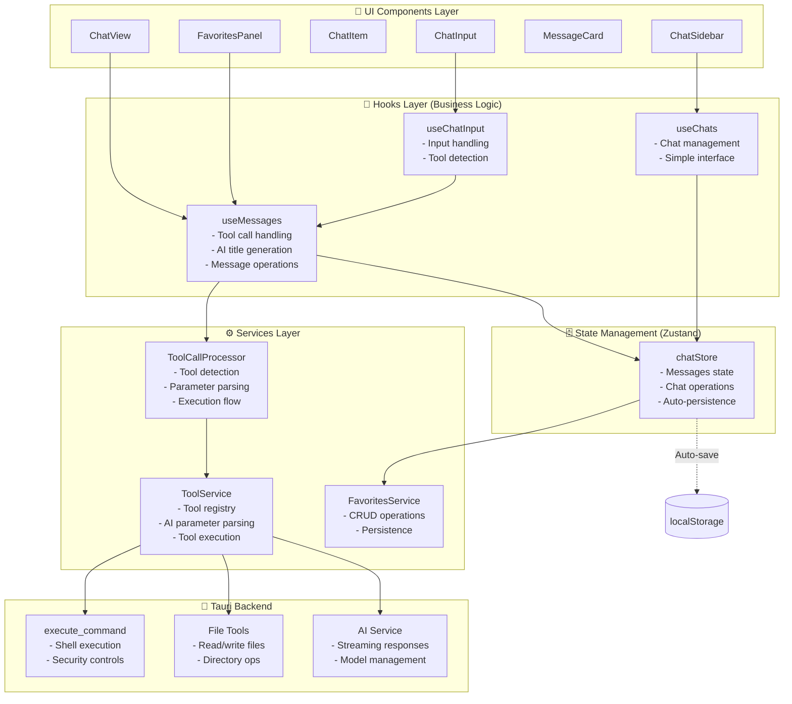

# 🏗️ Frontend Architecture Documentation

## 📋 Architecture Overview

Our frontend follows a modern **Component → Hook → Zustand Store → Service → Backend** pattern with clear separation of concerns.



## 🎯 Core Principles

### 1. **Single Responsibility**
- Each layer has a clear, focused responsibility
- Components handle UI only
- Hooks manage business logic and state access
- Stores manage centralized state
- Services handle pure business operations

### 2. **Unidirectional Data Flow**
```
User Action → Component → Hook → Store → Service → Backend
Backend Response → Service → Store → Hook → Component → UI Update
```

### 3. **Separation of Concerns**
- **UI Components**: Pure presentation, no business logic
- **Hooks**: Business logic, state management interface
- **Stores**: Centralized state with persistence
- **Services**: Pure business operations, no state

## 📁 Directory Structure

```
src/
├── components/           # UI Components
│   ├── ChatView/
│   ├── ChatSidebar/
│   ├── ChatItem/
│   ├── FavoritesPanel/
│   ├── MessageCard/
│   └── ChatInput/
├── hooks/               # Business Logic Hooks
│   ├── useMessages.ts   # Main messages hook
│   ├── useChats.ts      # Chat management
│   └── useChatInput.ts  # Input handling
├── store/               # Zustand Stores
│   └── chatStore.ts     # Main chat state
├── services/            # Business Services
│   ├── ToolCallProcessor.ts
│   ├── ToolService.ts
│   └── FavoritesService.ts
└── types/               # TypeScript Types
    └── chat.ts
```

## 🔗 Key Components

### **Hooks Layer (Modern Architecture)**

#### `useMessages.ts` - Main Messages Hook
**Purpose**: Primary hook for message operations and tool calls
**Responsibilities**:
- Tool call handling via `ToolCallProcessor`
- AI-powered chat title generation
- Message CRUD operations
- Auto-persistence integration

**Key Functions**:
```typescript
const {
  messages,
  isProcessing,
  sendMessage,
  generateChatTitle,
  autoUpdateChatTitle
} = useMessages();
```

#### `useChats.ts` - Chat Management
**Purpose**: Simplified chat list management
**Responsibilities**:
- Chat list operations
- Clean, parameter-free interface
- Chat selection and creation

#### `useChatInput.ts` - Input Handling
**Purpose**: Handle user input and tool detection
**Responsibilities**:
- Tool detection (`/execute_command`, `/read_file`, etc.)
- Integration with `useMessages`
- Input validation and routing

### **State Management (Zustand)**

#### `chatStore.ts` - Main Chat State
**Purpose**: Centralized state management for all chat data
**Features**:
- ✅ Messages state for all chats
- ✅ Auto-persistence to localStorage (fixed!)
- ✅ Streaming response handling
- ✅ Clean, reactive updates

**State Structure**:
```typescript
interface ChatState {
  chats: ChatItem[];
  messages: Record<string, Message[]>;
  currentChatId: string | null;
  isProcessing: boolean;
  // ... other state
}
```

### **Services Layer**

#### `ToolCallProcessor.ts` - Tool Execution Orchestration
**Purpose**: Orchestrate tool call detection and execution
**Responsibilities**:
- Tool detection from user input
- AI parameter parsing with streaming
- Backend integration coordination

#### `ToolService.ts` - Tool Registry and Execution
**Purpose**: Manage tool registry and execute tools
**Responsibilities**:
- Tool registration and management
- Parameter parsing and validation
- Direct backend communication

#### `FavoritesService.ts` - Favorites Management
**Purpose**: Handle favorites CRUD operations
**Responsibilities**:
- Favorites data operations
- Export functionality
- Persistence helpers

## 🔄 Data Flow Examples

### Tool Call Flow
```
User: "/execute_command pwd"
→ useChatInput detects tool call
→ useMessages processes with ToolCallProcessor
→ AI parses parameters ("pwd")
→ Backend executes command
→ Response streams back to UI
→ Auto-saves to localStorage
→ Auto-generates chat title
```

### Regular Chat Flow
```
User: "Hello"
→ useMessages.sendMessage()
→ chatStore.initiateAIResponse()
→ AI streaming response
→ Auto-saves to localStorage
→ Auto-generates chat title
```

## ✅ Verified Features

### **Core Functionality**
- ✅ Tool calls work (`/execute_command pwd`)
- ✅ Chat history persists across refreshes
- ✅ AI streaming responses
- ✅ Message operations (add, update, delete)

### **Advanced Features**
- ✅ AI-powered chat title generation
- ✅ Auto-title updates for generic titles
- ✅ Hover-based UI interactions
- ✅ Favorites system (fully functional)
- ✅ Tool call parameter parsing with AI

### **UI/UX Improvements**
- ✅ Clean chat item hover effects
- ✅ Meaningful chat titles
- ✅ Responsive design
- ✅ Tool execution feedback

## 🚀 Architecture Benefits

1. **🧹 Clean & Maintainable** - Clear separation of concerns
2. **🔄 Reactive** - Zustand provides efficient state updates
3. **💾 Persistent** - Auto-saves everything to localStorage
4. **🛠️ Extensible** - Easy to add new tools and features
5. **🎨 Modern** - Uses latest React patterns and TypeScript
6. **🚀 Performance** - Efficient state management and minimal re-renders
7. **🔧 Debuggable** - Clear data flow and error handling

## 📝 Development Guidelines

### **Adding New Features**
1. Start with UI component
2. Create or extend appropriate hook
3. Update store if new state needed
4. Add service for business logic
5. Integrate with backend if needed

### **Code Style**
- Use TypeScript for all files
- Follow React hooks patterns
- Keep components pure (no business logic)
- Use Zustand for state management
- Services should be stateless

### **Testing Strategy**
- Unit tests for services (pure functions)
- Integration tests for hooks
- Component tests for UI behavior
- E2E tests for critical user flows

---

*This architecture has been tested and verified to work with all core features including tool calls, persistence, AI title generation, and favorites management.*

## 📋 **Next Steps**

For detailed migration tasks and code review findings, see: **[FRONTEND_REVIEW_REPORT.md](./FRONTEND_REVIEW_REPORT.md)**
