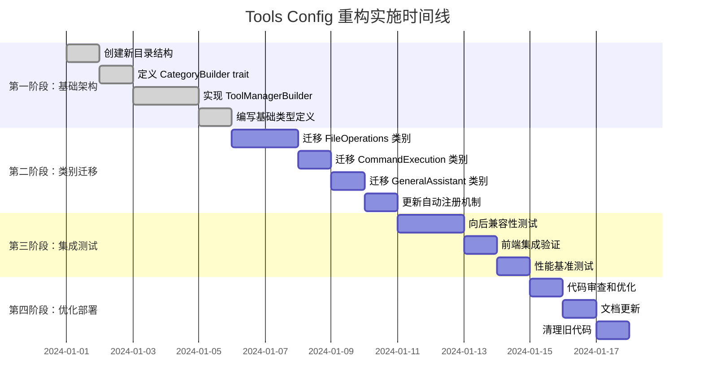

# 🏗️ Tools Config 重构实施计划

## 📋 项目概述

**重构目标：** 将 `src-tauri/src/tools/config.rs` (609行) 重构为模块化的建造者模式架构

**核心原则：**
- ✅ Tools 无权限：工具本身不包含权限逻辑
- ✅ Category 控制权限：只有 Category 才有 `enabled()` 方法
- ✅ 自动解析配置：根据 Tool 自动生成 ToolConfig
- ✅ 通过 Category 暴露：所有 Tools 只能通过 Category 访问
- ✅ 社区友好：贡献者只需实现简单的 CategoryBuilder trait

## 🎯 重构前后对比

### 重构前
```
src-tauri/src/tools/
├── config.rs          # 609行，包含所有配置
├── mod.rs              # 简单的模块导出
└── file_tools/         # 具体工具实现
    ├── mod.rs
    ├── read.rs
    ├── create.rs
    └── ...
```

### 重构后
```
src-tauri/src/tools/
├── mod.rs                          # 保持现有导出
├── config/
│   ├── mod.rs                      # 核心结构定义和重导出
│   ├── types.rs                    # ToolConfig, ToolCategory 等基础类型
│   ├── manager.rs                  # ToolConfigManager 实现
│   └── builder.rs                  # ToolManagerBuilder 实现
├── traits/
│   ├── mod.rs                      # Trait 模块导出
│   ├── category_builder.rs         # CategoryBuilder trait
│   └── permission_control.rs       # 权限控制 trait (可选)
├── categories/
│   ├── mod.rs                      # 自动发现和注册所有 categories
│   ├── file_operations/
│   │   ├── mod.rs                  # FileOperationsCategoryBuilder
│   │   └── tools.rs                # 所有文件工具实现
│   ├── command_execution/
│   │   ├── mod.rs                  # CommandExecutionCategoryBuilder
│   │   └── tools.rs                # ExecuteCommandTool
│   └── general_assistant/
│       └── mod.rs                  # GeneralAssistantCategoryBuilder
└── file_tools/                     # 逐步迁移到 categories/ 中
    └── ...
```

## 🔧 核心架构设计

### 1. CategoryBuilder Trait 定义

```rust
// traits/category_builder.rs
use std::collections::HashMap;
use std::sync::Arc;

pub trait CategoryBuilder: Send + Sync {
    /// 类别基础信息
    fn build_category(&self) -> ToolCategory;
    
    /// 该类别下的工具实例（无权限逻辑）
    fn build_tools(&self) -> HashMap<String, Arc<dyn Tool>>;
    
    /// 权限控制（只在 Category 级别）
    fn enabled(&self) -> bool;
    
    /// 构建优先级
    fn priority(&self) -> i32 { 0 }
    
    /// 自动从 Tools 生成 ToolConfigs
    fn build_tool_configs(&self) -> Vec<ToolConfig> {
        let tools = self.build_tools();
        let category = self.build_category();
        
        tools.into_iter().map(|(tool_name, tool)| {
            ToolConfig {
                name: tool.name(),
                display_name: tool.name(),
                description: tool.description(),
                category_id: category.id.clone(),
                enabled: true, // 由 Category.enabled() 控制
                requires_approval: tool.required_approval(),
                auto_prefix: Some(format!("/{}", tool.name())),
                permissions: vec![], // 权限在 Category 级别控制
                tool_type: match tool.tool_type() {
                    ToolType::AIParameterParsing => "AIParameterParsing".to_string(),
                    ToolType::RegexParameterExtraction => "RegexParameterExtraction".to_string(),
                },
                parameter_regex: tool.parameter_regex(),
                custom_prompt: tool.custom_prompt(),
            }
        }).collect()
    }
}
```

### 2. ToolManagerBuilder 实现

```rust
// config/builder.rs
pub struct ToolManagerBuilder {
    category_builders: Vec<Box<dyn CategoryBuilder>>,
}

impl ToolManagerBuilder {
    pub fn new() -> Self {
        Self {
            category_builders: Vec::new(),
        }
    }
    
    pub fn register_category<T: CategoryBuilder + 'static>(mut self, builder: T) -> Self {
        self.category_builders.push(Box::new(builder));
        self
    }
    
    pub fn build(self) -> ToolManager {
        let mut tools = HashMap::new();
        let mut config_manager = ToolConfigManager::default();
        
        // 按优先级排序
        let mut builders = self.category_builders;
        builders.sort_by_key(|b| b.priority());
        
        for builder in builders {
            // 只有 enabled 的 category 才会被处理
            if !builder.enabled() {
                continue;
            }
            
            // 1. 构建 category
            let mut category = builder.build_category();
            
            // 2. 构建 tools
            let category_tools = builder.build_tools();
            
            // 3. 自动生成 tool_configs
            let tool_configs = builder.build_tool_configs();
            
            // 4. 自动填充 category.tools 列表
            category.tools = category_tools.keys().cloned().collect();
            
            // 5. 注册到管理器
            config_manager.register_category(category);
            for tool_config in tool_configs {
                config_manager.register_tool_config(tool_config);
            }
            
            // 6. 注册工具实例
            tools.extend(category_tools);
        }
        
        ToolManager::new_with_config(tools, config_manager)
    }
    
    /// 构建默认的 ToolManager
    pub fn build_default() -> ToolManager {
        Self::new()
            .register_category(file_operations::FileOperationsCategoryBuilder::new())
            .register_category(command_execution::CommandExecutionCategoryBuilder::new())
            .register_category(general_assistant::GeneralAssistantCategoryBuilder::new())
            .build()
    }
}
```

### 3. 示例：FileOperationsCategory 实现

```rust
// categories/file_operations/mod.rs
use crate::traits::CategoryBuilder;
use crate::tools::file_tools::*;

pub struct FileOperationsCategoryBuilder;

impl FileOperationsCategoryBuilder {
    pub fn new() -> Self {
        Self
    }
}

impl CategoryBuilder for FileOperationsCategoryBuilder {
    fn build_category(&self) -> ToolCategory {
        ToolCategory {
            id: "file_operations".to_string(),
            name: "文件操作助手".to_string(),
            description: "提供完整的文件操作功能，包括读取、创建、更新、删除和搜索".to_string(),
            system_prompt: r#"你是专业的文件操作助手。你可以帮助用户：
1. 读取和查看文件内容
2. 创建新文件和目录
3. 更新和修改现有文件
4. 删除文件和目录
5. 搜索文件和内容

请根据用户需求选择合适的工具，并在执行危险操作前提醒用户。"#.to_string(),
            tools: vec![], // 将自动填充
            restrict_conversation: false,
            enabled: true,
            auto_prefix: Some("文件操作：".to_string()),
            icon: Some("📁".to_string()),
            color: Some("#2196F3".to_string()),
        }
    }

    fn build_tools(&self) -> HashMap<String, Arc<dyn Tool>> {
        let mut tools = HashMap::new();
        
        // 注册所有文件操作工具
        tools.insert("read_file".to_string(), Arc::new(read::ReadFileTool::new()));
        tools.insert("create_file".to_string(), Arc::new(create::CreateFileTool::new()));
        tools.insert("update_file".to_string(), Arc::new(update::UpdateFileTool::new()));
        tools.insert("append_file".to_string(), Arc::new(append::AppendFileTool::new()));
        tools.insert("delete_file".to_string(), Arc::new(delete::DeleteFileTool::new()));
        tools.insert("search_files".to_string(), Arc::new(search::SearchFilesTool::new()));
        tools.insert("simple_search".to_string(), Arc::new(simple_search::SimpleSearchTool::new()));
        
        tools
    }

    fn enabled(&self) -> bool {
        // 您的权限控制逻辑
        // 例如：检查用户权限、许可证验证、远程权限同步等
        self.check_file_operation_permissions()
    }
}

impl FileOperationsCategoryBuilder {
    fn check_file_operation_permissions(&self) -> bool {
        // 权限检查实现
        // 这里您可以：
        // 1. 检查本地权限配置
        // 2. 调用远程API验证用户权限
        // 3. 检查许可证状态
        // 4. 根据用户等级决定权限
        true
    }
}
```

## 📅 详细实施时间线



## 🚀 实施步骤详解

### 第一阶段：基础架构搭建 (预计 5 天)

#### 步骤 1.1：创建新目录结构
```bash
mkdir -p src-tauri/src/tools/config
mkdir -p src-tauri/src/tools/traits
mkdir -p src-tauri/src/tools/categories/file_operations
mkdir -p src-tauri/src/tools/categories/command_execution
mkdir -p src-tauri/src/tools/categories/general_assistant
```

#### 步骤 1.2：创建核心 Trait 定义
**文件：** `src-tauri/src/tools/traits/category_builder.rs`
- [ ] 定义 `CategoryBuilder` trait
- [ ] 实现自动 ToolConfig 生成逻辑
- [ ] 添加权限控制接口

#### 步骤 1.3：实现 ToolManagerBuilder
**文件：** `src-tauri/src/tools/config/builder.rs`
- [ ] 实现建造者模式的核心逻辑
- [ ] 添加类别注册和构建机制
- [ ] 集成权限控制过滤

#### 步骤 1.4：拆分基础类型
**文件：** `src-tauri/src/tools/config/types.rs`
- [ ] 从原 config.rs 提取 `ToolConfig` 结构
- [ ] 从原 config.rs 提取 `ToolCategory` 结构
- [ ] 保持 API 兼容性

#### 步骤 1.5：重构 ToolConfigManager
**文件：** `src-tauri/src/tools/config/manager.rs`
- [ ] 从原 config.rs 迁移 `ToolConfigManager`
- [ ] 适配新的建造者模式架构
- [ ] 保持所有现有方法

### 第二阶段：类别迁移 (预计 5 天)

#### 步骤 2.1：创建 FileOperationsCategory
**文件：** `src-tauri/src/tools/categories/file_operations/mod.rs`
- [ ] 实现 `FileOperationsCategoryBuilder`
- [ ] 集成所有文件操作工具
- [ ] 设置权限控制逻辑

#### 步骤 2.2：创建 CommandExecutionCategory
**文件：** `src-tauri/src/tools/categories/command_execution/mod.rs`
- [ ] 实现 `CommandExecutionCategoryBuilder`
- [ ] 集成命令执行工具
- [ ] 设置严格的权限控制

#### 步骤 2.3：创建 GeneralAssistantCategory
**文件：** `src-tauri/src/tools/categories/general_assistant/mod.rs`
- [ ] 实现 `GeneralAssistantCategoryBuilder`
- [ ] 设置通用助手配置
- [ ] 权限控制集成

#### 步骤 2.4：更新自动注册机制
**文件：** `src-tauri/src/tools/categories/mod.rs`
- [ ] 实现自动类别发现
- [ ] 创建默认 ToolManager 构建函数
- [ ] 更新导出接口

### 第三阶段：集成测试 (预计 4 天)

#### 步骤 3.1：向后兼容性测试
- [ ] 验证所有现有 API 正常工作
- [ ] 检查 Tauri 命令接口兼容性
- [ ] 确保配置文件格式向后兼容

#### 步骤 3.2：前端集成验证
- [ ] 测试前端工具选择器功能
- [ ] 验证系统提示词服务
- [ ] 检查聊天管理器集成

#### 步骤 3.3：性能基准测试
- [ ] 对比重构前后的启动时间
- [ ] 测试工具注册和发现性能
- [ ] 验证内存使用情况

### 第四阶段：优化部署 (预计 3 天)

#### 步骤 4.1：代码审查和优化
- [ ] 清理冗余代码
- [ ] 优化性能热点
- [ ] 标准化错误处理

#### 步骤 4.2：文档更新
- [ ] 更新贡献者指南
- [ ] 编写类别开发教程
- [ ] 更新 API 文档

#### 步骤 4.3：清理旧代码
- [ ] 移除已迁移的代码
- [ ] 更新导入引用
- [ ] 验证最终集成

## 🔄 迁移策略

### 渐进式迁移原则
1. **保持运行状态**：重构过程中系统始终可运行
2. **分步验证**：每个步骤完成后立即测试
3. **向后兼容**：现有 API 保持不变
4. **逐步清理**：完成迁移后再清理旧代码

### 具体迁移步骤

#### 阶段一：并行开发
```
现有 config.rs (保持运行) + 新架构 (并行开发)
```

#### 阶段二：逐步替换
```
部分使用新架构 + 部分使用旧架构 (向后兼容)
```

#### 阶段三：完全迁移
```
完全使用新架构 + 清理旧代码
```

## 🌟 社区贡献者指南

### 添加新类别的简单流程

#### 1. 创建类别目录
```bash
mkdir -p src-tauri/src/tools/categories/my_category
```

#### 2. 实现 CategoryBuilder
```rust
// categories/my_category/mod.rs
use crate::traits::CategoryBuilder;

pub struct MyCategoryBuilder;

impl CategoryBuilder for MyCategoryBuilder {
    fn build_category(&self) -> ToolCategory {
        ToolCategory {
            id: "my_category".to_string(),
            name: "我的类别".to_string(),
            description: "类别描述".to_string(),
            system_prompt: "系统提示词".to_string(),
            tools: vec![], // 自动填充
            restrict_conversation: false,
            enabled: true,
            auto_prefix: Some("前缀：".to_string()),
            icon: Some("🔧".to_string()),
            color: Some("#FF5722".to_string()),
        }
    }

    fn build_tools(&self) -> HashMap<String, Arc<dyn Tool>> {
        let mut tools = HashMap::new();
        tools.insert("my_tool".to_string(), Arc::new(MyTool::new()));
        tools
    }

    fn enabled(&self) -> bool {
        // 权限控制逻辑
        true
    }
}
```

#### 3. 注册类别
```rust
// categories/mod.rs
pub fn build_default_tool_manager() -> ToolManager {
    ToolManagerBuilder::new()
        // ... 现有类别
        .register_category(my_category::MyCategoryBuilder::new())
        .build()
}
```

### 贡献者只需要关注的三个方法：
1. **`build_category()`** - 定义类别信息
2. **`build_tools()`** - 注册工具实例
3. **`enabled()`** - 权限控制逻辑

## ⚠️ 风险评估和缓解措施

### 高风险项
1. **API 兼容性破坏**
   - **风险**：重构可能影响现有前端集成
   - **缓解**：保持所有现有 API 接口不变
   - **验证**：每个阶段完成后进行集成测试

2. **配置文件格式变更**
   - **风险**：用户配置可能丢失或无效
   - **缓解**：保持配置文件格式向后兼容
   - **验证**：测试现有配置文件的加载

### 中风险项
1. **性能回归**
   - **风险**：新架构可能影响性能
   - **缓解**：进行性能基准测试
   - **验证**：对比重构前后的性能指标

2. **工具注册失败**
   - **风险**：动态注册机制可能出现问题
   - **缓解**：添加详细的错误日志和回退机制
   - **验证**：测试各种异常情况

### 低风险项
1. **代码维护复杂度**
   - **风险**：新架构可能增加维护复杂度
   - **缓解**：详细的文档和示例代码
   - **验证**：邀请其他开发者试用新架构

## 📊 成功指标

### 技术指标
- [ ] **文件大小减少**：单个文件从 609 行减少到 < 100 行
- [ ] **模块化程度**：7 个类别完全独立
- [ ] **编译时间**：不超过重构前的 110%
- [ ] **运行时性能**：不超过重构前的 105%

### 开发体验指标
- [ ] **新类别添加时间**：< 30 分钟（包含文档阅读）
- [ ] **代码理解时间**：新开发者 < 1 小时理解架构
- [ ] **测试覆盖率**：> 85% 的核心功能有测试
- [ ] **文档完整性**：100% 的公开 API 有文档

### 业务指标
- [ ] **向后兼容性**：100% 现有功能正常工作
- [ ] **社区贡献**：重构后 3 个月内有外部贡献
- [ ] **维护效率**：bug 修复时间减少 50%
- [ ] **功能扩展**：新功能开发时间减少 40%

## 🎯 预期收益

### 短期收益（1-3 个月）
- ✅ 代码组织更清晰，维护更容易
- ✅ 新功能开发速度提升
- ✅ 权限控制更灵活，安全性提升

### 中期收益（3-6 个月）
- ✅ 社区贡献者增加，功能扩展加速
- ✅ 代码质量提升，bug 数量减少
- ✅ 架构稳定性增强，扩展性更好

### 长期收益（6-12 个月）
- ✅ 项目生态系统完善
- ✅ 维护成本显著降低
- ✅ 技术债务减少，可持续发展

## 📚 参考资料

### 设计模式参考
- **Builder Pattern**: 用于构建复杂的 ToolManager
- **Strategy Pattern**: 用于权限控制策略
- **Factory Pattern**: 用于工具实例创建
- **Registry Pattern**: 用于类别注册和发现

### 架构原则
- **Single Responsibility**: 每个类别负责一组相关工具
- **Open/Closed Principle**: 对扩展开放，对修改关闭
- **Dependency Inversion**: 依赖抽象而不是具体实现
- **Interface Segregation**: 接口职责单一，易于实现

---

**项目联系人**: [您的联系方式]
**文档版本**: v1.0
**最后更新**: 2024-01-01
**预计完成时间**: 2024-01-18 (17 天)

---

## 🚀 准备开始实施？

1. **确认计划**：请仔细审查本重构计划
2. **设置环境**：确保开发环境准备就绪
3. **创建分支**：建议创建 `feature/tools-config-refactor` 分支
4. **开始实施**：按照时间线逐步执行

**下一步**：切换到 Code 模式开始第一阶段的基础架构搭建！