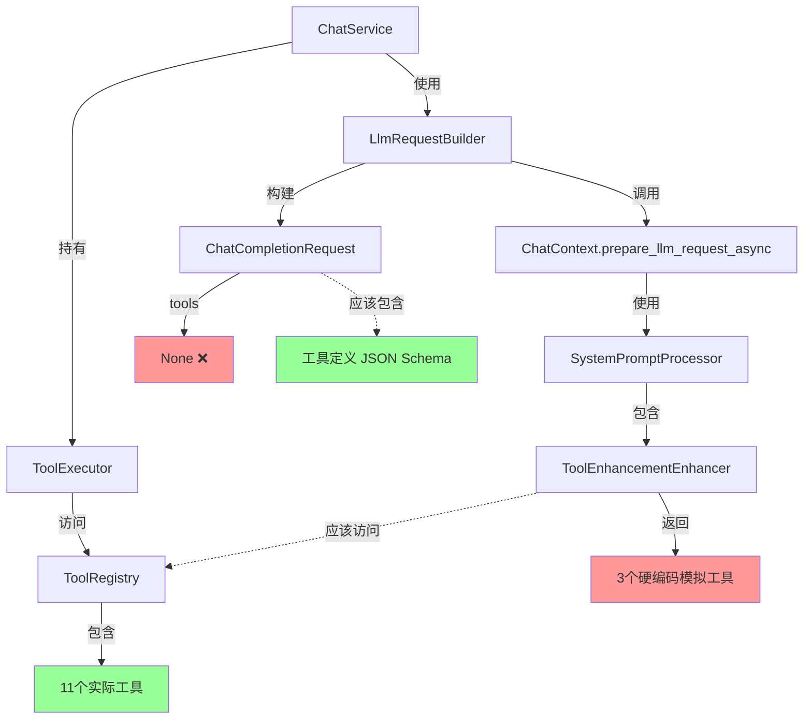

# Tool Integration Issue Analysis

## 问题描述

AI 助手不知道自己有哪些可用的工具，导致它无法正确使用工具。例如，当用户询问"工作区中有多少个文件夹"时，AI 回复说没有直接访问权限，但实际上它应该知道可以使用 `list_directory` 或 `find` 工具。

## 根本原因分析

经过代码审查，发现了两个独立但相关的问题：

### 问题 1: 工具定义未添加到 LLM API 请求中

**位置**: `crates/web_service/src/services/llm_request_builder.rs:110`

```rust
let request = ChatCompletionRequest {
    model: prepared.model_id.clone(),
    messages: chat_messages,
    stream: None,
    tools: None,  // ❌ 问题：工具定义为 None
    tool_choice: None,
    ..Default::default()
};
```

**影响**:
- OpenAI 的函数调用 API 需要在 `tools` 参数中接收正式的工具定义（JSON Schema 格式）
- 虽然 system prompt 中可能包含工具描述（markdown 格式），但 LLM 无法进行结构化的工具调用
- AI 不知道它可以调用哪些工具

### 问题 2: ToolEnhancementEnhancer 使用硬编码的模拟工具

**位置**: `crates/context_manager/src/pipeline/enhancers/tool_enhancement.rs:152-218`

```rust
fn get_available_tools(&self, _ctx: &ProcessingContext) -> Vec<ToolDefinition> {
    // TODO: Integrate with actual tool registry
    // For now, return mock tools for demonstration
    
    vec![
        ToolDefinition {
            name: "read_file".to_string(),
            // ...
        },
        ToolDefinition {
            name: "write_file".to_string(),
            // ...
        },
        ToolDefinition {
            name: "codebase_search".to_string(),
            // ...
        },
    ]
}
```

**影响**:
- 即使在 system prompt 中，也只包含 3 个硬编码的模拟工具
- 实际的工具注册表（`tool_system` crate）中有 11 个工具：
  - `read_file`
  - `create_file`
  - `update_file`
  - `append_file`
  - `delete_file`
  - `list_directory` ⭐
  - `replace_in_file`
  - `edit_lines`
  - `search`
  - `grep` ⭐
  - `glob` ⭐

## 架构图



## 信息流

### 当前流程（有问题）:

1. `ChatService` 创建时接收 `ToolExecutor` 和 `ToolRegistry`
2. `LlmRequestBuilder.build()` 调用 `ChatContext.prepare_llm_request_async()`
3. `ChatContext` 使用 `SystemPromptProcessor` 增强 system prompt
4. `ToolEnhancementEnhancer` 返回 **3 个硬编码的模拟工具**
5. 工具描述被添加到 system prompt（markdown 格式）
6. `LlmRequestBuilder` 构建 `ChatCompletionRequest`，但 `tools: None`
7. LLM 收到 system prompt，但**没有正式的工具定义**，只有文本描述

### 期望流程:

1. `ChatService` 创建时接收 `ToolExecutor` 和 `ToolRegistry`
2. `LlmRequestBuilder.build()` 从 `ToolRegistry` 获取工具定义
3. `ChatContext` 使用 `SystemPromptProcessor` 增强 system prompt
4. `ToolEnhancementEnhancer` 从 `ChatContext` 读取**实际的工具定义**
5. 工具描述被添加到 system prompt（markdown 格式）
6. `LlmRequestBuilder` 构建 `ChatCompletionRequest`，包含**完整的工具定义**（JSON Schema 格式）
7. LLM 收到完整的工具信息，既有文本描述，也有结构化定义

## 代码位置

### 1. ToolRegistry (实际的工具来源)
- **文件**: `crates/tool_system/src/registry/registries.rs`
- **方法**: `list_tool_definitions() -> Vec<ToolDefinition>`
- **方法**: `filter_tools_by_permissions(permissions) -> Vec<ToolDefinition>`

### 2. ToolEnhancementEnhancer (需要修复)
- **文件**: `crates/context_manager/src/pipeline/enhancers/tool_enhancement.rs`
- **问题方法**: `get_available_tools()` - 返回硬编码工具
- **需要**: 从 `ChatContext` 或 `ProcessingContext` 读取实际工具

### 3. LlmRequestBuilder (需要修复)
- **文件**: `crates/web_service/src/services/llm_request_builder.rs`
- **问题行**: 第 110 行 - `tools: None`
- **需要**: 从 `ToolRegistry` 获取工具定义并转换为 API 格式

### 4. ChatContext
- **文件**: `crates/context_manager/src/structs/context.rs`
- **需要**: 添加字段存储工具定义，或添加方法注入工具注册表

## 解决方案

### 方案 1: 在 ChatContext 中存储工具定义

**优点**:
- 保持 context_manager 独立性
- 可以根据权限过滤工具
- 支持不同上下文使用不同工具集

**实现**:
1. 在 `ChatContext` 添加 `available_tools: Vec<ToolDefinition>` 字段
2. 在 `SessionManager.create_context()` 时从 `ToolRegistry` 获取并设置工具
3. `ToolEnhancementEnhancer` 从 `ProcessingContext.chat_context.available_tools` 读取
4. `LlmRequestBuilder` 从 `PreparedLlmRequest` 中获取工具定义

### 方案 2: 通过依赖注入传递 ToolRegistry

**优点**:
- 实时获取最新工具列表
- 无需存储冗余数据

**缺点**:
- 增加 context_manager 对 tool_system 的依赖
- 需要修改更多构造函数

### 方案 3: 混合方案（推荐）

1. **在 `PreparedLlmRequest` 中添加工具定义**:
   ```rust
   pub struct PreparedLlmRequest {
       // ... existing fields
       pub available_tools: Vec<crate::pipeline::context::ToolDefinition>,
   }
   ```

2. **在 `SessionManager` 初始化时设置工具**:
   - 从 `ToolRegistry` 获取工具定义
   - 根据代理角色过滤权限
   - 存储在 `ChatContext` 的运行时字段中

3. **修改 `ToolEnhancementEnhancer`**:
   - 从 `ProcessingContext` 读取工具定义
   - 生成 markdown 格式的工具描述

4. **修改 `LlmRequestBuilder`**:
   - 从 `PreparedLlmRequest.available_tools` 获取工具定义
   - 转换为 OpenAI API 格式（JSON Schema）
   - 设置 `ChatCompletionRequest.tools`

## 下一步行动

1. ✅ 创建此分析文档
2. 🔄 实现方案 3
3. ⏳ 添加单元测试验证工具集成
4. ⏳ 测试端到端工作流
5. ⏳ 更新相关文档
