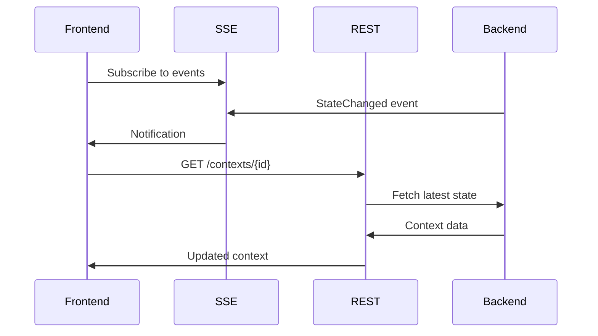
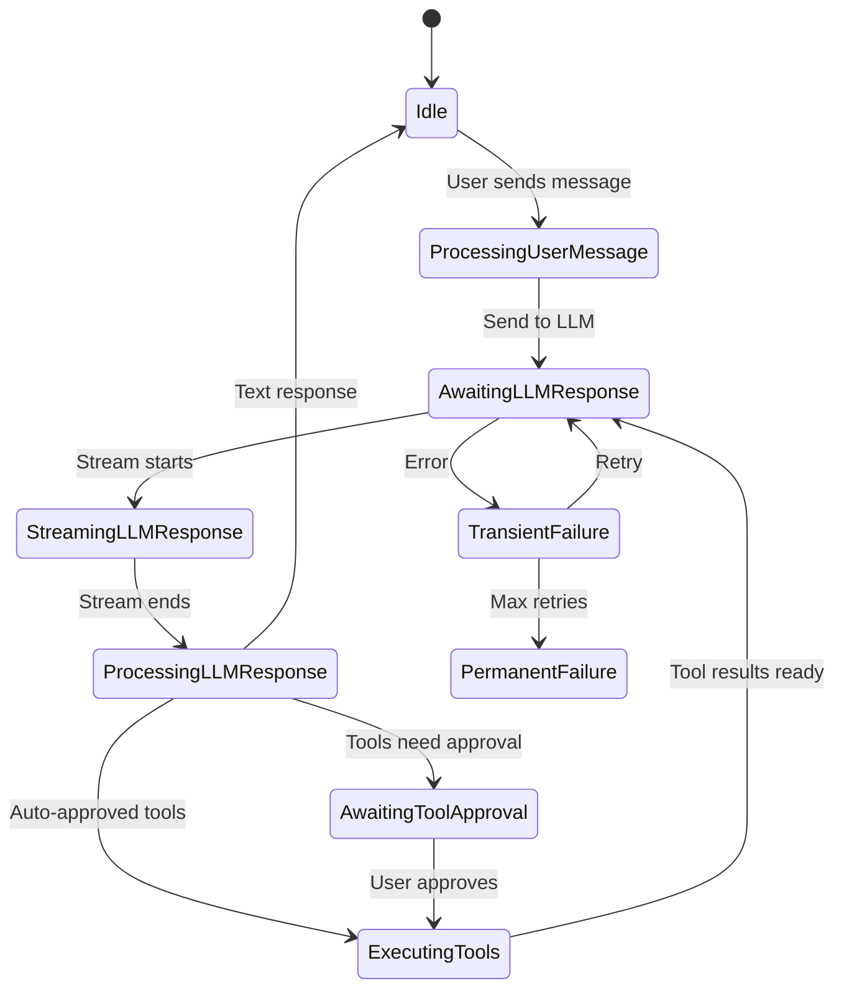
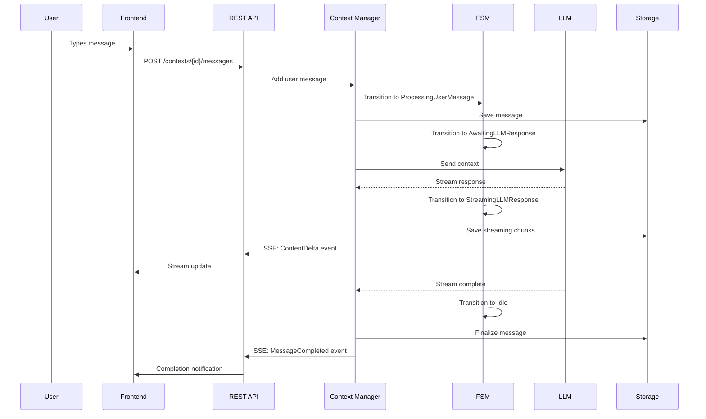

# Context & Session Manager Architecture (Post-Refactor)

**Status**: ✅ Production Ready  
**Last Updated**: 2025-11-09  
**OpenSpec Change ID**: `refactor-context-session-architecture`

---

## Table of Contents

1. [Overview](#overview)
2. [Architecture Principles](#architecture-principles)
3. [Core Components](#core-components)
4. [Data Flow](#data-flow)
5. [Storage Architecture](#storage-architecture)
6. [State Management](#state-management)
7. [API Design](#api-design)
8. [Testing Strategy](#testing-strategy)
9. [Migration Guide](#migration-guide)

---

## Overview

The Context & Session Manager architecture has been refactored to implement a **backend-first** design where all business logic, state management, and data persistence occur in the Rust backend. Frontend clients are thin rendering layers that consume backend APIs.

### Key Benefits

- **Single Source of Truth**: All conversation state lives in the backend
- **Multi-Client Support**: Multiple frontends can connect to the same backend
- **Testable**: Complete lifecycle can be tested without a frontend
- **Scalable**: Backend can handle multiple concurrent contexts
- **Persistent**: Context-local message pools with efficient storage

---

## Architecture Principles

### 1. Backend-First Design

```
┌─────────────────────────────────────────────────────────────┐
│                    Frontend (Thin Client)                    │
│  - UI Rendering                                              │
│  - User Input Handling                                       │
│  - Display Logic Only                                        │
└────────────────────────┬────────────────────────────────────┘
                         │ REST API + SSE
                         ▼
┌─────────────────────────────────────────────────────────────┐
│                  Backend (Business Logic)                    │
│  - Context Management                                        │
│  - Message Processing                                        │
│  - State Machine (FSM)                                       │
│  - Tool Execution                                            │
│  - LLM Integration                                           │
│  - Data Persistence                                          │
└─────────────────────────────────────────────────────────────┘
```

### 2. Signal-Pull Synchronization

The architecture uses a **Signal-Pull** pattern for frontend-backend sync:

- **Signal (SSE)**: Lightweight notifications about state changes
- **Pull (REST)**: Frontend fetches actual data when needed



### 3. Context-Local Message Pool

Each context has its own message storage directory:

```
contexts/
├── {context-id}/
│   ├── metadata.json          # Context config and metadata
│   ├── message_index.json     # Message index for fast lookup
│   └── messages/
│       ├── {msg-id-1}.json
│       ├── {msg-id-2}.json
│       └── {msg-id-3}.json
```

**Benefits**:
- Fast message lookup (O(1) via index)
- Efficient partial loading (load only visible messages)
- Easy context deletion (remove directory)
- Scalable to 1000+ messages per context

---

## Core Components

### 1. ChatContext

The central data structure representing a conversation:

```rust
pub struct ChatContext {
    pub id: Uuid,
    pub parent_id: Option<Uuid>,
    pub config: ChatConfig,
    pub message_pool: HashMap<Uuid, MessageNode>,
    pub branches: HashMap<String, Branch>,
    pub active_branch_name: String,
    pub current_state: ContextState,
    pub created_at: DateTime<Utc>,
    pub updated_at: DateTime<Utc>,
}
```

**Key Features**:
- **Message Pool**: Flat HashMap for O(1) message access
- **Branches**: Multiple conversation branches within one context
- **FSM State**: Current state in the conversation lifecycle
- **Config**: Model, mode, system prompt, and parameters

### 2. Finite State Machine (FSM)

The FSM manages the conversation lifecycle:



**States**:
- `Idle`: Waiting for user input
- `ProcessingUserMessage`: Preparing message for LLM
- `AwaitingLLMResponse`: Waiting for LLM connection
- `StreamingLLMResponse`: Receiving streaming chunks
- `ProcessingLLMResponse`: Processing complete response
- `AwaitingToolApproval`: Waiting for user to approve tools
- `ExecutingTools`: Running approved tools
- `TransientFailure`: Temporary error (can retry)
- `PermanentFailure`: Unrecoverable error

### 3. Branch System

Supports multiple conversation branches:

```rust
pub struct Branch {
    pub name: String,
    pub message_ids: Vec<Uuid>,
    pub parent_message_id: Option<Uuid>,
}
```

**Use Cases**:
- Try different approaches to a problem
- Explore alternative solutions
- A/B testing different prompts
- Rollback to earlier conversation points

### 4. Message Types

```rust
pub enum MessageType {
    Text,        // Regular text message
    Plan,        // Planning/thinking message
    Question,    // Interactive question to user
    ToolCall,    // Tool execution request
    ToolResult,  // Tool execution result
}
```

### 5. Storage Provider

```rust
pub trait StorageProvider {
    async fn save_context(&self, context: &ChatContext) -> Result<()>;
    async fn load_context(&self, id: Uuid) -> Result<ChatContext>;
    async fn save_message(&self, context_id: Uuid, message: &MessageNode) -> Result<()>;
    async fn load_messages(&self, context_id: Uuid, ids: &[Uuid]) -> Result<Vec<MessageNode>>;
    async fn delete_context(&self, id: Uuid) -> Result<()>;
}
```

---

## Data Flow

### Complete Message Flow



---

## Storage Architecture

### File Structure

```
data/
└── contexts/
    ├── {context-id-1}/
    │   ├── metadata.json
    │   ├── message_index.json
    │   └── messages/
    │       ├── {msg-1}.json
    │       └── {msg-2}.json
    └── {context-id-2}/
        ├── metadata.json
        ├── message_index.json
        └── messages/
            └── {msg-3}.json
```

### metadata.json

```json
{
  "id": "uuid",
  "parent_id": null,
  "config": {
    "model_id": "gpt-4",
    "mode": "code",
    "parameters": {},
    "system_prompt_id": "default",
    "agent_role": "assistant",
    "workspace_path": "/path/to/workspace"
  },
  "branches": {
    "main": {
      "name": "main",
      "message_ids": ["msg-1", "msg-2"],
      "parent_message_id": null
    }
  },
  "active_branch_name": "main",
  "current_state": "Idle",
  "created_at": "2025-11-09T10:00:00Z",
  "updated_at": "2025-11-09T10:05:00Z"
}
```

### message_index.json

```json
{
  "messages": [
    {
      "id": "msg-1",
      "role": "user",
      "message_type": "text",
      "created_at": "2025-11-09T10:00:00Z",
      "branch": "main"
    },
    {
      "id": "msg-2",
      "role": "assistant",
      "message_type": "text",
      "created_at": "2025-11-09T10:01:00Z",
      "branch": "main"
    }
  ]
}
```

---

## State Management

### Context Lifecycle

1. **Creation**: `ChatContext::new()` creates a new context with default config
2. **Message Addition**: Messages added via `add_message_to_branch()`
3. **State Transitions**: FSM manages state via `handle_event()` and `transition_to_*()`
4. **Streaming**: `begin_streaming_response()`, `apply_streaming_delta()`, `finish_streaming_response()`
5. **Persistence**: Auto-save on state changes via `StorageProvider`
6. **Deletion**: `delete_context()` removes all files

### Concurrency

- **Thread-Safe**: Context Manager uses `Arc<RwLock<ChatContext>>` for concurrent access
- **Async**: All I/O operations are async (tokio runtime)
- **Lock-Free Reads**: Multiple readers can access context simultaneously
- **Write Serialization**: Writes are serialized via RwLock

---

## API Design

### REST Endpoints

```
GET    /api/contexts                    # List all contexts
POST   /api/contexts                    # Create new context
GET    /api/contexts/{id}               # Get context details
PUT    /api/contexts/{id}               # Update context config
DELETE /api/contexts/{id}               # Delete context

GET    /api/contexts/{id}/messages      # Get messages (paginated)
POST   /api/contexts/{id}/messages      # Add user message
GET    /api/contexts/{id}/messages/{msg_id}  # Get specific message

POST   /api/contexts/{id}/branches      # Create new branch
PUT    /api/contexts/{id}/branches/{name}    # Switch branch

POST   /api/contexts/{id}/tools/approve # Approve tool execution
GET    /api/contexts/{id}/state         # Get current FSM state
```

### SSE Events

```
event: StateChanged
data: {"context_id": "uuid", "new_state": "StreamingLLMResponse"}

event: ContentDelta
data: {"context_id": "uuid", "message_id": "uuid", "delta": "text chunk", "sequence": 42}

event: MessageCompleted
data: {"context_id": "uuid", "message_id": "uuid"}

event: Heartbeat
data: {"timestamp": "2025-11-09T10:00:00Z"}
```

---

## Testing Strategy

### Unit Tests (95 tests, 100% passing)

- **FSM Tests**: State transitions, event handling
- **Context Tests**: Message management, branch operations
- **Storage Tests**: Save/load, migration, integrity
- **Serialization Tests**: JSON encoding/decoding

### Integration Tests

- **Lifecycle Tests**: Complete user-assistant cycles
- **Branch Tests**: Multi-branch operations
- **Streaming Tests**: Chunk processing, completion

### E2E Tests (Phase 8.1)

- **Multi-turn Conversations**: 6-message cycles
- **Mode Switching**: Plan → Act transitions
- **Multi-branch Operations**: Parallel branch work

### Performance Tests (Phase 8.2)

- **Long Conversations**: 1000+ messages
- **Concurrent Contexts**: 10 contexts simultaneously
- **Tool-Intensive**: 100 tool call cycles
- **Streaming**: 5000 chunks across 50 responses

### Migration Tests (Phase 8.3)

- **Legacy Format**: Old context format compatibility
- **Data Integrity**: Verify no data loss during migration
- **API Compatibility**: Backward-compatible APIs

---

## Migration Guide

See [Context Manager Migration](./context-manager-migration.md) for detailed migration instructions.

### Quick Start

1. **Backend**: Already migrated, no changes needed
2. **Frontend**: Use `BackendContextService` instead of Zustand stores
3. **Data**: Run migration utility to convert LocalStorage to backend storage

---

## References

- [OpenSpec Change](../../openspec/changes/refactor-context-session-architecture/README.md)
- [Design Document](../../openspec/changes/refactor-context-session-architecture/design.md)
- [Tasks](../../openspec/changes/refactor-context-session-architecture/tasks.md)
- [Context Manager Migration](./context-manager-migration.md)

