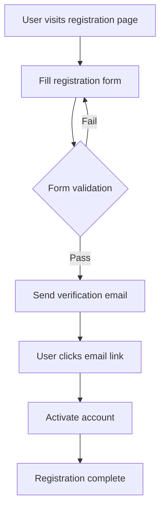

# Mermaid Diagram Enhancement

## Feature Overview

The Mermaid diagram enhancement feature dynamically adds instructions to the system prompt guiding the AI to use Mermaid diagrams, making the AI more inclined to present information visually.

## Feature Capabilities

### ✅ Implemented Features

1. **Dynamic System Prompt Enhancement**
   - Automatically appends Mermaid usage guidelines after the system prompt
   - Includes examples and use cases for 7 common diagram types
   - Encourages AI to use diagrams in appropriate scenarios

2. **User Control Toggle**
   - Provides toggle control in system settings
   - Enabled by default, users can disable at any time
   - Settings are persisted

3. **Complete Diagram Support**
   - Flowcharts
   - Sequence Diagrams
   - Class Diagrams
   - State Diagrams
   - Gantt Charts
   - ER Diagrams
   - Git Graphs

## Usage

### Enable/Disable Feature

1. Click the settings button to open system settings
2. Find the "Mermaid Diagrams Enhancement" toggle
3. Toggle to enable or disable the feature

### Effect Demonstration

When enabled, the AI will proactively use diagrams in the following scenarios:

- **Explain Processes**: Use flowcharts to show steps
- **Describe Architecture**: Use class or component diagrams
- **Show Interactions**: Use sequence diagrams
- **Describe States**: Use state diagrams
- **Plan Timelines**: Use Gantt charts
- **Design Databases**: Use ER diagrams

## Technical Implementation

### File Structure

```
src/
├── utils/mermaidUtils.ts          # Mermaid utility functions
├── hooks/useMessages.ts           # Message processing, includes system prompt enhancement
├── components/
│   ├── MessageCard/index.tsx      # Mermaid diagram rendering component
│   └── SystemSettingsModal/       # Settings interface, includes toggle
└── docs/MERMAID_ENHANCEMENT.md    # This document
```

### Core Functions

- `isMermaidEnhancementEnabled()`: Check if feature is enabled
- `setMermaidEnhancementEnabled(enabled)`: Set feature state
- `getMermaidEnhancementPrompt()`: Get enhancement prompt
- `getEffectiveSystemPrompt()`: Build final system prompt

### Storage Key

- `mermaid_enhancement_enabled`: Feature toggle state (localStorage)

## Example Conversation

### Before Enable
```
User: Explain the user registration process
AI: The user registration process includes the following steps: 1. Fill form 2. Verify email 3. Create account...
```

### After Enable
```
User: Explain the user registration process
AI: The user registration process is as follows:



Detailed step explanation:...
```

## Notes

1. **Performance Impact**: Enhancement increases system prompt length, may slightly affect response speed
2. **Compatibility**: All supported Mermaid diagram types are correctly rendered on the frontend
3. **User Experience**: Enabled by default, but users can disable at any time
4. **Caching Mechanism**: Same diagrams are cached to avoid repeated rendering

## Future Improvements

- [ ] Add support for more diagram types
- [ ] Intelligent detection of most suitable diagram type
- [ ] Provide diagram template library
- [ ] Support custom enhancement prompts
