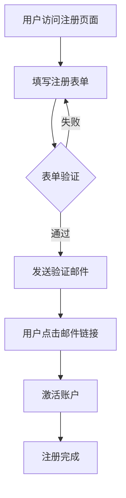

# Mermaid 图表增强功能

## 功能概述

Mermaid 图表增强功能会在系统提示词中动态添加指导 AI 使用 Mermaid 图表的说明，让 AI 更倾向于用图表的方式展示信息。

## 功能特性

### ✅ 已实现的功能

1. **动态系统提示增强**
   - 自动在系统提示词后追加 Mermaid 使用指南
   - 包含 7 种常用图表类型的示例和使用场景
   - 鼓励 AI 在合适的场景下使用图表

2. **用户控制开关**
   - 在系统设置中提供开关控制
   - 默认启用，用户可以随时关闭
   - 设置会持久化保存

3. **完整的图表支持**
   - 流程图 (Flowcharts)
   - 时序图 (Sequence Diagrams)
   - 类图 (Class Diagrams)
   - 状态图 (State Diagrams)
   - 甘特图 (Gantt Charts)
   - 实体关系图 (ER Diagrams)
   - Git 图 (Git Graphs)

## 使用方法

### 启用/禁用功能

1. 点击设置按钮打开系统设置
2. 找到 "Mermaid Diagrams Enhancement" 开关
3. 切换开关来启用或禁用功能

### 效果展示

当功能启用时，AI 会在以下场景主动使用图表：

- **解释流程**: 使用流程图展示步骤
- **说明架构**: 使用类图或组件图
- **展示交互**: 使用时序图
- **描述状态**: 使用状态图
- **规划时间**: 使用甘特图
- **设计数据库**: 使用 ER 图

## 技术实现

### 文件结构

```
src/
├── utils/mermaidUtils.ts          # Mermaid 工具函数
├── hooks/useMessages.ts           # 消息处理，包含系统提示增强
├── components/
│   ├── MessageCard/index.tsx      # Mermaid 图表渲染组件
│   └── SystemSettingsModal/       # 设置界面，包含开关
└── docs/MERMAID_ENHANCEMENT.md    # 本文档
```

### 核心函数

- `isMermaidEnhancementEnabled()`: 检查功能是否启用
- `setMermaidEnhancementEnabled(enabled)`: 设置功能状态
- `getMermaidEnhancementPrompt()`: 获取增强提示词
- `getEffectiveSystemPrompt()`: 构建最终系统提示

### 存储键

- `mermaid_enhancement_enabled`: 功能开关状态 (localStorage)

## 示例对话

### 启用前
```
用户: 解释一下用户注册流程
AI: 用户注册流程包括以下步骤：1. 填写表单 2. 验证邮箱 3. 创建账户...
```

### 启用后
```
用户: 解释一下用户注册流程
AI: 用户注册流程如下：



详细步骤说明：...
```

## 注意事项

1. **性能影响**: 增强功能会增加系统提示词长度，可能略微影响响应速度
2. **兼容性**: 所有支持的 Mermaid 图表类型都已在前端正确渲染
3. **用户体验**: 默认启用，但用户可以随时关闭
4. **缓存机制**: 相同的图表会被缓存，避免重复渲染

## 未来改进

- [ ] 添加更多图表类型支持
- [ ] 智能检测最适合的图表类型
- [ ] 提供图表模板库
- [ ] 支持自定义增强提示词
