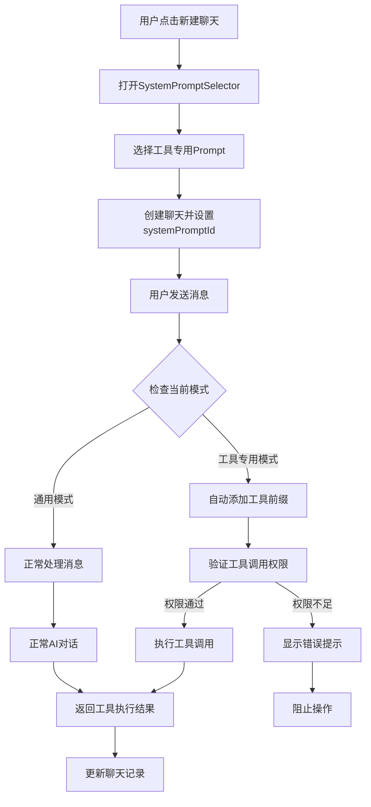
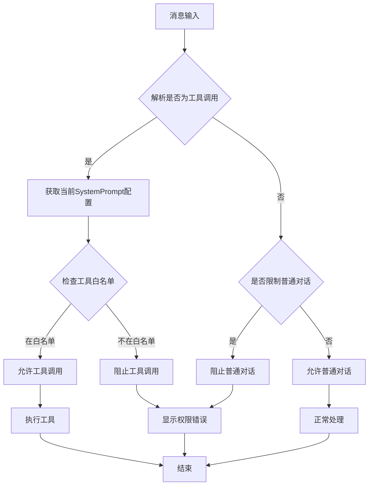

# System Prompt 增强功能改进计划

## 项目概述

本计划旨在围绕 System Prompt 对聊天应用进行全面功能增强，主要目标包括：

1. **强制选择 System Prompt**：新建聊天时必须选择系统提示
2. **弱化 Prompt 展示**：不再显示完整提示内容，只展示能力描述
3. **工具专用模式**：实现严格的单工具专用助手
4. **分组管理**：按工具类型对聊天进行分组管理

## 当前架构分析

### 现有组件结构
```
ChatSidebar
├── useChatManager (聊天管理)
├── SystemPromptService (系统提示服务)
├── ToolService (工具服务)
└── ChatService (聊天服务)
```

### 现有数据结构
```typescript
interface SystemPromptPreset {
  id: string;
  name: string;
  content: string;
}

interface ChatItem {
  id: string;
  title: string;
  messages: Message[];
  createdAt: number;
  systemPrompt?: string;
  pinned?: boolean;
  model?: string;
}
```

## 核心设计理念

### 严格模式原则
- **单一职责**：每个工具专用 prompt 只能执行一种工具操作
- **自动转换**：用户输入自动转换为对应的工具调用
- **权限限制**：严格阻止未授权的工具调用和普通对话
- **审计合规**：满足安全审计要求，限制 AI 对话能力

## 详细架构设计

### 1. 扩展数据结构

#### 新的 SystemPromptPreset 接口
```typescript
interface SystemPromptPreset {
  id: string;                    // 唯一标识
  name: string;                  // 显示名称
  content: string;               // 完整提示内容（隐藏）
  description: string;           // 能力描述（显示）
  category: string;              // 工具类别
  mode: 'general' | 'tool_specific'; // 模式类型
  
  // 工具专用模式字段
  autoToolPrefix?: string;       // 自动工具前缀 (如: "/read_file")
  allowedTools?: string[];       // 允许的工具列表（白名单）
  restrictConversation?: boolean; // 是否限制普通对话
}
```

#### 扩展 ChatItem 接口
```typescript
interface ChatItem {
  id: string;
  title: string;
  messages: Message[];
  createdAt: number;
  systemPrompt?: string;
  systemPromptId?: string;       // 新增：关联的系统提示ID
  toolCategory?: string;         // 新增：工具类别
  pinned?: boolean;
  model?: string;
}
```

### 2. 工具类别定义

```typescript
enum ToolCategory {
  GENERAL = 'general',           // 通用助手
  FILE_READER = 'file_reader',   // 文件读取专家
  FILE_CREATOR = 'file_creator', // 文件创建专家
  FILE_DELETER = 'file_deleter', // 文件删除专家
  COMMAND_EXECUTOR = 'command_executor', // 命令执行专家
  FILE_UPDATER = 'file_updater', // 文件更新专家
  FILE_SEARCHER = 'file_searcher' // 文件搜索专家
}
```

### 3. 预定义工具专用 Prompt 模板

```typescript
const TOOL_SPECIFIC_PROMPTS: SystemPromptPreset[] = [
  {
    id: 'general-assistant',
    name: '通用助手',
    content: '我是一个通用AI助手，可以帮助您解答问题、分析内容、提供建议等。',
    description: '支持多种对话和分析任务',
    category: ToolCategory.GENERAL,
    mode: 'general'
  },
  {
    id: 'file-reader',
    name: '文件读取专家',
    content: '我是文件读取专家，专门帮助您读取和分析文件内容。请告诉我您想要读取的文件路径。',
    description: '专门用于读取和分析文件内容',
    category: ToolCategory.FILE_READER,
    mode: 'tool_specific',
    autoToolPrefix: '/read_file',
    allowedTools: ['read_file'],
    restrictConversation: true
  },
  {
    id: 'file-creator',
    name: '文件创建专家',
    content: '我是文件创建专家，专门帮助您创建新文件。请告诉我文件路径和内容要求。',
    description: '专门用于创建新文件',
    category: ToolCategory.FILE_CREATOR,
    mode: 'tool_specific',
    autoToolPrefix: '/create_file',
    allowedTools: ['create_file'],
    restrictConversation: true
  },
  {
    id: 'command-executor',
    name: '命令执行专家',
    content: '我是命令执行专家，专门帮助您执行系统命令。请告诉我您需要执行的命令。',
    description: '专门用于执行系统命令',
    category: ToolCategory.COMMAND_EXECUTOR,
    mode: 'tool_specific',
    autoToolPrefix: '/execute_command',
    allowedTools: ['execute_command'],
    restrictConversation: true
  }
];
```

## 实现计划

### 阶段一：数据结构升级 (1-2天)

#### 1.1 更新类型定义
**文件：`src/types/chat.ts`**
- 扩展 `SystemPromptPreset` 接口
- 扩展 `ChatItem` 接口
- 添加 `ToolCategory` 枚举

#### 1.2 升级 SystemPromptService
**文件：`src/services/SystemPromptService.ts`**

新增方法：
```typescript
class SystemPromptService {
  // 获取预定义的工具专用模板
  getToolSpecificTemplates(): SystemPromptPreset[]
  
  // 按类别获取预设
  getPresetsByCategory(category: ToolCategory): SystemPromptPreset[]
  
  // 检查是否为工具专用模式
  isToolSpecificMode(presetId: string): boolean
  
  // 获取允许的工具列表
  getAllowedTools(presetId: string): string[]
  
  // 获取自动工具前缀
  getAutoToolPrefix(presetId: string): string | undefined
}
```

#### 1.3 数据迁移策略
```typescript
// 迁移现有数据到新结构
const migrateExistingData = () => {
  // 1. 为现有 SystemPromptPreset 添加默认字段
  // 2. 为现有 ChatItem 添加 systemPromptId 和 toolCategory
  // 3. 保持向后兼容性
};
```

### 阶段二：聊天创建流程改进 (2-3天)

#### 2.1 创建 SystemPromptSelector 组件
**文件：`src/components/SystemPromptSelector/index.tsx`**

```typescript
interface SystemPromptSelectorProps {
  open: boolean;
  onClose: () => void;
  onSelect: (presetId: string) => void;
}

const SystemPromptSelector: React.FC<SystemPromptSelectorProps> = ({
  open,
  onClose,
  onSelect
}) => {
  // 按类别分组显示预设
  // 只显示 description，隐藏 content
  // 支持搜索和筛选
};
```

#### 2.2 修改 ChatSidebar
**文件：`src/components/ChatSidebar/index.tsx`**

更新新建聊天逻辑：
```typescript
const handleNewChat = () => {
  // 打开系统提示选择弹窗，而不是直接创建聊天
  setIsSystemPromptSelectorOpen(true);
};

const handleSystemPromptSelect = (presetId: string) => {
  // 创建聊天并关联选中的系统提示
  const newChatId = addChat(undefined, presetId);
  selectChat(newChatId);
  setIsSystemPromptSelectorOpen(false);
};
```

#### 2.3 更新 useChatManager
**文件：`src/hooks/useChatManager.ts`**

修改 addChat 方法：
```typescript
const addChat = useCallback((
  firstUserMessageContent?: string,
  systemPromptId: string // 必需参数
): string => {
  const preset = systemPromptService.findPresetById(systemPromptId);
  if (!preset) {
    throw new Error('Invalid system prompt ID');
  }
  
  const newChat = chatService.createChatWithSystemPrompt(
    firstUserMessageContent,
    selectedModel,
    preset
  );
  
  // 设置工具类别
  newChat.toolCategory = preset.category;
  newChat.systemPromptId = systemPromptId;
  
  // ... 其余逻辑
}, [/* 依赖项 */]);
```

### 阶段三：严格模式工具控制 (3-4天)

#### 3.1 扩展 ToolService
**文件：`src/services/ToolService.ts`**

新增权限控制方法：
```typescript
class ToolService {
  // 检查工具调用权限
  checkToolPermission(
    toolName: string,
    systemPromptId: string
  ): boolean {
    const preset = systemPromptService.findPresetById(systemPromptId);
    if (!preset || preset.mode !== 'tool_specific') {
      return true; // 通用模式允许所有工具
    }
    
    return preset.allowedTools?.includes(toolName) || false;
  }
  
  // 自动添加工具前缀
  autoAddToolPrefix(
    message: string,
    systemPromptId: string
  ): string {
    const preset = systemPromptService.findPresetById(systemPromptId);
    if (preset?.mode === 'tool_specific' && preset.autoToolPrefix) {
      // 检查消息是否已经包含工具前缀
      if (!message.startsWith('/')) {
        return `${preset.autoToolPrefix} ${message}`;
      }
    }
    return message;
  }
  
  // 验证工具调用合规性
  validateToolCall(
    toolCall: ToolCallRequest,
    systemPromptId: string
  ): ValidationResult {
    const isAllowed = this.checkToolPermission(
      toolCall.tool_name,
      systemPromptId
    );
    
    return {
      isValid: isAllowed,
      errorMessage: isAllowed ? undefined : '当前模式不允许此工具调用'
    };
  }
}
```

#### 3.2 修改消息发送流程
**文件：`src/hooks/useMessages.ts`**

集成自动前缀和权限检查：
```typescript
const sendMessage = useCallback(async (content: string) => {
  // 1. 自动添加工具前缀（如果是工具专用模式）
  const processedContent = toolService.autoAddToolPrefix(
    content,
    currentChat?.systemPromptId || ''
  );
  
  // 2. 检查工具调用权限
  const toolCall = toolService.parseToolCallFormat(processedContent);
  if (toolCall) {
    const validation = toolService.validateToolCall(
      toolCall,
      currentChat?.systemPromptId || ''
    );
    
    if (!validation.isValid) {
      // 显示错误消息，阻止工具调用
      addAssistantMessage(validation.errorMessage || '工具调用被阻止');
      return;
    }
  }
  
  // 3. 继续正常的消息发送流程
  await originalSendMessage(processedContent);
}, [/* 依赖项 */]);
```

#### 3.3 实现对话限制机制
```typescript
// 在工具专用模式下限制普通对话
const validateConversation = (
  content: string,
  systemPromptId: string
): boolean => {
  const preset = systemPromptService.findPresetById(systemPromptId);
  
  if (preset?.restrictConversation) {
    // 检查是否为工具调用
    const isToolCall = toolService.parseToolCallFormat(content) !== null;
    if (!isToolCall) {
      return false; // 阻止普通对话
    }
  }
  
  return true;
};
```

### 阶段四：Sidebar 分组重构 (2-3天)

#### 4.1 更新分组工具函数
**文件：`src/utils/chatUtils.ts`**

```typescript
// 替换原有的 groupChatsByDate
export const groupChatsByToolCategory = (
  chats: ChatItem[]
): Record<string, ChatItem[]> => {
  const grouped: Record<string, ChatItem[]> = {};
  
  chats.forEach(chat => {
    const category = chat.toolCategory || 'general';
    if (!grouped[category]) {
      grouped[category] = [];
    }
    grouped[category].push(chat);
  });
  
  // 每个类别内部按时间排序
  Object.keys(grouped).forEach(category => {
    grouped[category].sort((a, b) => b.createdAt - a.createdAt);
  });
  
  return grouped;
};

// 获取类别显示信息
export const getCategoryDisplayInfo = (category: string) => {
  const categoryMap = {
    [ToolCategory.GENERAL]: {
      name: '通用助手',
      icon: '💬',
      description: '支持多种对话任务'
    },
    [ToolCategory.FILE_READER]: {
      name: '文件读取',
      icon: '📖',
      description: '专门读取分析文件'
    },
    [ToolCategory.FILE_CREATOR]: {
      name: '文件创建',
      icon: '📝',
      description: '专门创建新文件'
    },
    [ToolCategory.COMMAND_EXECUTOR]: {
      name: '命令执行',
      icon: '⚡',
      description: '专门执行系统命令'
    }
  };
  
  return categoryMap[category] || categoryMap[ToolCategory.GENERAL];
};
```

#### 4.2 重构 ChatSidebar 渲染逻辑
**文件：`src/components/ChatSidebar/index.tsx`**

```typescript
// 更新分组显示逻辑
const groupedChats = groupChatsByToolCategory(chats);

const renderChatGroups = () => {
  return Object.entries(groupedChats).map(([category, chatsInGroup]) => {
    const categoryInfo = getCategoryDisplayInfo(category);
    
    return (
      <div key={category} style={{ marginBottom: 16 }}>
        {/* 类别标题 */}
        <Flex align="center" gap="small" style={{ padding: '8px 12px' }}>
          <span style={{ fontSize: 16 }}>{categoryInfo.icon}</span>
          <Text strong>{categoryInfo.name}</Text>
          <Badge count={chatsInGroup.length} size="small" />
        </Flex>
        
        {/* 类别描述 */}
        <Text 
          type="secondary" 
          style={{ 
            fontSize: 12, 
            paddingLeft: 12,
            display: 'block',
            marginBottom: 8
          }}
        >
          {categoryInfo.description}
        </Text>
        
        {/* 聊天列表 */}
        <List
          itemLayout="horizontal"
          dataSource={chatsInGroup}
          split={false}
          renderItem={(chat) => (
            <ChatItem
              key={chat.id}
              chat={chat}
              isSelected={chat.id === currentChatId}
              onSelect={selectChat}
              onDelete={handleDelete}
              onPin={pinChat}
              onUnpin={unpinChat}
              onEdit={handleEditTitle}
              // ... 其他props
            />
          )}
        />
      </div>
    );
  });
};
```

### 阶段五：UI 优化和完善 (1-2天)

#### 5.1 弱化 Prompt 显示
- 在聊天界面完全隐藏 system prompt 内容
- 只在聊天顶部显示简短的能力描述
- 提供工具类别图标标识

#### 5.2 增强用户体验
- 为不同工具类别添加专用图标和颜色主题
- 优化分组的折叠/展开功能
- 添加工具使用提示和帮助信息

#### 5.3 错误处理和反馈
- 完善工具调用被阻止时的用户提示
- 添加权限说明和使用指南
- 优化错误消息的显示方式

## 技术实现流程图



## 权限控制流程图



## 数据迁移策略

### 迁移步骤
1. **备份现有数据**：保存当前的聊天记录和系统提示
2. **字段扩展**：为现有记录添加新字段的默认值
3. **预设初始化**：导入预定义的工具专用模板
4. **关联建立**：为现有聊天建立与系统提示的关联
5. **验证测试**：确保数据迁移的完整性和正确性

### 向后兼容性
- 保持现有API接口的兼容性
- 为缺失字段提供合理的默认值
- 支持渐进式迁移，允许新旧数据共存

## 测试策略

### 单元测试
- SystemPromptService 的新方法
- ToolService 的权限控制逻辑
- 数据迁移函数的正确性

### 集成测试
- 新建聊天流程的完整测试
- 工具调用权限验证
- Sidebar 分组显示功能

### 用户体验测试
- 不同工具专用模式的使用体验
- 权限限制的用户反馈
- 界面交互的流畅性

## 部署计划

### 渐进式发布
1. **阶段性发布**：按功能模块逐步发布
2. **灰度测试**：先在小范围用户中测试
3. **功能开关**：支持动态启用/禁用新功能
4. **回滚机制**：确保出现问题时能快速回滚

### 监控和维护
- 添加关键功能的监控指标
- 记录用户使用行为和错误日志
- 定期收集用户反馈并优化

## 风险评估和缓解

### 主要风险
1. **数据迁移风险**：可能导致现有数据丢失或损坏
2. **用户体验风险**：新流程可能增加用户操作复杂度
3. **性能风险**：权限检查可能影响响应速度

### 缓解措施
1. **完善的备份和测试机制**
2. **提供详细的用户引导和帮助文档**
3. **优化权限检查算法，使用缓存减少计算开销**

## 总结

这个 System Prompt 增强计划将显著提升应用的安全性和专业性，通过严格的工具专用模式满足审计要求，同时通过智能分组和优化的用户界面提升用户体验。整个实施过程预计需要 8-12 天，建议按阶段进行，确保每个阶段的稳定性后再进入下一阶段。