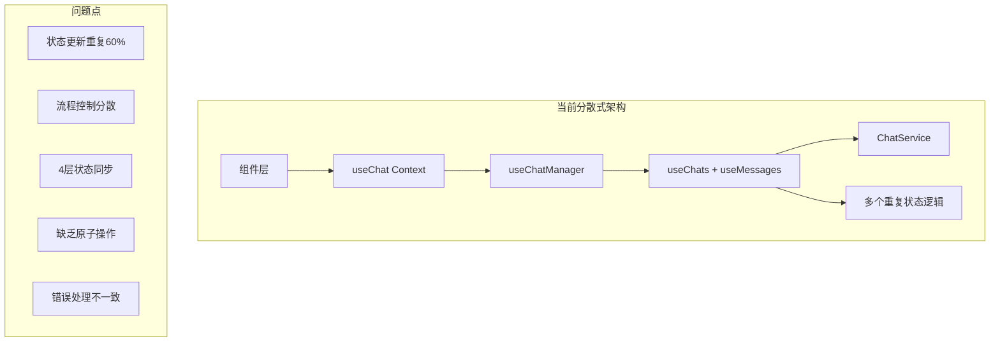
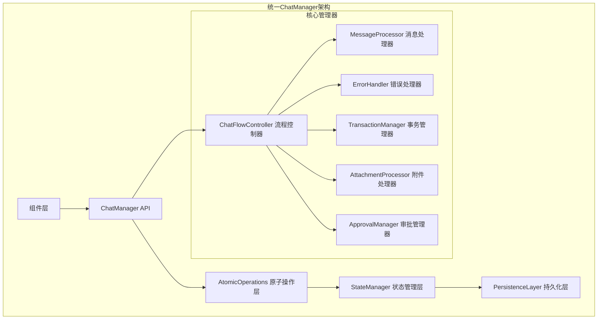
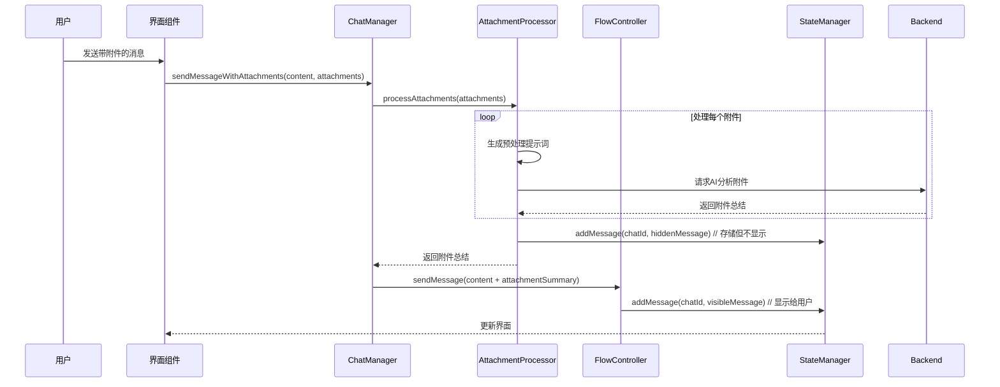
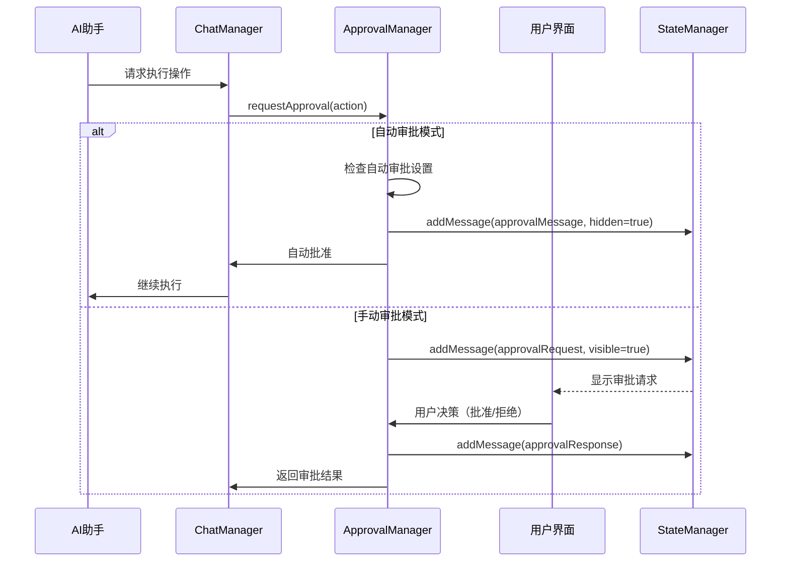
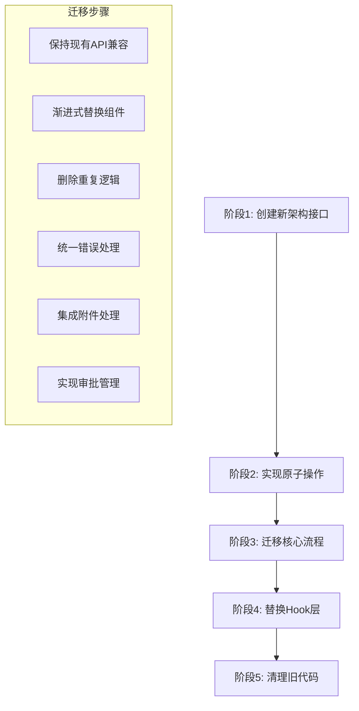

# 统一聊天流程控制架构设计方案

## 📋 项目概述

基于前端代码分析结果，设计统一的聊天流程控制架构，解决当前架构中状态更新逻辑重复、聊天流程控制分散、多层状态管理复杂等问题。

## 🎯 设计目标

1. **消除60%的状态更新逻辑重复** - 统一状态更新入口
2. **集中化聊天流程控制** - 统一ChatManager管理所有聊天操作
3. **简化多层状态管理架构** - 从4层减少到2层
4. **建立统一的原子操作接口** - 提供addChat、updateChat、addMessage等基础操作
5. **建立一致的错误处理机制** - 统一错误处理和重试策略
6. **支持前端控制架构转变** - 开发者可轻松使用原子功能控制流程

## 📊 现有架构问题分析

### 当前分散式架构



### 主要问题

1. **状态更新逻辑重复率达60%** - 在useMessages.ts、ChatService.ts等多处重复相同的状态更新模式
2. **聊天流程控制分散** - 消息处理逻辑散布在sendMessage、handleToolCall、initiateAIResponse等多个函数中
3. **多层状态管理架构复杂** - 服务层→Hooks层→上下文层→组件层，状态同步链路过长
4. **缺乏原子操作** - 没有统一的addChat、updateChat、addMessage、updateMessage等基础操作
5. **错误处理不一致** - 相似的错误处理模式遍布各个hooks

## 🏗️ 新架构设计方案

### 整体架构图



## 🔧 核心架构组件

### 1. ChatManager 统一管理器

```typescript
interface ChatManager {
  // 原子操作接口
  atomicOps: AtomicOperations;
  
  // 流程控制
  flowController: ChatFlowController;
  
  // 状态管理
  stateManager: StateManager;
  
  // 错误处理
  errorHandler: ErrorHandler;
  
  // 附件处理
  attachmentProcessor: AttachmentProcessor;
  
  // 审批管理
  approvalManager: ApprovalManager;
}
```

### 2. 原子操作接口设计


## 📝 详细接口定义

### 核心类型定义

```typescript
// 统一的结果类型
interface OperationResult<T> {
  success: boolean;
  data?: T;
  error?: string;
  errorCode?: string;
}

// 聊天操作选项
interface CreateChatOptions {
  title?: string;
  systemPrompt?: string;
  systemPromptId?: string;
  toolCategory?: string;
  model?: string;
  initialMessage?: string;
  autoApproval?: boolean; // 新增：自动审批设置
}

// 消息类型扩展
interface Message {
  role: "system" | "user" | "assistant";
  content: string;
  id?: string;
  processorUpdates?: string[];
  isHidden?: boolean; // 新增：控制消息是否在GUI中显示
  messageType?: 'normal' | 'attachment_processing' | 'approval_request' | 'approval_response'; // 新增：消息类型
  attachmentSummary?: string; // 新增：附件处理结果
  parentMessageId?: string; // 新增：关联关系
  metadata?: MessageMetadata; // 新增：元数据
}

// 消息元数据
interface MessageMetadata {
  attachments?: Attachment[];
  approvalRequired?: boolean;
  autoApproved?: boolean;
  processingSteps?: ProcessingStep[];
}

// 附件类型
interface Attachment {
  id: string;
  type: 'image' | 'file' | 'screenshot';
  url: string;
  name: string;
  size: number;
  mimeType: string;
}

// 审批动作类型
interface ApprovalAction {
  id: string;
  type: 'tool_execution' | 'file_operation' | 'system_change';
  description: string;
  details: any;
  riskLevel: 'low' | 'medium' | 'high';
}
```

### 附件处理流程



### 审批管理流程



### 原子操作接口实现

```typescript
class UnifiedChatManager implements ChatManager {
  private stateManager: StateManager;
  private flowController: ChatFlowController;
  private attachmentProcessor: AttachmentProcessor;
  private approvalManager: ApprovalManager;
  private errorHandler: ErrorHandler;

  // 聊天原子操作
  async addChat(options: CreateChatOptions): Promise<OperationResult<ChatItem>> {
    return this.transaction(async () => {
      const chat = this.createChatEntity(options);
      await this.stateManager.addChat(chat);
      await this.persistenceLayer.saveChat(chat);
      return { success: true, data: chat };
    });
  }

  async updateChat(chatId: string, updates: ChatUpdates): Promise<OperationResult<ChatItem>> {
    return this.transaction(async () => {
      const chat = await this.stateManager.getChat(chatId);
      if (!chat) throw new Error(`Chat ${chatId} not found`);
      
      const updatedChat = { ...chat, ...updates };
      await this.stateManager.updateChat(chatId, updatedChat);
      await this.persistenceLayer.saveChat(updatedChat);
      return { success: true, data: updatedChat };
    });
  }

  // 消息原子操作
  async addMessage(chatId: string, message: Message): Promise<OperationResult<Message>> {
    return this.transaction(async () => {
      const fullMessage = { 
        ...message, 
        id: message.id || generateId(),
        messageType: message.messageType || 'normal'
      };
      
      await this.stateManager.addMessage(chatId, fullMessage);
      await this.persistenceLayer.saveMessage(chatId, fullMessage);
      return { success: true, data: fullMessage };
    });
  }

  // 带附件的消息发送
  async sendMessageWithAttachments(
    chatId: string, 
    content: string, 
    attachments: Attachment[]
  ): Promise<OperationResult<MessageFlow>> {
    return this.transaction(async () => {
      // 1. 处理附件
      const attachmentResults = await this.attachmentProcessor.processAttachments(attachments);
      
      // 2. 存储隐藏的附件处理消息
      for (const result of attachmentResults) {
        await this.addMessage(chatId, {
          role: 'user',
          content: result.originalContent,
          isHidden: true,
          messageType: 'attachment_processing',
          attachmentSummary: result.summary,
          metadata: { attachments: [result.attachment] }
        });
      }
      
      // 3. 合并附件总结到主消息
      const enrichedContent = this.attachmentProcessor.mergeAttachmentSummaries(
        content, 
        attachmentResults
      );
      
      // 4. 发送主消息
      return this.flowController.sendMessage(chatId, enrichedContent);
    });
  }

  // 审批流程处理
  async handleApprovalFlow(
    chatId: string, 
    action: ApprovalAction
  ): Promise<OperationResult<ApprovalFlow>> {
    const chat = await this.stateManager.getChat(chatId);
    
    if (chat?.autoApproval) {
      // 自动审批模式
      await this.addMessage(chatId, {
        role: 'system',
        content: `自动批准操作: ${action.description}`,
        isHidden: true,
        messageType: 'approval_response',
        metadata: { autoApproved: true }
      });
      
      return { 
        success: true, 
        data: { approved: true, automatic: true } 
      };
    } else {
      // 手动审批模式
      await this.addMessage(chatId, {
        role: 'system',
        content: `请求批准操作: ${action.description}`,
        isHidden: false,
        messageType: 'approval_request',
        metadata: { approvalRequired: true }
      });
      
      return this.approvalManager.waitForUserApproval(chatId, action);
    }
  }

  // 事务管理
  private async transaction<T>(operation: () => Promise<T>): Promise<T> {
    const transactionId = generateId();
    try {
      await this.stateManager.beginTransaction(transactionId);
      const result = await operation();
      await this.stateManager.commitTransaction(transactionId);
      return result;
    } catch (error) {
      await this.stateManager.rollbackTransaction(transactionId);
      throw this.errorHandler.processError(error);
    }
  }
}
```

## 🔄 流程控制器设计

### 核心流程图


## 🎛️ 状态管理策略

### 统一状态管理器

```typescript
class UnifiedStateManager {
  private state: ChatState = {
    chats: new Map(),
    currentChatId: null,
    isProcessing: false,
    listeners: new Set(),
    transactions: new Map()
  };

  // 统一状态更新入口
  updateState(updates: StateUpdates): void {
    const newState = { ...this.state, ...updates };
    this.state = newState;
    this.notifyListeners(newState);
  }

  // 响应式状态订阅
  subscribe(listener: StateListener): Unsubscribe {
    this.listeners.add(listener);
    return () => this.listeners.delete(listener);
  }

  // 获取可见消息（过滤隐藏消息）
  getVisibleMessages(chatId: string): Message[] {
    const chat = this.getChat(chatId);
    return chat?.messages.filter(msg => !msg.isHidden) || [];
  }

  // 获取隐藏消息（用于调试或管理）
  getHiddenMessages(chatId: string): Message[] {
    const chat = this.getChat(chatId);
    return chat?.messages.filter(msg => msg.isHidden) || [];
  }

  // 原子化状态操作
  atomicUpdate<T>(operation: () => T): T {
    try {
      const result = operation();
      this.validateState();
      return result;
    } catch (error) {
      this.rollbackState();
      throw error;
    }
  }

  // 事务管理
  async beginTransaction(transactionId: string): Promise<void> {
    this.transactions.set(transactionId, {
      id: transactionId,
      snapshot: this.createSnapshot(),
      timestamp: Date.now()
    });
  }

  async commitTransaction(transactionId: string): Promise<void> {
    this.transactions.delete(transactionId);
  }

  async rollbackTransaction(transactionId: string): Promise<void> {
    const transaction = this.transactions.get(transactionId);
    if (transaction) {
      this.restoreSnapshot(transaction.snapshot);
      this.transactions.delete(transactionId);
    }
  }
}
```

## 🛠️ 迁移策略

### 渐进式迁移计划



### 详细迁移步骤

#### 第一阶段：核心架构实现（1-2周）
1. 创建 `UnifiedChatManager` 类
2. 实现原子操作接口
3. 设计状态管理器
4. 建立事务管理机制

#### 第二阶段：扩展功能实现（1-2周）
1. 实现 `AttachmentProcessor` 附件处理器
2. 实现 `ApprovalManager` 审批管理器
3. 集成消息类型系统
4. 建立隐藏消息机制

#### 第三阶段：流程控制器（1周）
1. 实现 `ChatFlowController`
2. 集成消息处理逻辑
3. 统一错误处理机制
4. 添加重试策略

#### 第四阶段：集成和测试（1周）
1. 替换现有Hook实现
2. 更新组件集成
3. 性能优化测试
4. 错误场景测试

#### 第五阶段：清理和优化（1周）
1. 删除重复代码
2. 优化性能
3. 完善文档
4. 代码审查

## 📋 使用示例和最佳实践

### 基本使用示例

```typescript
// 1. 创建新聊天
const chatResult = await chatManager.addChat({
  title: "技术讨论",
  systemPromptId: "tech-assistant",
  toolCategory: "development",
  autoApproval: false
});

// 2. 发送普通消息
const messageResult = await chatManager.sendMessage(
  chatResult.data.id,
  "请帮我分析这个代码问题"
);

// 3. 发送带附件的消息
const attachmentResult = await chatManager.sendMessageWithAttachments(
  chatResult.data.id,
  "请分析这个截图中的错误",
  [{ type: 'screenshot', url: 'data:image/png;base64,...' }]
);

// 4. 处理审批流程
const approvalResult = await chatManager.handleApprovalFlow(
  chatResult.data.id,
  {
    type: 'file_operation',
    description: '修改配置文件',
    riskLevel: 'medium'
  }
);
```

### 最佳实践指南

1. **使用事务处理复杂操作**
```typescript
await chatManager.transaction(async () => {
  await chatManager.addMessage(chatId, userMessage);
  await chatManager.processAttachments(attachments);
  await chatManager.initiateAIResponse(chatId);
});
```

2. **正确处理隐藏消息**
```typescript
// 添加附件处理消息（不在UI显示）
await chatManager.addMessage(chatId, {
  content: "附件分析结果",
  isHidden: true,
  messageType: 'attachment_processing'
});
```

3. **合理配置审批策略**
```typescript
// 高风险操作禁用自动审批
const chat = await chatManager.addChat({
  autoApproval: false, // 禁用自动审批
  toolCategory: "system_admin"
});
```

## 🎯 预期收益

### 架构改进

1. **减少60%重复代码** - 统一状态更新逻辑
2. **简化架构层次** - 从4层减少到2层
3. **提高开发效率** - 统一的原子操作接口
4. **增强错误处理** - 一致的错误恢复机制
5. **支持前端控制** - 开发者可轻松控制聊天流程

### 功能增强

1. **智能附件处理** - 自动分析附件并生成总结
2. **灵活审批机制** - 支持自动和手动审批模式
3. **隐藏消息管理** - 支持后台处理消息
4. **事务一致性** - 保证操作的原子性和一致性
5. **可扩展架构** - 易于添加新功能和集成

### 性能优化

1. **减少状态同步开销** - 简化状态传递链路
2. **优化消息存储** - 智能消息显示策略
3. **批量操作支持** - 提高大量操作的性能
4. **内存使用优化** - 更高效的状态管理

## 🔧 技术实现要点

### 错误处理策略

```typescript
class ErrorHandler {
  async processError(error: Error): Promise<never> {
    // 网络错误重试
    if (error instanceof NetworkError) {
      return this.retryWithBackoff(error);
    }
    
    // 存储错误回滚
    if (error instanceof StorageError) {
      return this.rollbackAndNotify(error);
    }
    
    // 其他错误直接抛出
    throw this.enrichError(error);
  }
  
  private async retryWithBackoff(error: NetworkError): Promise<never> {
    const maxRetries = 3;
    const baseDelay = 1000;
    
    for (let i = 0; i < maxRetries; i++) {
      await this.delay(baseDelay * Math.pow(2, i));
      try {
        return await error.retry();
      } catch (retryError) {
        if (i === maxRetries - 1) throw retryError;
      }
    }
  }
}
```

### 性能监控

```typescript
class PerformanceMonitor {
  trackOperation(operationName: string, duration: number): void {
    console.log(`[Performance] ${operationName}: ${duration}ms`);
    
    // 发送到监控系统
    this.sendMetrics({
      operation: operationName,
      duration,
      timestamp: Date.now()
    });
  }
  
  async withTracking<T>(operationName: string, operation: () => Promise<T>): Promise<T> {
    const start = performance.now();
    try {
      const result = await operation();
      this.trackOperation(operationName, performance.now() - start);
      return result;
    } catch (error) {
      this.trackOperation(`${operationName}_error`, performance.now() - start);
      throw error;
    }
  }
}
```

## 📚 总结

这个统一聊天流程控制架构设计解决了现有架构的核心问题，提供了：

1. **清晰的架构层次** - 明确的职责分离和接口定义
2. **完整的原子操作** - 涵盖所有聊天相关的基础操作
3. **智能流程处理** - 支持附件处理和审批管理
4. **强大的错误处理** - 事务管理和错误恢复机制
5. **可扩展的设计** - 易于添加新功能和优化

通过这个新架构，开发团队将获得更高的开发效率、更好的代码质量和更强的系统可维护性。