# Unified Chat Flow Control Architecture Design

## 📋 Project Overview

Based on frontend code analysis, design a unified chat flow control architecture to solve current issues including duplicate state update logic, scattered chat flow control, and complex multi-layer state management.

## 🎯 Design Goals

1. **Eliminate 60% state update logic duplication** - Unified state update entry point
2. **Centralize chat flow control** - Unified ChatManager manages all chat operations
3. **Simplify multi-layer state management architecture** - Reduce from 4 layers to 2 layers
4. **Establish unified atomic operation interfaces** - Provide basic operations like addChat, updateChat, addMessage
5. **Establish consistent error handling mechanism** - Unified error handling and retry strategies
6. **Support frontend control architecture transformation** - Developers can easily control chat flow using atomic functions

## 📊 Current Architecture Problem Analysis

### Current Decentralized Architecture


### Main Problems

1. **60% state update logic duplication** - Same state update patterns repeated in useMessages.ts, ChatService.ts, etc.
2. **Scattered chat flow control** - Message processing logic spread across sendMessage, handleToolCall, initiateAIResponse, etc.
3. **Complex multi-layer state management** - Service layer → Hooks layer → Context layer → Component layer, long state sync chain
4. **Lack of atomic operations** - No unified basic operations like addChat, updateChat, addMessage, updateMessage
5. **Inconsistent error handling** - Similar error handling patterns scattered across various hooks

## 🏗️ New Architecture Design

### Overall Architecture Diagram

```mermaid
graph TB
    subgraph "Unified ChatManager Architecture"
        A[Component Layer] --> B[ChatManager API]
        B --> C[AtomicOperations Layer]
        C --> D[StateManager Layer]
        D --> E[PersistenceLayer]

        subgraph "Core Managers"
            F[ChatFlowController]
            G[MessageProcessor]
            H[ErrorHandler]
            I[TransactionManager]
            J[AttachmentProcessor]
            K[ApprovalManager]
        end

        B --> F
        F --> G
        F --> H
        F --> I
        F --> J
        F --> K
    end
```



## 🔧 Core Architecture Components

### 1. ChatManager Unified Manager

```typescript
interface ChatManager {
  // Atomic operation interfaces
  atomicOps: AtomicOperations;

  // Flow control
  flowController: ChatFlowController;

  // State management
  stateManager: StateManager;

  // Error handling
  errorHandler: ErrorHandler;

  // Attachment processing
  attachmentProcessor: AttachmentProcessor;

  // Approval management
  approvalManager: ApprovalManager;
}
```

### 2. Atomic Operation Interface Design


## 📝 Detailed Interface Definitions

### Core Type Definitions

```typescript
// Unified result type
interface OperationResult<T> {
  success: boolean;
  data?: T;
  error?: string;
  errorCode?: string;
}

// Chat operation options
interface CreateChatOptions {
  title?: string;
  systemPrompt?: string;
  systemPromptId?: string;
  toolCategory?: string;
  model?: string;
  initialMessage?: string;
  autoApproval?: boolean; // New: Auto-approval setting
}

// Message type extension
interface Message {
  role: "system" | "user" | "assistant";
  content: string;
  id?: string;
  processorUpdates?: string[];
  isHidden?: boolean; // New: Control whether message displays in GUI
  messageType?: 'normal' | 'attachment_processing' | 'approval_request' | 'approval_response'; // New: Message type
  attachmentSummary?: string; // New: Attachment processing result
  parentMessageId?: string; // New: Relationship reference
  metadata?: MessageMetadata; // New: Metadata
}

// Message metadata
interface MessageMetadata {
  attachments?: Attachment[];
  approvalRequired?: boolean;
  autoApproved?: boolean;
  processingSteps?: ProcessingStep[];
}

// Attachment type
interface Attachment {
  id: string;
  type: 'image' | 'file' | 'screenshot';
  url: string;
  name: string;
  size: number;
  mimeType: string;
}

// Approval action type
interface ApprovalAction {
  id: string;
  type: 'tool_execution' | 'file_operation' | 'system_change';
  description: string;
  details: any;
  riskLevel: 'low' | 'medium' | 'high';
}
```

### Attachment Processing Flow


### Approval Management Flow


### Atomic Operation Interface Implementation

```typescript
class UnifiedChatManager implements ChatManager {
  private stateManager: StateManager;
  private flowController: ChatFlowController;
  private attachmentProcessor: AttachmentProcessor;
  private approvalManager: ApprovalManager;
  private errorHandler: ErrorHandler;

  // Chat atomic operations
  async addChat(options: CreateChatOptions): Promise<OperationResult<ChatItem>> {
    return this.transaction(async () => {
      const chat = this.createChatEntity(options);
      await this.stateManager.addChat(chat);
      await this.persistenceLayer.saveChat(chat);
      return { success: true, data: chat };
    });
  }

  async updateChat(chatId: string, updates: ChatUpdates): Promise<OperationResult<ChatItem>> {
    return this.transaction(async () => {
      const chat = await this.stateManager.getChat(chatId);
      if (!chat) throw new Error(`Chat ${chatId} not found`);

      const updatedChat = { ...chat, ...updates };
      await this.stateManager.updateChat(chatId, updatedChat);
      await this.persistenceLayer.saveChat(updatedChat);
      return { success: true, data: updatedChat };
    });
  }

  // Message atomic operations
  async addMessage(chatId: string, message: Message): Promise<OperationResult<Message>> {
    return this.transaction(async () => {
      const fullMessage = {
        ...message,
        id: message.id || generateId(),
        messageType: message.messageType || 'normal'
      };

      await this.stateManager.addMessage(chatId, fullMessage);
      await this.persistenceLayer.saveMessage(chatId, fullMessage);
      return { success: true, data: fullMessage };
    });
  }

  // Send message with attachments
  async sendMessageWithAttachments(
    chatId: string,
    content: string,
    attachments: Attachment[]
  ): Promise<OperationResult<MessageFlow>> {
    return this.transaction(async () => {
      // 1. Process attachments
      const attachmentResults = await this.attachmentProcessor.processAttachments(attachments);

      // 2. Store hidden attachment processing messages
      for (const result of attachmentResults) {
        await this.addMessage(chatId, {
          role: 'user',
          content: result.originalContent,
          isHidden: true,
          messageType: 'attachment_processing',
          attachmentSummary: result.summary,
          metadata: { attachments: [result.attachment] }
        });
      }

      // 3. Merge attachment summaries into main message
      const enrichedContent = this.attachmentProcessor.mergeAttachmentSummaries(
        content,
        attachmentResults
      );

      // 4. Send main message
      return this.flowController.sendMessage(chatId, enrichedContent);
    });
  }

  // Approval flow processing
  async handleApprovalFlow(
    chatId: string,
    action: ApprovalAction
  ): Promise<OperationResult<ApprovalFlow>> {
    const chat = await this.stateManager.getChat(chatId);

    if (chat?.autoApproval) {
      // Auto-approval mode
      await this.addMessage(chatId, {
        role: 'system',
        content: `Auto-approved operation: ${action.description}`,
        isHidden: true,
        messageType: 'approval_response',
        metadata: { autoApproved: true }
      });

      return {
        success: true,
        data: { approved: true, automatic: true }
      };
    } else {
      // Manual approval mode
      await this.addMessage(chatId, {
        role: 'system',
        content: `Request approval for operation: ${action.description}`,
        isHidden: false,
        messageType: 'approval_request',
        metadata: { approvalRequired: true }
      });

      return this.approvalManager.waitForUserApproval(chatId, action);
    }
  }

  // Transaction management
  private async transaction<T>(operation: () => Promise<T>): Promise<T> {
    const transactionId = generateId();
    try {
      await this.stateManager.beginTransaction(transactionId);
      const result = await operation();
      await this.stateManager.commitTransaction(transactionId);
      return result;
    } catch (error) {
      await this.stateManager.rollbackTransaction(transactionId);
      throw this.errorHandler.processError(error);
    }
  }
}
```

## 🔄 Flow Controller Design

### Core Flow Diagram


## 🎛️ State Management Strategy

### Unified State Manager

```typescript
class UnifiedStateManager {
  private state: ChatState = {
    chats: new Map(),
    currentChatId: null,
    isProcessing: false,
    listeners: new Set(),
    transactions: new Map()
  };

  // Unified state update entry
  updateState(updates: StateUpdates): void {
    const newState = { ...this.state, ...updates };
    this.state = newState;
    this.notifyListeners(newState);
  }

  // Reactive state subscription
  subscribe(listener: StateListener): Unsubscribe {
    this.listeners.add(listener);
    return () => this.listeners.delete(listener);
  }

  // Get visible messages (filter hidden messages)
  getVisibleMessages(chatId: string): Message[] {
    const chat = this.getChat(chatId);
    return chat?.messages.filter(msg => !msg.isHidden) || [];
  }

  // Get hidden messages (for debugging or management)
  getHiddenMessages(chatId: string): Message[] {
    const chat = this.getChat(chatId);
    return chat?.messages.filter(msg => msg.isHidden) || [];
  }

  // Atomic state operations
  atomicUpdate<T>(operation: () => T): T {
    try {
      const result = operation();
      this.validateState();
      return result;
    } catch (error) {
      this.rollbackState();
      throw error;
    }
  }

  // Transaction management
  async beginTransaction(transactionId: string): Promise<void> {
    this.transactions.set(transactionId, {
      id: transactionId,
      snapshot: this.createSnapshot(),
      timestamp: Date.now()
    });
  }

  async commitTransaction(transactionId: string): Promise<void> {
    this.transactions.delete(transactionId);
  }

  async rollbackTransaction(transactionId: string): Promise<void> {
    const transaction = this.transactions.get(transactionId);
    if (transaction) {
      this.restoreSnapshot(transaction.snapshot);
      this.transactions.delete(transactionId);
    }
  }
}
```

## 🛠️ Migration Strategy

### Gradual Migration Plan


### Detailed Migration Steps

#### Phase 1: Core Architecture Implementation (1-2 weeks)
1. Create `UnifiedChatManager` class
2. Implement atomic operation interfaces
3. Design state manager
4. Establish transaction management mechanism

#### Phase 2: Extended Functionality Implementation (1-2 weeks)
1. Implement `AttachmentProcessor` attachment processor
2. Implement `ApprovalManager` approval manager
3. Integrate message type system
4. Establish hidden message mechanism

#### Phase 3: Flow Controller (1 week)
1. Implement `ChatFlowController`
2. Integrate message processing logic
3. Unified error handling mechanism
4. Add retry strategies

#### Phase 4: Integration and Testing (1 week)
1. Replace existing Hook implementations
2. Update component integration
3. Performance optimization testing
4. Error scenario testing

#### Phase 5: Cleanup and Optimization (1 week)
1. Remove duplicate code
2. Optimize performance
3. Complete documentation
4. Code review

## 📋 Usage Examples and Best Practices

### Basic Usage Example

```typescript
// 1. Create new chat
const chatResult = await chatManager.addChat({
  title: "Technical Discussion",
  systemPromptId: "tech-assistant",
  toolCategory: "development",
  autoApproval: false
});

// 2. Send regular message
const messageResult = await chatManager.sendMessage(
  chatResult.data.id,
  "Please help me analyze this code issue"
);

// 3. Send message with attachments
const attachmentResult = await chatManager.sendMessageWithAttachments(
  chatResult.data.id,
  "Please analyze the error in this screenshot",
  [{ type: 'screenshot', url: 'data:image/png;base64,...' }]
);

// 4. Handle approval flow
const approvalResult = await chatManager.handleApprovalFlow(
  chatResult.data.id,
  {
    type: 'file_operation',
    description: 'Modify configuration file',
    riskLevel: 'medium'
  }
);
```

### Best Practices Guide

1. **Use transactions for complex operations**
```typescript
await chatManager.transaction(async () => {
  await chatManager.addMessage(chatId, userMessage);
  await chatManager.processAttachments(attachments);
  await chatManager.initiateAIResponse(chatId);
});
```

2. **Correctly handle hidden messages**
```typescript
// Add attachment processing message (not displayed in UI)
await chatManager.addMessage(chatId, {
  content: "Attachment analysis result",
  isHidden: true,
  messageType: 'attachment_processing'
});
```

3. **Reasonably configure approval strategies**
```typescript
// Disable auto-approval for high-risk operations
const chat = await chatManager.addChat({
  autoApproval: false, // Disable auto-approval
  toolCategory: "system_admin"
});
```

## 🎯 Expected Benefits

### Architecture Improvements

1. **Reduce 60% duplicate code** - Unified state update logic
2. **Simplify architecture layers** - Reduce from 4 layers to 2 layers
3. **Improve development efficiency** - Unified atomic operation interfaces
4. **Enhanced error handling** - Consistent error recovery mechanism
5. **Support frontend control** - Developers can easily control chat flow

### Feature Enhancements

1. **Smart attachment processing** - Automatically analyze attachments and generate summaries
2. **Flexible approval mechanism** - Support auto and manual approval modes
3. **Hidden message management** - Support background processing messages
4. **Transaction consistency** - Ensure atomicity and consistency of operations
5. **Extensible architecture** - Easy to add new features and integrations

### Performance Optimization

1. **Reduce state sync overhead** - Simplify state passing chain
2. **Optimize message storage** - Smart message display strategy
3. **Batch operation support** - Improve performance of large-scale operations
4. **Memory usage optimization** - More efficient state management

## 🔧 Technical Implementation Points

### Error Handling Strategy

```typescript
class ErrorHandler {
  async processError(error: Error): Promise<never> {
    // Network error retry
    if (error instanceof NetworkError) {
      return this.retryWithBackoff(error);
    }

    // Storage error rollback
    if (error instanceof StorageError) {
      return this.rollbackAndNotify(error);
    }

    // Other errors throw directly
    throw this.enrichError(error);
  }

  private async retryWithBackoff(error: NetworkError): Promise<never> {
    const maxRetries = 3;
    const baseDelay = 1000;

    for (let i = 0; i < maxRetries; i++) {
      await this.delay(baseDelay * Math.pow(2, i));
      try {
        return await error.retry();
      } catch (retryError) {
        if (i === maxRetries - 1) throw retryError;
      }
    }
  }
}
```

### Performance Monitoring

```typescript
class PerformanceMonitor {
  trackOperation(operationName: string, duration: number): void {
    console.log(`[Performance] ${operationName}: ${duration}ms`);

    // Send to monitoring system
    this.sendMetrics({
      operation: operationName,
      duration,
      timestamp: Date.now()
    });
  }

  async withTracking<T>(operationName: string, operation: () => Promise<T>): Promise<T> {
    const start = performance.now();
    try {
      const result = await operation();
      this.trackOperation(operationName, performance.now() - start);
      return result;
    } catch (error) {
      this.trackOperation(`${operationName}_error`, performance.now() - start);
      throw error;
    }
  }
}
```

## 📚 Summary

This unified chat flow control architecture design solves the core problems of the existing architecture, providing:

1. **Clear architecture layers** - Clear separation of responsibilities and interface definitions
2. **Complete atomic operations** - Cover all chat-related basic operations
3. **Smart flow processing** - Support attachment processing and approval management
4. **Powerful error handling** - Transaction management and error recovery mechanism
5. **Extensible design** - Easy to add new features and optimizations

Through this new architecture, the development team will achieve higher development efficiency, better code quality, and stronger system maintainability.