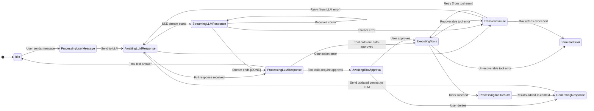

# Context Manager FSM Plan

## 1. Overview

This document proposes a Finite State Machine (FSM) to manage the lifecycle of a `ChatContext` within the `context_manager` crate. Introducing an FSM will bring robustness, predictability, and clarity to the complex flow of a conversation, especially when dealing with asynchronous operations like LLM calls and tool executions.

This plan is based on the existing architecture and aims to formalize the state management, including support for streaming LLM responses.

## 2. FSM States

The `ContextState` enum will represent the various states a chat session can be in.

-   **`Idle`**: The default state. The context is waiting for user input.
-   **`ProcessingUserMessage`**: The system has received a new user message and is preparing it to be sent to the LLM.
-   **`AwaitingLLMResponse`**: The context has been sent to the LLM, and the system is waiting for a response. This state initiates the connection.
-   **`StreamingLLMResponse`**: The system is actively receiving and processing a stream of response chunks (SSE) from the LLM.
-   **`ProcessingLLMResponse`**: The LLM response (either full or streamed) is complete, and the system is processing the final output (e.g., for tool calls).
-   **`AwaitingToolApproval`**: The LLM has requested to use tools that require user approval.
-   **`ExecutingTools`**: The system is executing approved tool calls.
-   **`ProcessingToolResults`**: Tool executions have finished, and the system is processing their results.
-   **`GeneratingResponse`**: The system is preparing a new request to the LLM after a tool call or generating a final answer.
-   **`TransientFailure`**: A recoverable error occurred (e.g., network issue).
-   **`Failed`**: An unrecoverable error occurred. This is a terminal state.

## 3. State Transition Diagram

## 4. Implementation Details

-   The `ContextState` enum will be updated in the `context_manager` crate to include `StreamingLLMResponse`.
-   The `ChatContext` struct will hold the current `ContextState`.
-   A `handle_event` method on `ChatContext` will manage state transitions.

## 5. Streaming with `reqwest-sse`

To handle streaming responses, we will integrate the `reqwest-sse` crate.

-   **Transition to Streaming**: When the `AwaitingLLMResponse` state receives a successful HTTP response that indicates an SSE stream, it will transition to `StreamingLLMResponse`.
-   **Event Consumption**: In the `StreamingLLMResponse` state, the FSM will use `response.events()` from `reqwest-sse` to consume the stream.
-   **Processing Chunks**: For each event received from the stream:
    -   The FSM will parse the event data (a JSON chunk).
    -   It will incrementally append the content from the chunk to the assistant's message within the `ChatContext`.
    -   The UI will be notified of the update to provide a real-time typing effect.
-   **Stream Completion**: When the stream sends a `[DONE]` message or closes, the FSM will transition from `StreamingLLMResponse` to `ProcessingLLMResponse` to finalize the message and check for tool calls.
-   **Error Handling**: Any errors during the stream will cause a transition to `TransientFailure`, allowing for potential retries.