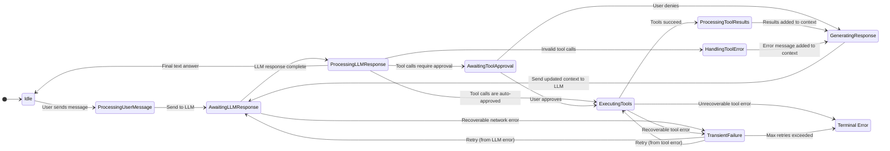

# Architecture Plan: `context_manager` State Machine (v6 - Final)

## 1. Vision &amp; Goal

This document proposes the integration of a formal Finite State Machine (FSM) into the `context_manager` crate. The FSM will explicitly manage the conversation lifecycle, ensuring robustness across tool-calling, streaming, error handling, auto-approval, and retry scenarios.

**Goal**: To create a resilient, predictable, and flexible system by making the conversation state explicit and unifying the handling of all LLM response types and tool execution policies.

## 2. Data Structure Enhancements

### 2.1. `ChatContext` State

```rust
// In crates/context_manager/src/structs/context.rs
pub enum ContextState {
    Idle,
    ProcessingUserMessage,
    AwaitingLLMResponse,
    ProcessingLLMResponse,
    AwaitingToolApproval,
    ExecutingTools,
    ProcessingToolResults,
    HandlingToolError { tool_name: String, error: String },
    GeneratingResponse,
    TransientFailure { error: String, retry_count: u8 },
    Failed { error: String },
}
```

### 2.2. Tool Definition &amp; Arguments

To support configurable tool approval and more ergonomic argument handling, we will enhance the core tool-related structs.

```rust
// In crates/context_manager/src/structs/tool.rs
// This struct is what the LLM responds with.
pub struct ToolCallRequest {
    pub id: String,
    pub tool_name: String,
    // This now uses the more flexible ToolArguments enum.
    pub arguments: ToolArguments,
    pub approval_status: ApprovalStatus,
}

// In crates/tool_system/src/types.rs
/// A flexible enum for tool arguments, making simple tools easier to define and call.
#[derive(Serialize, Deserialize, Clone, Debug)]
#[serde(untagged)]
pub enum ToolArguments {
    /// A single, unnamed string argument.
    String(String),
    /// A list of unnamed string arguments.
    StringList(Vec<String>),
    /// A complex, structured set of named arguments.
    Json(serde_json::Value),
}

pub struct ToolDefinition {
    // ... existing fields like name, description, parameters ...
    #[serde(default = "default_requires_approval")]
    pub requires_approval: bool,
}
```

## 3. Conversation Lifecycle FSM Design

The FSM is updated to distinguish between transient and terminal failures and to handle auto-approval.

### 3.1. State Machine Diagram



## 4. `tool_system` Crate Refactoring Plan

### 4.1. Unified `Tool` Trait

The `Tool` trait will be updated to use the new `ToolArguments` enum, improving developer ergonomics.

```rust
// In crates/tool_system/src/lib.rs
use async_trait::async_trait;
use crate::types::{ToolDefinition, ToolArguments, ToolError};

#[async_trait]
pub trait Tool: Send + Sync {
    /// Returns the tool's static definition.
    fn definition(&self) -> ToolDefinition;

    /// Executes the tool with the given arguments.
    async fn execute(&self, args: ToolArguments) -> Result<serde_json::Value, ToolError>;
}
```
A simple tool can now be implemented cleanly:
```rust
async fn execute(&self, args: ToolArguments) -> Result<serde_json::Value, ToolError> {
    if let ToolArguments::String(path) = args {
        // ... logic for single string argument ...
        Ok(serde_json::json!({"status": "ok"}))
    } else {
        Err(ToolError::InvalidArguments)
    }
}
```

### 4.2. Central `ToolRegistry` & Stateless `ToolExecutor`

The `ToolRegistry` and `ToolExecutor` will be implemented as previously described, forming the core of the decoupled tool execution engine. The `ToolExecutor` will now pass the `ToolArguments` enum directly to the tool's `execute` method.

## 5. Error Handling & Retry Strategy

This section remains a critical part of the design, distinguishing between `TransientFailure` (with retries) and the terminal `Failed` state.