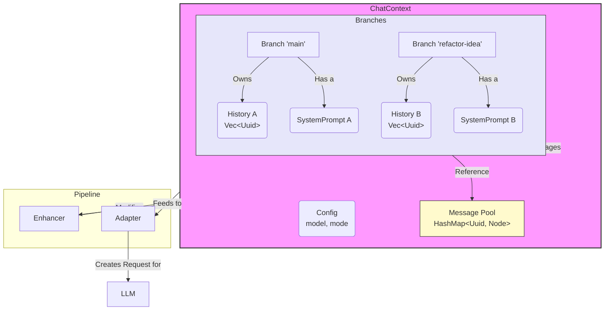

# `context_manager` Crate: The Definitive Architecture

## 1. Vision &amp; Core Principles

The `context_manager` crate provides a robust, performant, and logically sound system for managing complex, multi-turn, and multi-branch conversations with LLMs.

**Core Principles:**

*   **Context is King**: The `ChatContext` is the central, self-contained unit of conversation.
*   **Performance by Design**: Data structures are chosen to favor fast, predictable access patterns over complex traversals.
*   **Explicit is Better than Implicit**: Key concepts like tool calls, branches, and system prompts are first-class citizens in the data model, not emergent behaviors.
*   **Clear Ownership**: The architecture delineates clear ownership of data (e.g., `ChatContext` owns all message data; `Branch` owns its history sequence).

## 2. Architecture Overview



## 3. The Core: `ChatContext` and `Branch`

The architecture is built upon two primary structs: `ChatContext`, which holds the state of an entire conversation, and `Branch`, which represents a single, coherent line of dialogue within that conversation.

### 3.1. Data Structures

```rust
use uuid::Uuid;
use std::collections::HashMap;

// --- Core Context and Branch Structures ---

/// Represents a complete conversational session. Can be a top-level chat or a sub-context.
#[derive(Serialize, Deserialize, Clone, Debug)]
pub struct ChatContext {
    pub id: Uuid,
    pub parent_id: Option<Uuid>,
    pub config: ChatConfig,
    
    /// The single source of truth for all message data in this context.
    /// Provides O(1) lookup performance for any message by its ID.
    pub message_pool: HashMap<Uuid, MessageNode>,
    
    /// Manages all distinct lines of conversation within this context.
    pub branches: HashMap<String, Branch>,
    
    pub active_branch_name: String,
}

/// Represents a single, coherent line of conversation with its own "personality".
#[derive(Serialize, Deserialize, Clone, Debug)]
pub struct Branch {
    pub name: String,
    
    /// An ordered list of message IDs defining the history of this branch.
    /// This provides a performant, explicit representation of the conversation flow.
    pub message_ids: Vec<Uuid>,
    
    /// The specific system prompt that defines the behavior of this branch.
    pub system_prompt: Option<SystemPrompt>,
    
    /// An additional, user-provided prompt for this branch.
    pub user_prompt: Option<String>,
}

/// The configuration for a ChatContext.
#[derive(Serialize, Deserialize, Clone, Debug)]
pub struct ChatConfig {
    pub model_id: String,
    pub mode: String, // e.g., "planning", "coding", "tool-use"
    pub parameters: HashMap<String, serde_json::Value>, // e.g., temperature
}

/// A specific system prompt definition.
#[derive(Serialize, Deserialize, Clone, Debug)]
pub struct SystemPrompt {
    pub id: String,
    pub content: String,
}
```

### 3.2. Design Rationale

*   **Performance**: By storing all `MessageNode`s in a central `message_pool` and having `Branch` hold an ordered `Vec<Uuid>`, we eliminate costly linked-list traversals. Building a branch's history is a fast, linear scan over the `message_ids` vector with O(1) lookups into the pool.
*   **Clarity**: The data model is explicit. A `Branch` *is* its history (`message_ids`). There is no ambiguity.
*   **Flexibility**: Each `Branch` can have its own `SystemPrompt`, allowing a single `ChatContext` to explore multiple conversational directions with different core instructions simultaneously.

## 4. The Atom: `InternalMessage` and Tool Call Lifecycle

`InternalMessage` is the fundamental unit of communication. Its design is optimized to make tool usage a transparent, trackable, first-class operation.

### 4.1. Data Structures

```rust
// --- Message and Tool Call Structures ---

/// A node in the message graph, stored in the message_pool.
#[derive(Serialize, Deserialize, Clone, Debug)]
pub struct MessageNode {
    pub id: Uuid,
    pub message: InternalMessage,
    pub parent_id: Option<Uuid>, // Retained for structural integrity and visualization
}

/// The unified internal message structure.
#[derive(Serialize, Deserialize, Clone, Debug)]
pub struct InternalMessage {
    pub role: Role,
    pub content: Vec<ContentPart>,
    
    /// If present, indicates this Assistant message is requesting tool calls.
    #[serde(skip_serializing_if = "Option::is_none")]
    pub tool_calls: Option<Vec<ToolCallRequest>>,
    
    /// If present, indicates this Tool message is the result of a tool call.
    #[serde(skip_serializing_if = "Option::is_none")]
    pub tool_result: Option<ToolCallResult>,
    
    pub metadata: Option<MessageMetadata>,
}

/// A request from the Assistant to call a single tool.
#[derive(Serialize, Deserialize, Clone, Debug, PartialEq)]
pub struct ToolCallRequest {
    pub id: String, // Unique ID for this specific call
    pub tool_name: String,
    pub arguments: serde_json::Value,
    pub approval_status: ApprovalStatus,
}

/// The result of a single tool call execution.
#[derive(Serialize, Deserialize, Clone, Debug, PartialEq)]
pub struct ToolCallResult {
    pub request_id: String, // Corresponds to ToolCallRequest.id
    pub result: serde_json::Value,
}

/// The lifecycle status of a tool call request.
#[derive(Serialize, Deserialize, Clone, Debug, PartialEq)]
pub enum ApprovalStatus {
    Pending,
    Approved,
    Denied,
}

// --- Other supporting enums and structs (Role, ContentPart, etc.) remain as previously defined ---
```

### 4.3. Detailed Tool Invocation Workflow

To clarify how the data structures support the tool call process, here is a step-by-step breakdown of a typical tool invocation sequence.

#### Sequence Diagram

```mermaid
sequenceDiagram
    participant User
    participant App_UI as Application/UI
    participant ChatManager
    participant LLM
    participant ToolExecutor

    User->>+App_UI: Sends a message (e.g., "What's the weather in London?")
    App_UI->>+ChatManager: Adds User message to active branch
    ChatManager->>+LLM: Sends current context (including tool definitions)
    LLM-->>-ChatManager: Returns Assistant message with `tool_calls` (status: Pending)
    ChatManager-->>-App_UI: Stores message, updates UI to show pending tool call
    
    alt Approval Required
        App_UI->>+User: Displays tool call for approval
        User->>+App_UI: Clicks "Approve"
        App_UI->>+ChatManager: Updates `approval_status` to `Approved` in the Assistant message
    end

    ChatManager->>+ToolExecutor: Executes `Approved` tool calls
    ToolExecutor-->>-ChatManager: Returns result for each call

    loop For each result
        ChatManager->>ChatManager: Creates a new `Tool` message with `ToolCallResult`
        ChatManager->>ChatManager: Appends new `Tool` message to active branch
    end
    
    ChatManager-->>-App_UI: Updates UI with tool result message(s)
    
    opt Continue Conversation
        ChatManager->>+LLM: Sends updated context (now including tool results)
        LLM-->>-ChatManager: Returns final Assistant response (e.g., "The weather is...")
        ChatManager-->>-App_UI: Displays final response
    end
```

#### Step-by-Step Explanation

1.  **User Action**: The user sends a message that implies a tool is needed.
2.  **Initial LLM Call**: The `ChatManager` sends the conversation history, including available tool definitions (added by an `Enhancer`), to the LLM.
3.  **Tool Request**: The LLM determines a tool is needed and responds with an `Assistant` message. This message's `tool_calls` field contains a list of `ToolCallRequest` structs, each with `approval_status: Pending`.
4.  **Approval Flow**:
    *   The `ChatManager` adds this `Assistant` message to the history.
    *   The UI observes the `tool_calls` field and the `Pending` status, and renders an approval request to the user.
    *   The user approves (or denies) the request.
    *   The UI informs the `ChatManager`, which **mutates the existing `Assistant` message in the `message_pool`**, changing the `approval_status` to `Approved`. This is a critical step: we are updating the state of the request, not creating a new message.
5.  **Execution**: The `ChatManager` (or a dedicated `ToolExecutor` service) identifies the message with `Approved` tool calls and executes them.
6.  **Result Generation**: For each successfully executed tool, the `ToolExecutor` returns a result. The `ChatManager` then creates a **new** `InternalMessage` with `role: Tool`. The `tool_result` field of this message is populated with a `ToolCallResult` struct, linking it back to the original `ToolCallRequest` via the `request_id`.
7.  **History Update**: This new `Tool` message is added to the `message_pool` and its ID is appended to the active branch's `message_ids` vector.
8.  **Final Response**: The `ChatManager` sends the updated context—now including the `Tool` message(s) with the results—back to the LLM. The LLM uses this information to formulate a natural language response to the user (e.g., "The weather in London is 15°C and cloudy."). This final response is a standard `Assistant` message with no tool calls.

This explicit, stateful process ensures that every step of the tool interaction is captured, auditable, and robust.

### 4.2. Tool Call Workflow

1.  **Request**: The LLM, as `Assistant`, issues an `InternalMessage` with one or more `ToolCallRequest`s in its `tool_calls` field. `approval_status` is `Pending`.
2.  **Approval**: The system intercepts this message and updates the `approval_status` of each `ToolCallRequest` based on user interaction.
3.  **Execution**: The system executes all `Approved` requests.
4.  **Response**: For each executed call, a *new* `InternalMessage` with `role: Tool` is created. Its `tool_result` field contains the outcome, linked by `request_id`. These new messages are appended to the active branch.

## 5. Processing Pipeline: `Enhancer` and `Adapter`

The pipeline components operate on the `ChatContext` to prepare it for the LLM.

*   **`Enhancer`**: A trait that modifies the `ChatContext` in-place. It can inject context, trim history, or add tool definitions, using the rich information from the `ChatContext` and active `Branch` to make intelligent decisions.
*   **`Adapter`**: A trait that transforms the final, enhanced `ChatContext` into a provider-specific, type-safe request body. It uses an associated type (`type RequestBody: Serialize`) to ensure compile-time correctness.

```rust
// --- Adapter Trait ---
pub trait Adapter {
    type RequestBody: Serialize;

    /// Transforms the complete context into a provider-specific request struct.
    fn adapt(&self, context: &ChatContext) -> Result<Self::RequestBody, String>;
}
```

## 6. Hierarchical Contexts & Sub-Tasks

The `parent_id` in `ChatContext` enables powerful sub-task execution:

1.  **Creation**: A main context can spawn a child `ChatContext` for a complex, isolated task (e.g., "research this API"). The child's `parent_id` points to the main context.
2.  **Execution**: The child context runs its own independent conversation, potentially with a different model, mode, or system prompt.
3.  **Summarization & Return**: Once the task is complete, the child context's history is summarized into a single, concise `InternalMessage`. This summary message is then appended to the parent context's active branch.
4.  **Termination**: The child context is destroyed.

This keeps the main conversation history clean and focused, while allowing for arbitrarily complex sub-routines.