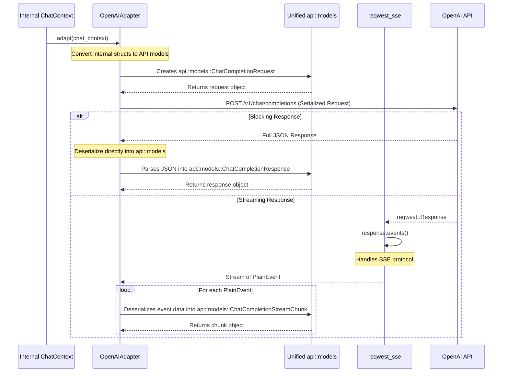

> **Note:** This document is a historical design plan. While it provides valuable context for the design decisions, the canonical and up-to-date description of the current system architecture can be found in `.kilocode/rules/memory-bank/architecture.md`.

# Copilot Client Model Refactoring Plan

## 1. Introduction

The `copilot_client` crate currently suffers from redundant and inconsistent data models for handling OpenAI API requests and responses. Models are scattered across `src/adapters/openai_adapter.rs` (for request serialization), `src/model/block_model.rs` (for block response deserialization), and `src/model/stream_model.rs` (for stream response deserialization and general-purpose messages).

This separation leads to:
- **Code Duplication:** Structs like `ChatCompletionRequest`, `ChatMessage`, and `ContentPart` are defined multiple times with slight variations.
- **Maintenance Overhead:** Changes to the OpenAI API require updating multiple, disconnected parts of the codebase.
- **Conceptual Confusion:** It's unclear which model is the "source of truth," making the code harder to understand and extend.

This document proposes a refactoring plan to unify these models into a single, canonical set that serves as the single source of truth for all OpenAI API interactions.

## 2. Proposed File Structure Changes

To centralize the API models, we will introduce a new `api` module and deprecate the old `model` directory.

### Current Structure

```
crates/copilot_client/src/
├── adapters/
│   └── openai_adapter.rs  // Contains request models
├── model/
│   ├── block_model.rs     // Contains block response models
│   ├── mod.rs
│   └── stream_model.rs    // Contains stream response and other models
├── lib.rs
└── ...
```

### Proposed New Structure

```
crates/copilot_client/src/
├── adapters/
│   └── openai_adapter.rs  // Will be updated to use api::models
├── api/
│   ├── mod.rs             // Declares the models module
│   └── models.rs          // NEW: Single source of truth for all API models
├── lib.rs
└── ...

(The `crates/copilot_client/src/model/` directory will be deleted.)
```

## 3. Unified API Model Definitions

The new file `crates/copilot_client/src/api/models.rs` will contain the following unified structs. These models will derive both `Serialize` and `Deserialize` and will be designed to be compatible with request building, block response parsing, and stream response parsing.

```rust
// In: crates/copilot_client/src/api/models.rs

use serde::{Deserialize, Serialize};
use std::collections::HashMap;

// ========== Core Request Body ==========

#[derive(Debug, Serialize, Deserialize, Clone, Default)]
pub struct ChatCompletionRequest {
    /// The model to use for the completion.
    pub model: String,
    /// A list of messages comprising the conversation so far.
    pub messages: Vec<ChatMessage>,
    /// A list of tools the model may call.
    #[serde(skip_serializing_if = "Option::is_none")]
    pub tools: Option<Vec<Tool>>,
    /// Controls which function is called by the model.
    #[serde(skip_serializing_if = "Option::is_none")]
    pub tool_choice: Option<ToolChoice>,
    /// Whether to stream the response.
    #[serde(skip_serializing_if = "Option::is_none")]
    pub stream: Option<bool>,
    /// Additional parameters like temperature, top_p, etc.
    #[serde(flatten)]
    pub parameters: HashMap<String, serde_json::Value>,
}

// ========== Message and Content Structures ==========

#[derive(Debug, Serialize, Deserialize, Clone)]
pub struct ChatMessage {
    /// The role of the message author.
    pub role: Role,
    /// The contents of the message.
    pub content: Content,
    /// The tool calls generated by the model, if any.
    #[serde(skip_serializing_if = "Option::is_none")]
    pub tool_calls: Option<Vec<ToolCall>>,
    /// The ID of the tool call this message is a response to.
    #[serde(skip_serializing_if = "Option::is_none")]
    pub tool_call_id: Option<String>,
}

#[derive(Debug, Serialize, Deserialize, Clone, PartialEq)]
#[serde(rename_all = "lowercase")]
pub enum Role {
    System,
    User,
    Assistant,
    Tool,
}

#[derive(Debug, Serialize, Deserialize, Clone, PartialEq)]
#[serde(untagged)]
pub enum Content {
    /// A single string of text content.
    Text(String),
    /// A list of content parts, for complex messages (e.g., with images).
    Parts(Vec<ContentPart>),
}

#[derive(Debug, Serialize, Deserialize, Clone, PartialEq)]
#[serde(tag = "type", rename_all = "snake_case")]
pub enum ContentPart {
    Text { text: String },
    ImageUrl { image_url: ImageUrl },
}

#[derive(Debug, Serialize, Deserialize, Clone, PartialEq)]
pub struct ImageUrl {
    /// The URL of the image.
    pub url: String,
    /// The level of detail to use for the image.
    #[serde(skip_serializing_if = "Option::is_none")]
    pub detail: Option<String>,
}

// ========== Tool-Related Structures ==========

#[derive(Debug, Serialize, Deserialize, Clone)]
pub struct Tool {
    #[serde(rename = "type")]
    pub tool_type: String, // Always "function"
    pub function: FunctionDefinition,
}

#[derive(Debug, Serialize, Deserialize, Clone)]
pub struct FunctionDefinition {
    pub name: String,
    #[serde(skip_serializing_if = "Option::is_none")]
    pub description: Option<String>,
    pub parameters: serde_json::Value, // JSON Schema
}

#[derive(Debug, Serialize, Deserialize, Clone)]
#[serde(untagged)]
pub enum ToolChoice {
    String(String), // e.g., "none", "auto"
    Object {
        #[serde(rename = "type")]
        tool_type: String, // "function"
        function: FunctionChoice,
    },
}

#[derive(Debug, Serialize, Deserialize, Clone)]
pub struct FunctionChoice {
    pub name: String,
}

#[derive(Debug, Serialize, Deserialize, Clone)]
pub struct ToolCall {
    pub id: String,
    #[serde(rename = "type")]
    pub tool_type: String, // Always "function"
    pub function: FunctionCall,
}

#[derive(Debug, Serialize, Deserialize, Clone)]
pub struct FunctionCall {
    pub name: String,
    pub arguments: String, // JSON string
}

// ========== Response Structures ==========

// For Block Responses
#[derive(Debug, Serialize, Deserialize, Clone)]
pub struct ChatCompletionResponse {
    pub id: String,
    pub object: String,
    pub created: u64,
    pub model: String,
    pub choices: Vec<ResponseChoice>,
    pub usage: Usage,
    #[serde(skip_serializing_if = "Option::is_none")]
    pub system_fingerprint: Option<String>,
}

#[derive(Debug, Serialize, Deserialize, Clone)]
pub struct ResponseChoice {
    pub index: u32,
    pub message: ChatMessage,
    pub finish_reason: String,
}

#[derive(Debug, Serialize, Deserialize, Clone)]
pub struct Usage {
    pub prompt_tokens: u32,
    pub completion_tokens: u32,
    pub total_tokens: u32,
}

// For Stream Responses
#[derive(Debug, Serialize, Deserialize, Clone)]
pub struct ChatCompletionStreamChunk {
    pub id: String,
    pub object: String,
    pub created: u64,
    pub model: String,
    pub choices: Vec<StreamChoice>,
}

#[derive(Debug, Serialize, Deserialize, Clone)]
pub struct StreamChoice {
    pub index: u32,
    pub delta: StreamDelta,
    #[serde(skip_serializing_if = "Option::is_none")]
    pub finish_reason: Option<String>,
}

#[derive(Debug, Serialize, Deserialize, Clone, Default)]
pub struct StreamDelta {
    #[serde(skip_serializing_if = "Option::is_none")]
    pub role: Option<Role>,
    #[serde(skip_serializing_if = "Option::is_none")]
    pub content: Option<String>,
    #[serde(skip_serializing_if = "Option::is_none")]
    pub tool_calls: Option<Vec<ToolCall>>,
}
```

## 4. Data Flow and Invocation Diagram

To clarify how the new unified models will be used, the following diagram illustrates the data flow for a typical API call after the refactoring.



As the diagram shows, the `api::models` module becomes the single interface for all API data structures. The `OpenAIAdapter` orchestrates the conversion to and from these models, while `reqwest-sse` is specifically used to handle the low-level details of parsing the Server-Sent Events stream.

## 5. Refactoring and Adoption Plan

1.  **Create New Module:** Create the `crates/copilot_client/src/api/mod.rs` and `crates/copilot_client/src/api/models.rs` files and populate them with the code from section 3.
2.  **Update `lib.rs`:** Add `pub mod api;` to `crates/copilot_client/src/lib.rs` and remove the `pub mod model;`.
3.  **Refactor `OpenAIAdapter`:**
    -   Update `openai_adapter.rs` to `use crate::api::models::*;`.
    -   Remove the local model definitions (`ChatCompletionRequest`, `ChatMessage`, etc.).
    -   The `adapt` function's return type will become `Result<api::models::ChatCompletionRequest, String>`.
    -   The logic inside `adapt` will need minor adjustments to construct the new unified models. The conversion from `context_manager` internal structs remains largely the same.
4.  **Update Response Handling:**
    -   Any code that currently parses block responses using `block_model::Response` should be updated to use `api::models::ChatCompletionResponse`.
    -   Any code that parses stream responses using `stream_model::StreamChunk` should be updated to use `api::models::ChatCompletionStreamChunk`.
5.  **Delete Old Module:** Once all dependencies are updated, the entire `crates/copilot_client/src/model/` directory can be safely deleted.
6.  **Run Tests:** Compile the crate and run all tests to ensure the refactoring has not introduced any regressions.

This plan establishes a clean, maintainable, and unified data model structure for the `copilot_client` crate, aligning it better with the OpenAI API and reducing internal complexity.