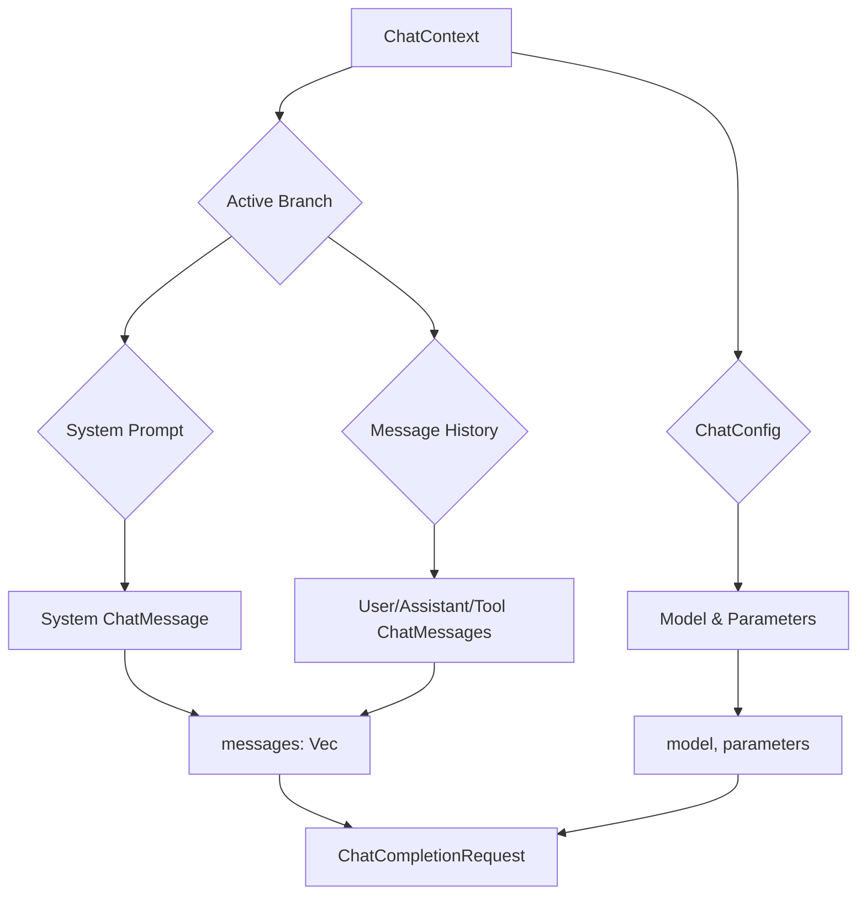

# OpenAI Adapter Design Plan

## 1. Overview

This document outlines the design for an `Adapter` implementation that transforms the internal `ChatContext` structure into a request body compatible with the OpenAI Chat Completions API. This allows the `copilot_client` to communicate with OpenAI-compliant endpoints.

The adapter will be responsible for mapping roles, message content (including text and images), tool calls, and configuration from the `ChatContext` to the corresponding fields in the OpenAI API request format.

## 2. File Location

The new implementation will reside in a new file within the `copilot_client` crate:

*   **New File:** `crates/copilot_client/src/adapters/openai_adapter.rs`
*   **Module Update:** The new module will be declared in `crates/copilot_client/src/adapters/mod.rs`.

## 3. OpenAI Request Structures

The following Rust structs will be defined in `openai_adapter.rs`. They are designed to serialize into the JSON format expected by the OpenAI Chat Completions API.

```rust
use serde::Serialize;
use std::collections::HashMap;

#[derive(Serialize, Debug)]
pub struct ChatCompletionRequest {
    pub model: String,
    pub messages: Vec<ChatMessage>,
    #[serde(skip_serializing_if = "Option::is_none")]
    pub tools: Option<Vec<Tool>>,
    #[serde(skip_serializing_if = "Option::is_none")]
    pub tool_choice: Option<String>, // "auto" is a common value
    #[serde(flatten)]
    pub parameters: HashMap<String, serde_json::Value>, // For temperature, top_p, etc.
}

#[derive(Serialize, Debug)]
pub struct ChatMessage {
    pub role: String,
    #[serde(skip_serializing_if = "is_default")]
    pub content: Content,
    #[serde(skip_serializing_if = "Option::is_none")]
    pub tool_calls: Option<Vec<ToolCall>>,
    #[serde(skip_serializing_if = "Option::is_none")]
    pub tool_call_id: Option<String>,
}

// Helper to avoid serializing empty content
fn is_default<T: Default + PartialEq>(t: &T) -> bool {
    *t == T::default()
}

#[derive(Serialize, Debug, PartialEq, Default)]
#[serde(untagged)]
pub enum Content {
    #[default]
    None,
    Text(String),
    Parts(Vec<ContentPart>),
}

#[derive(Serialize, Debug, PartialEq)]
#[serde(tag = "type", rename_all = "snake_case")]
pub enum ContentPart {
    Text { text: String },
    ImageUrl { image_url: ImageUrl },
}

#[derive(Serialize, Debug, PartialEq)]
pub struct ImageUrl {
    pub url: String,
    #[serde(skip_serializing_if = "Option::is_none")]
    pub detail: Option<String>,
}

#[derive(Serialize, Debug)]
pub struct Tool {
    #[serde(rename = "type")]
    pub tool_type: String, // Always "function" for now
    pub function: Function,
}

#[derive(Serialize, Debug)]
pub struct Function {
    pub name: String,
    #[serde(skip_serializing_if = "Option::is_none")]
    pub description: Option<String>,
    pub parameters: serde_json::Value, // JSON Schema object
}

#[derive(Serialize, Debug)]
pub struct ToolCall {
    pub id: String,
    #[serde(rename = "type")]
    pub tool_type: String, // Always "function"
    pub function: ToolCallFunction,
}

#[derive(Serialize, Debug)]
pub struct ToolCallFunction {
    pub name: String,
    pub arguments: String, // JSON string of arguments
}
```

## 4. Adapter Implementation

A new struct, `OpenAIAdapter`, will implement the `Adapter` trait.

```rust
// In crates/copilot_client/src/adapters/openai_adapter.rs

use context_manager::traits::adapter::Adapter;
use context_manager::structs::context::ChatContext;
// ... other necessary imports

pub struct OpenAIAdapter;

impl Adapter for OpenAIAdapter {
    type RequestBody = ChatCompletionRequest;

    fn adapt(&self, context: &ChatContext) -> Result<Self::RequestBody, String> {
        // Logic will be implemented here as described in section 5.
        unimplemented!();
    }
}
```

## 5. `adapt` Method Logic

The `adapt` method will perform the transformation from `ChatContext` to `ChatCompletionRequest`.

### Data Flow Diagram



### Step-by-Step Logic

1.  **Get Active Branch:** Retrieve the active branch from `context.get_active_branch()`. If it doesn't exist, return an error.

2.  **Initialize Messages:** Create an empty `Vec<ChatMessage>`.

3.  **Handle System Prompt:**
    *   If the active branch has a `system_prompt`, create a `ChatMessage` with `role: "system"` and `content: Content::Text(system_prompt.content)`.
    *   Add this as the first message in the `messages` vector.

4.  **Process Message History:**
    *   Iterate through the `message_ids` in the active branch.
    *   For each `message_id`, retrieve the `MessageNode` from `context.message_pool`.
    *   Map the `InternalMessage` from the node to an OpenAI `ChatMessage` based on its `role` and content.

5.  **Message Mapping Logic:**

    *   **`Role::User`:**
        *   Create a `ChatMessage` with `role: "user"`.
        *   Map the `content: Vec<context_manager::structs::message::ContentPart>` to `content: Content`.
            *   If there's one text part, use `Content::Text`.
            *   If there are multiple parts (text or image), map to `Content::Parts(Vec<ContentPart>)`.
                *   `context_manager::ContentPart::Text(s)` -> `openai_adapter::ContentPart::Text { text: s }`
                *   `context_manager::ContentPart::Image { url, detail }` -> `openai_adapter::ContentPart::ImageUrl { image_url: ImageUrl { url, detail } }`

    *   **`Role::Assistant`:**
        *   Create a `ChatMessage` with `role: "assistant"`.
        *   If `tool_calls` is `Some`, map them:
            *   Iterate through `internal_message.tool_calls`.
            *   For each `ToolCallRequest`, create an `openai_adapter::ToolCall` with:
                *   `id`: from `request.id`.
                *   `tool_type`: "function".
                *   `function`: `ToolCallFunction` with `name: request.tool_name` and `arguments: request.arguments.to_string()`.
            *   Set the `tool_calls` field on the `ChatMessage`.
        *   If `tool_calls` is `None`, map the `content` as for the `User` role. An assistant message can have either content or tool_calls, but not both.

    *   **`Role::Tool`:**
        *   Create a `ChatMessage` with `role: "tool"`.
        *   The `tool_result` field must be `Some`.
        *   Set `tool_call_id` to `tool_result.request_id`.
        *   Set `content` to `Content::Text(tool_result.result.to_string())`.

6.  **Handle Tools:**
    *   The `tools` field in the request is currently out of scope for the `adapt` method, as tool definitions are managed by a different part of the system (`ToolEnhancer`). This adapter will assume the tool definitions are injected later or are not needed for this specific transformation. For now, it will be `None`.

7.  **Construct Final Request:**
    *   Create the `ChatCompletionRequest` instance.
    *   Set `model` from `context.config.model_id`.
    *   Set `messages` to the vector of `ChatMessage`s created.
    *   Set `parameters` from `context.config.parameters`.
    *   Return the completed request.

This design provides a comprehensive plan for creating a robust adapter for the OpenAI API.