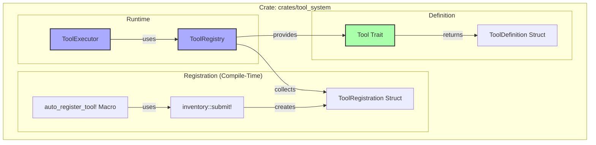
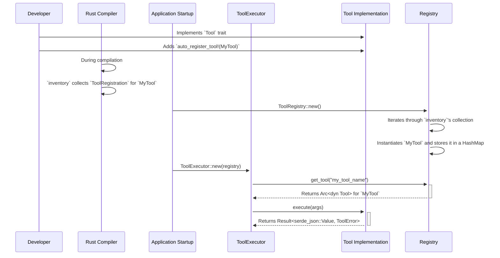

# Tool System Developer Guide

## 1. Overview

### 1.1. System Introduction
The tool system is a modern, high-performance architecture for managing and executing tools within the application. It is designed for zero-hardcoding and high extensibility, leveraging Rust's powerful type system and compile-time features. The core of the system is the `tool_system` crate, which encapsulates all logic for tool definition, registration, and execution.

### 1.2. Design Goals
- **Zero-Hardcoding**: Tools are automatically discovered and registered at compile time using the `inventory` crate, eliminating the need for manual registration lists.
- **High Extensibility**: Adding new tools is as simple as implementing a trait and adding a macro. The system automatically incorporates them.
- **Type Safety**: Leverages Rust's trait system to ensure all tools conform to a standard, type-safe interface.
- **Decoupling**: The `tool_system` crate is a self-contained, independent module, cleanly separating tool management from the rest of the application.
- **Clarity**: The design is centered around a simple `Tool` trait, making the architecture easy to understand and reason about.

### 1.3. Core Features
- **`Tool` Trait Architecture**: A clean and simple `Tool` trait is the foundation for all tool implementations.
- **Automatic Registration**: The `inventory` crate is used to automatically collect all tool implementations at compile time.
- **Centralized Registry**: A `ToolRegistry` provides a single point of access for querying and retrieving tools.
- **Asynchronous Execution**: The `ToolExecutor` runs tools asynchronously, ensuring the application remains responsive.

## 2. Architecture

### 2.1. Core Component Relationships

The architecture is composed of three main components: the `Tool` trait, the `ToolRegistry`, and the `ToolExecutor`.



#### Component Responsibilities

- **[`Tool`](../../crates/tool_system/src/types/tool.rs) Trait**: The central interface that every tool must implement. It defines the tool's metadata (`definition`) and its core logic (`execute`).
- **[`ToolDefinition`](../../crates/tool_system/src/types/tool.rs) Struct**: A struct that holds the static information about a tool, such as its name, description, and parameters. This data is used to inform the LLM and the UI.
- **[`ToolRegistry`](../../crates/tool_system/src/registry/registries.rs) Struct**: A runtime container that holds instances of all registered tools. It is initialized at startup by collecting all `ToolRegistration` instances created at compile time.
- **[`ToolExecutor`](../../crates/tool_system/src/executor.rs) Struct**: The component responsible for running a tool. It queries the `ToolRegistry` to find the requested tool and then calls its `execute` method.
- **`inventory` Crate**: A third-party crate that enables automatic, compile-time registration. The `auto_register_tool!` macro uses `inventory::submit!` to add a `ToolRegistration` struct to a global, static collection.

### 2.2. Data Flow: From Registration to Execution



## 3. How to Add a New Tool

Adding a new tool is a straightforward process that involves implementing the `Tool` trait and using the registration macro.

### Step 1: Define Your Tool Struct

Create a struct for your tool.

```rust
// in crates/tool_system/src/internal/my_new_tool.rs
use crate::types::{Tool, ToolDefinition, ToolError, ToolArguments};
use async_trait::async_trait;
use serde_json::json;

pub struct MyNewTool;

impl MyNewTool {
    pub const TOOL_NAME: &'static str = "my_new_tool";

    pub fn new() -> Self {
        Self
    }
}
```

### Step 2: Implement the `Tool` Trait

Implement the `definition` and `execute` methods for your struct.

```rust
#[async_trait]
impl Tool for MyNewTool {
    fn definition(&self) -> ToolDefinition {
        ToolDefinition {
            name: Self::TOOL_NAME.to_string(),
            description: "This is a new tool that does something amazing.".to_string(),
            parameters: vec![], // Add parameters here if needed
            requires_approval: true,
            ..Default::default() // Use default for other fields
        }
    }

    async fn execute(&self, _args: ToolArguments) -> Result<serde_json::Value, ToolError> {
        // Your tool's logic goes here
        Ok(json!({ "status": "success", "message": "MyNewTool executed successfully!" }))
    }
}
```

### Step 3: Register the Tool

Use the `auto_register_tool!` macro to make the system aware of your new tool. This is typically done in the same file.

```rust
use crate::registry::macros::auto_register_tool;

auto_register_tool!(MyNewTool);
```

### Step 4: Add to the Module Tree

Ensure your new tool's module is included in a parent `mod.rs` file (e.g., `crates/tool_system/src/internal/mod.rs`).

```rust
// in crates/tool_system/src/internal/mod.rs
pub mod my_new_tool;
```

That's it! At the next compile, the `inventory` crate will automatically discover and register `MyNewTool`, making it available through the `ToolRegistry`.

## 4. Testing

To ensure your tool works correctly, you should add unit and integration tests.

### Unit Testing a Tool

You can test the tool's logic in isolation.

```rust
#[cfg(test)]
mod tests {
    use super::*;
    use serde_json::Value;

    #[tokio::test]
    async fn test_my_new_tool_execution() {
        let tool = MyNewTool::new();
        let result = tool.execute(ToolArguments::Json(json!({}))).await.unwrap();
        
        assert_eq!(result.get("status").unwrap(), "success");
    }
}
```

### Integration Testing with the Registry

You can also test that the tool is correctly registered and executable through the `ToolRegistry` and `ToolExecutor`.

```rust
#[test]
fn test_my_new_tool_is_registered() {
    let registry = ToolRegistry::new();
    let tool = registry.get_tool(MyNewTool::TOOL_NAME);
    assert!(tool.is_some(), "MyNewTool should be registered");
}

#[tokio::test]
async fn test_execute_my_new_tool_via_executor() {
    let registry = Arc::new(Mutex::new(ToolRegistry::new()));
    let executor = ToolExecutor::new(registry);

    let result = executor.execute_tool(
        MyNewTool::TOOL_NAME,
        ToolArguments::Json(json!({}))
    ).await;

    assert!(result.is_ok());
    let value = result.unwrap();
    assert_eq!(value.get("status").unwrap(), "success");
}
```

## 5. Best Practices

### File Structure
Keep tool implementations organized within the `crates/tool_system/src/` directory. For internal, general-purpose tools, place them in `internal/`.

```
crates/tool_system/src/
├── lib.rs              # Crate root
├── executor.rs         # ToolExecutor implementation
├── types/              # Core data structures (Tool, ToolDefinition, etc.)
│   ├── mod.rs
│   └── tool.rs
├── registry/           # Registration logic
│   ├── mod.rs
│   ├── registries.rs   # ToolRegistry implementation
│   └── macros.rs       # Registration macros
└── internal/           # Implementations of built-in tools
    ├── mod.rs
    └── read_file.rs
```

### Naming Conventions
- **Tool Name (in `ToolDefinition`)**: Use `snake_case` (e.g., `read_file`, `execute_command`). This is the name the LLM will use.
- **Struct Name**: Use `PascalCase` (e.g., `ReadFileTool`).

## 6. Summary

The new tool system provides a clean, robust, and highly extensible architecture for managing tools. By leveraging a simple `Tool` trait and the power of compile-time registration with the `inventory` crate, the system eliminates manual configuration and makes adding new tools a trivial task. This design promotes modularity, testability, and long-term maintainability.