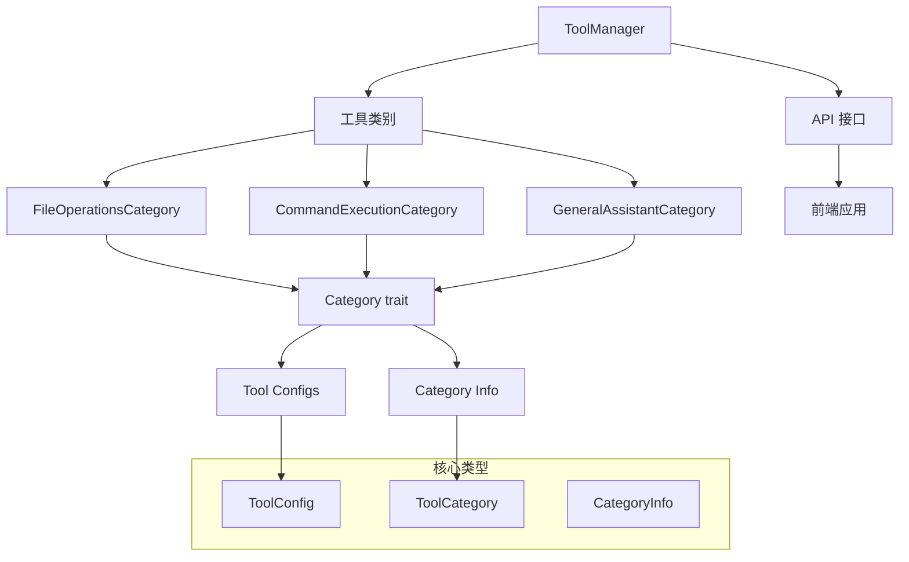
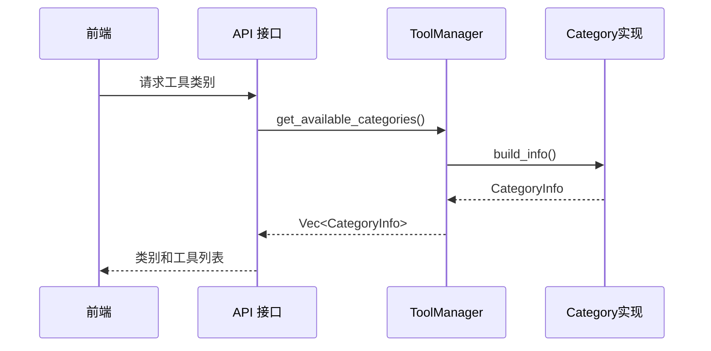

# 工具系统开发者指南

## 概览

### 系统简介
工具系统是一个基于 Category trait 的现代化工具管理架构，提供零硬编码、高扩展性的工具管理功能。系统采用简洁的设计模式，摒弃了复杂的建造者模式，改用直观的 Category trait 实现。

### 设计目标
- **零硬编码**：通过 Category trait 实现完全的配置驱动
- **高扩展性**：易于添加新的工具类别和工具实例
- **类型安全**：利用 Rust 的类型系统确保编译时安全
- **简洁明了**：移除复杂的建造者模式，采用直观的 trait 设计
- **离线控制**：后端可以通过 enable() 方法控制发行版功能

### 核心特性
- **Category trait 架构**：基于 [`Category`](../../src-tauri/src/tools/category.rs:8) trait 的简洁类别系统
- **严格工具模式**：支持限制用户只能输入工具调用命令
- **系统提示符**：每个类别都有自定义的系统提示符
- **动态配置**：前端完全依赖后端动态获取类别信息
- **离线功能控制**：后端可以通过代码控制功能的启用状态

## 架构关系

### 1. 核心组件关系



#### 组件职责说明

**[`ToolManager`](../../src-tauri/src/tools/tool_manager.rs:12)**
- 核心工具管理器，负责工具实例的存储和访问
- 提供工具注册、获取、类别管理等功能
- 通过 Category trait 管理所有工具类别

**[`Category`](../../src-tauri/src/tools/category.rs:8) trait**
- 定义工具类别的标准接口
- 每个工具类别都必须实现此 trait
- 提供类别信息、工具配置、权限控制等功能

**[`CategoryInfo`](../../src-tauri/src/tools/category.rs:22)**
- 包含完整的类别信息和工具配置
- 用于向前端提供统一的数据结构
- 包含 ToolCategory 和 ToolConfig 列表

### 2. 数据流向



### 3. Category trait 设计

系统采用简洁的 Category trait 设计，去除了复杂的建造者模式：

```rust
pub trait Category: Send + Sync {
    fn id(&self) -> &str;
    fn name(&self) -> &str;
    fn enable(&self) -> bool;
    fn strict_tools_mode(&self) -> bool;
    fn system_prompt(&self) -> String;
    fn build_tool_configs(&self) -> Vec<ToolConfig>;
    fn build_info(&self) -> CategoryInfo;
}
```

#### 设计原则
- **简洁性**：每个方法都有明确的职责
- **一致性**：所有类别实现都遵循相同的接口
- **可测试性**：每个方法都可以独立测试
- **扩展性**：易于添加新的类别实现

## 开发接口

### 1. 获取工具类别

```rust
use crate::tools::*;

// 获取所有可用类别
let categories = get_available_categories();

// 创建工具管理器
let manager = create_default_tool_manager();

// 获取类别信息
let category_infos = manager.get_all_category_infos();
```

### 2. 添加新工具类别

#### 步骤 1：实现 Category trait

```rust
use crate::tools::category::{Category, CategoryInfo};
use crate::tools::types::{ToolCategory, ToolConfig};

pub struct MyCustomCategory {
    enabled: bool,
}

impl MyCustomCategory {
    pub fn new() -> Self {
        Self { enabled: true }
    }
}

impl Category for MyCustomCategory {
    fn id(&self) -> &str {
        "my_custom"
    }
    
    fn name(&self) -> &str {
        "my_custom"
    }
    
    fn enable(&self) -> bool {
        self.enabled
    }
    
    fn strict_tools_mode(&self) -> bool {
        false // 根据需要设置
    }
    
    fn system_prompt(&self) -> String {
        "你是一个自定义工具助手，专门处理特定的任务。".to_string()
    }
    
    fn build_tool_configs(&self) -> Vec<ToolConfig> {
        vec![
            // 在这里定义你的工具配置
        ]
    }
    
    fn build_info(&self) -> CategoryInfo {
        CategoryInfo {
            category: ToolCategory {
                id: self.id().to_string(),
                name: self.name().to_string(),
                display_name: "自定义类别".to_string(),
                description: "我的自定义工具类别".to_string(),
                icon: "🔧".to_string(),
                enabled: self.enable(),
                strict_tools_mode: self.strict_tools_mode(),
                system_prompt: self.system_prompt(),
            },
            tool_configs: self.build_tool_configs(),
        }
    }
}
```

#### 步骤 2：注册到模块

在 [`categories/mod.rs`](../../src-tauri/src/tools/categories/mod.rs) 中添加：

```rust
pub mod my_custom;
pub use my_custom::MyCustomCategory;
```

#### 步骤 3：集成到系统

在 [`mod.rs`](../../src-tauri/src/tools/mod.rs) 的 `get_available_categories()` 函数中添加：

```rust
pub fn get_available_categories() -> Vec<ToolCategory> {
    use categories::*;

    vec![
        FileOperationsCategory::new().build_info().category,
        CommandExecutionCategory::new().build_info().category,
        GeneralAssistantCategory::new().build_info().category,
        MyCustomCategory::new().build_info().category, // 新增
    ]
}
```

### 3. 添加新工具

在类别的 `build_tool_configs()` 方法中添加新工具：

```rust
fn build_tool_configs(&self) -> Vec<ToolConfig> {
    vec![
        ToolConfig {
            name: "my_tool".to_string(),
            display_name: "我的工具".to_string(),
            description: "这是一个自定义工具".to_string(),
            category_id: self.id().to_string(),
            enabled: true,
            parameters: vec![
                Parameter {
                    name: "input".to_string(),
                    param_type: "string".to_string(),
                    description: "输入参数".to_string(),
                    required: true,
                    default_value: None,
                }
            ],
            requires_approval: false,
            permissions: vec![],
        }
    ]
}
```

## 测试

### 运行所有测试

```bash
cd src-tauri
cargo test tools:: -- --nocapture
```

### 具体测试模块

```bash
# 测试 Category trait 实现
cargo test test_file_operations_category -- --nocapture

# 测试严格模式功能
cargo test test_multiple_category_strict_mode -- --nocapture

# 测试 API 接口
cargo test test_get_category_tools_functionality -- --nocapture
```

### 测试验证

#### 基本功能验证

```rust
#[test]
fn test_category_implementation() {
    let category = FileOperationsCategory::new();
    
    // 测试基本属性
    assert_eq!(category.id(), "file_operations");
    assert!(category.enable());
    
    // 测试工具配置
    let tool_configs = category.build_tool_configs();
    assert!(!tool_configs.is_empty());
    
    // 测试类别信息
    let info = category.build_info();
    assert_eq!(info.category.display_name, "文件操作");
}
```

#### 严格模式验证

```rust
#[test]
fn test_strict_mode_configuration() {
    let file_ops = FileOperationsCategory::new();
    let cmd_exec = CommandExecutionCategory::new();
    
    // 验证严格模式设置
    assert!(!file_ops.strict_tools_mode());
    assert!(cmd_exec.strict_tools_mode());
}
```

## 故障排除

### 常见问题

1. **类别未显示在前端**
   - 检查 `get_available_categories()` 是否包含你的类别
   - 确认 `enable()` 方法返回 `true`
   - 验证 API 接口是否正常工作

2. **工具配置错误**
   - 检查 `build_tool_configs()` 方法的实现
   - 确认 `category_id` 与类别 ID 一致
   - 验证参数配置的正确性

3. **系统提示符不生效**
   - 检查 `system_prompt()` 方法的实现
   - 确认前端正确接收并使用了系统提示符

### 调试工具

```rust
// 打印类别信息
let info = category.build_info();
println!("Category: {:?}", info.category);
println!("Tools: {:?}", info.tool_configs);

// 验证工具数量
let tools = category.build_tool_configs();
println!("Tool count: {}", tools.len());
```

## 最佳实践

### 文件结构规范

```
src/tools/
├── category.rs          # Category trait 定义
├── types.rs            # 共用类型定义
├── mod.rs              # 模块导出和核心函数
├── tool_manager.rs     # 工具管理器实现
├── config_manager.rs   # 配置管理器（向后兼容）
└── categories/         # 类别实现
    ├── mod.rs
    ├── file_operations.rs
    ├── command_execution.rs
    └── general_assistant.rs
```

### Naming Conventions

- **Category ID**: Use lowercase letters separated by underscores (e.g., `file_operations`)
- **Category Name**: Keep consistent with ID
- **Display Name**: Use English description (e.g., `File Operations`)
- **Tool Name**: Use lowercase letters separated by underscores (e.g., `read_file`)

## Architecture Advantages

### Improvements over Builder Pattern

1. **Simplicity**: Removed complex builder chain calls
2. **Intuitiveness**: Each category directly implements Category trait
3. **Maintainability**: Reduced intermediate layers, code is easier to understand
4. **Performance**: Reduced unnecessary object creation and conversion
5. **Testability**: Each method can be tested independently

### System Features

- **Tools register to tool_category** ✅
- **tool_category exposed to frontend** ✅
- **Frontend only responsible for parsing tool_categories and displaying** ✅
- **Backend can offline control release features (through enable() method)** ✅
- **Frontend cannot have any hardcode definitions** ✅

## Example Code

### Creating a Simple Tool Manager

```rust
use crate::tools::*;

let manager = create_default_tool_manager();
let categories = manager.get_enabled_categories();

for category in categories {
    println!("类别: {} - {}", category.display_name, category.description);
}
```

### 获取特定类别的工具

```rust
let file_tools = manager.get_category_tools("file_operations");
for tool in file_tools {
    println!("工具: {} - {}", tool.display_name, tool.description);
}
```

## 更新日志

### v3.0.0 - Category trait 重构（当前版本）
- 移除复杂的建造者模式
- 采用简洁的 Category trait 设计
- 提供系统提示符功能
- 实现前后端完全解耦
- 支持离线功能控制

### v2.0.0 - 建造者模式重构（已废弃）
- 引入建造者模式架构
- 支持严格工具模式
- 添加图标颜色映射

### v1.x.x - 原始实现（已废弃）
- 基础工具管理功能
- 简单的类别系统

## 总结

新的工具系统通过 Category trait 提供了一个简洁、高效、易于扩展的工具管理架构。系统完全摒弃了硬编码，实现了前后端的完全解耦，同时保持了高度的类型安全和可测试性。

开发者只需要实现 Category trait 就可以轻松添加新的工具类别，系统会自动处理配置管理、API 暴露和前端集成等所有复杂细节。