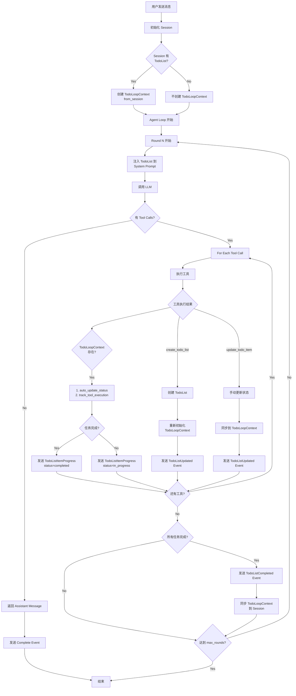
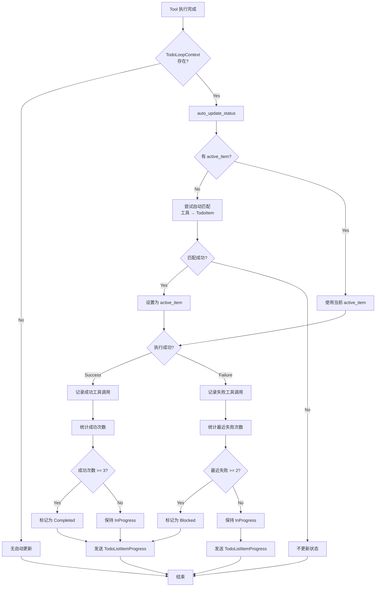
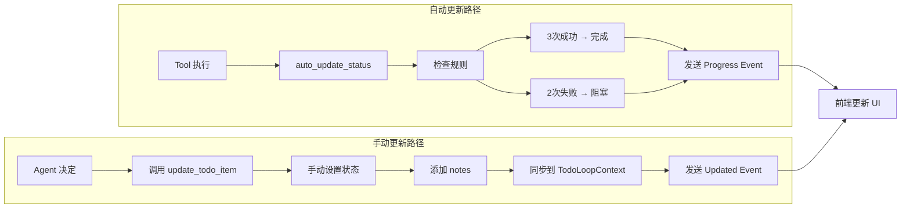
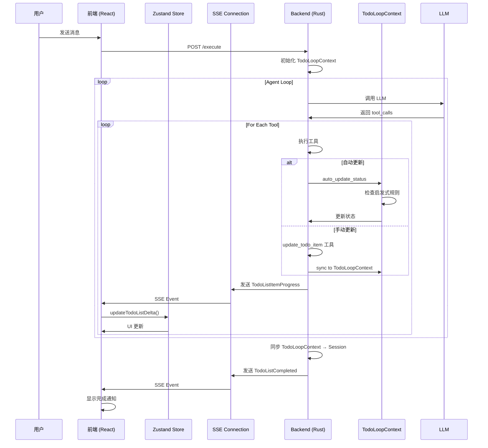
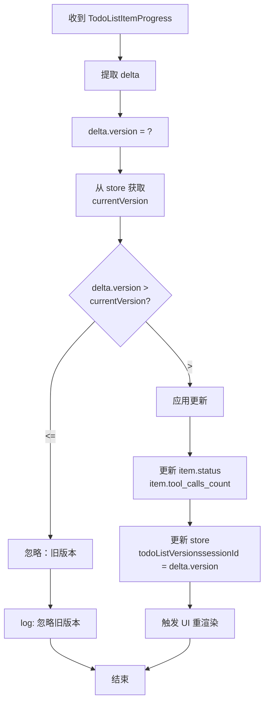

# TodoList 更新流程图

## 1. 完整的 Agent Loop 执行流程



## 2. 自动状态推断流程（详细）



## 3. 手动 vs 自动更新对比



## 4. 数据流：从前端到后端



## 5. 版本控制和冲突检测



## 6. 关键问题：Session ID 匹配

```mermaid
graph TD
    subgraph 修复前 - BROKEN
        B1[Backend 发送 Event] --> B2[useAgentEventSubscription]
        B2 --> B3[setTodoList<br/>key = chatId]
        B3 --> B4[Store:<br/>todoListschatId = ...]
        B4 --> B5[TodoList.tsx<br/>读取 todoListssessionId]
        B5 --> B6[❌ 找不到数据！<br/>UI 不更新]
    end

    subgraph 修复后 - WORKING
        A1[Backend 发送 Event] --> A2[useAgentEventSubscription]
        A2 --> A3[setTodoList<br/>key = todoList.session_id]
        A3 --> A4[Store:<br/>todoListssession_id = ...]
        A4 --> A5[TodoList.tsx<br/>读取 todoListssessionId]
        A5 --> A6[✅ 找到数据！<br/>UI 正确更新]
    end
```



## 7. 改进建议：LLM 辅助决策（未来）

```mermaid
graph TD
    Start[Tool 执行成功] --> Count[统计成功次数]

    Count --> CheckCount{成功次数 >= 3?}

    CheckCount -->|No| Auto[自动：保持 InProgress]
    CheckCount -->|Yes| CheckTaskType{任务类型?}

    CheckTaskType -->|简单任务| AutoComplete[自动标记 Completed<br/>无需 LLM]
    CheckTaskType -->|复杂任务| AskLLM[询问 LLM<br/>"任务是否完成?"]

    AskLLM --> LLMResponse{LLM 回答}
    LLMResponse -->|Yes| ManualComplete[标记 Completed]
    LLMResponse -->|No| KeepGoing[继续执行]

    AutoComplete --> SendEvent[发送 Progress Event]
    ManualComplete --> SendEvent
    KeepGoing --> Auto
    Auto --> SendEvent2[发送 Progress Event]

    SendEvent --> End[结束]
    SendEvent2 --> End
```

## 关键说明

### 当前机制（自动 + 手动混合）

1. **自动更新**（默认）：
   - 触发：每次 tool 执行后
   - 规则：3 次成功 → 完成，2 次失败 → 阻塞
   - 优点：快速、自动、无需 LLM
   - 缺点：可能误判

2. **手动更新**（Agent 决定）：
   - 触发：Agent 调用 `update_todo_item` 工具
   - 场景：Agent 认为自动规则不准确
   - 优点：精确控制
   - 缺点：需要 Agent 主动干预

### 关键修复

- ✅ Session ID 匹配（前端能收到更新）
- ✅ TodoLoopContext 重新初始化（新列表有跟踪）
- ✅ 双向同步（手动 ↔ 自动不冲突）
- ✅ 完成事件发送（用户能看到完成）
- ✅ 版本控制（增量更新有效）

### 建议改进

1. **短期**：改进启发式规则（更智能的阈值）
2. **中期**：LLM 辅助决策（复杂任务询问 LLM）
3. **长期**：混合模式（简单自动，复杂 LLM）
