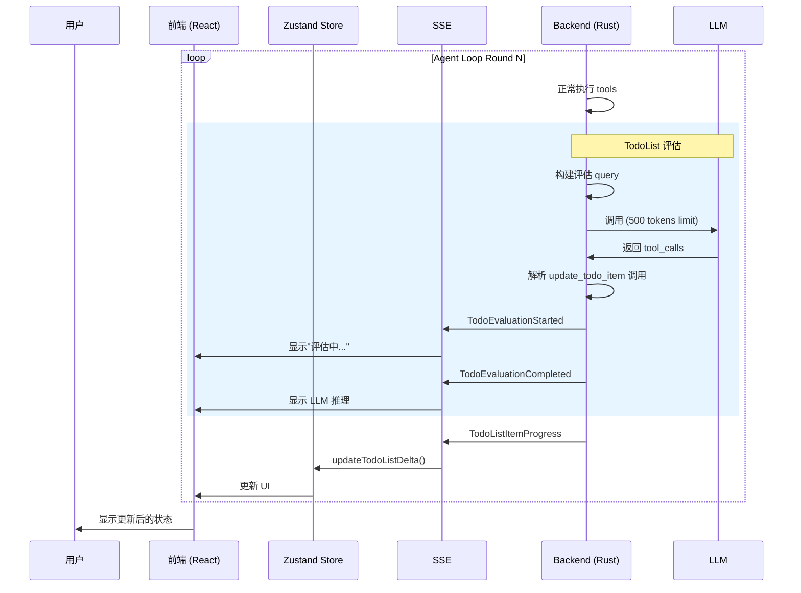

# TodoList LLM 评估机制

## 概述

在 Agent Loop 每轮结束时，**单独调用一次 LLM**，让其评估 TodoList 的任务进度。这个设计结合了自动跟踪的智能决策能力和简洁的实现方式。

## 设计动机

### 旧方案的局限性

```
启发式规则：
- 3次成功工具调用 → 完成
- 2次失败工具调用 → 阻塞

问题：
1. "Fix bug" 调用 3 次工具后自动完成 → 但 bug 可能根本没修复！
2. "Read config" 调用 3 次工具 → 可能根本还没读完
3. 规则太死板，不理解任务语义
```

### 新方案的优势

```
LLM 评估：
- 理解任务描述："Fix authentication bug"
- 分析执行历史：read_file → write_file → run_tests
- 判断："Tests pass, so bug is fixed" → 标记完成
- 有推理能力，能做出更准确的判断
```

## 架构设计

```
Agent Loop Round N
    │
    ├─ 正常流程：LLM → Tools → Results → Messages
    │
    └─ 末尾追加：TodoList 评估 ⭐
        │
        ├─ 构建评估 Query
        │   ├─ System Prompt（评估专家角色）
        │   ├─ 当前 TodoList 状态
        │   └─ 最近 Tool 执行记录
        │
        ├─ 调用 LLM（只给 update_todo_item tool）
        │   └─ output limit: 500 tokens
        │
        ├─ 解析 LLM 决策
        │   ├─ update_todo_item(item_id="1", status="completed")
        │   └─ update_todo_item(item_id="2", status="blocked")
        │
        ├─ 应用更新
        │   ├─ 更新 TodoLoopContext
        │   ├─ 更新 Session
        │   └─ 发送 Progress Event → 前端
        │
        └─ 发送评估事件
            ├─ TodoEvaluationStarted
            └─ TodoEvaluationCompleted
```

## 核心实现

### 1. 评估触发时机

```rust
// crates/agent-loop/src/runner.rs
for round in 0..config.max_rounds {
    // ... 正常的 agent loop 逻辑 ...

    // 每轮结束时，评估 TodoList
    if let Some(ref ctx) = todo_context {
        match evaluate_todo_progress(ctx, session, llm.clone(), &event_tx, &session_id).await {
            Ok(result) => {
                if result.needs_evaluation && !result.updates.is_empty() {
                    // 应用 LLM 的更新
                    apply_llm_updates(&mut todo_context, session, result.updates);
                }
            }
            Err(e) => log::warn!("Evaluation failed: {}", e),
        }
    }
}
```

### 2. 评估 Query 构建

```rust
pub fn build_todo_evaluation_messages(ctx: &TodoLoopContext, session: &Session) -> Vec<Message> {
    let system_prompt = r#"
You are a task progress evaluator. Your job is to evaluate whether tasks are complete.

## Rules
1. Mark as "completed" if the task goal has been achieved
2. Mark as "blocked" if there are unresolvable issues
3. Keep as "in_progress" if more work is needed
4. Add brief notes explaining your decision

## Available Actions
- update_todo_item: Update the status of a todo item
"#;

    let todo_context = format!(
        r#"
## Current Todo List (Round {}/{})

{}

## Recent Tool Executions
{}

Review each "in_progress" task. For each task:
1. Check if the goal has been achieved based on tool execution results
2. If complete, call update_todo_item with status="completed"
3. If blocked, call update_todo_item with status="blocked"
"#,
        ctx.current_round + 1,
        ctx.max_rounds,
        ctx.format_for_prompt(),
        format_recent_tools(ctx, 5)
    );

    vec![
        Message::system(system_prompt),
        Message::user(todo_context),
    ]
}
```

### 3. 专用 Tool Schema

```rust
pub fn get_todo_evaluation_tools() -> Vec<ToolSchema> {
    vec![
        ToolSchema {
            schema_type: "function".to_string(),
            function: FunctionSchema {
                name: "update_todo_item".to_string(),
                description: "Update todo item status".to_string(),
                parameters: json!({
                    "properties": {
                        "item_id": { "type": "string" },
                        "status": { "type": "string", "enum": ["completed", "blocked"] },
                        "notes": { "type": "string" }
                    },
                    "required": ["item_id", "status"]
                }),
            },
        }
    ]
}
```

### 4. 事件类型

```rust
// 评估开始
pub enum AgentEvent {
    TodoEvaluationStarted {
        session_id: String,
        items_count: usize,
    },

    // 评估完成
    TodoEvaluationCompleted {
        session_id: String,
        updates_count: usize,
        reasoning: String,  // LLM 的推理说明
    },
}
```

## 流程图

### 完整流程

```mermaid
graph TD
    Start[Round N 结束] --> CheckTodo{有 TodoList?}
    CheckTodo -->|No| Skip[跳过评估]
    CheckTodo -->|Yes| CheckInProgress{有 in_progress<br/>任务?}

    CheckInProgress -->|No| Skip
    CheckInProgress -->|Yes| SendStart[发送<br/>TodoEvaluationStarted]

    SendStart --> BuildQuery[构建评估 Query]
    BuildQuery --> CallLLM[调用 LLM<br/>tools=[update_todo_item]]

    CallLLM --> ParseDecision{解析 LLM<br/>决策}
    ParseDecision -->|有更新| ApplyUpdates[应用更新]
    ParseDecision -->|无更新| SendComplete[发送<br/>TodoEvaluationCompleted]

    ApplyUpdates --> UpdateContext[更新<br/>TodoLoopContext]
    UpdateContext --> UpdateSession[更新 Session]
    UpdateSession --> SendProgress[发送<br/>TodoListItemProgress]
    SendProgress --> SendComplete

    SendComplete --> End[结束]
    Skip --> End
```

### 前端数据流



## 优点分析

### 1. 智能决策

| 场景 | 启发式规则 | LLM 评估 |
|------|-----------|----------|
| "Fix bug" | 3次工具后完成 | 检查测试结果，确认 bug 修复 |
| "Read config" | 3次工具后完成 | 检查是否读取了所有必要文件 |
| "Write tests" | 3次工具后完成 | 检查测试覆盖率和质量 |
| "Optimize performance" | 3次工具后完成 | 检查性能指标是否达标 |

### 2. 透明性

LLM 的推理过程可见：
```
[评估完成] 更新了 1 个任务
推理："The test suite now passes after the fix was applied.
       The authentication bug has been resolved."
```

### 3. 低成本

- 只在必要时调用（有 in_progress 任务时）
- 限制 output tokens（500）
- 简单的 tool schema
- 不影响主流程性能

### 4. 可扩展

可以轻松添加更多评估维度：
```rust
// 未来可以添加
evaluate_code_quality()     // 评估代码质量
evaluate_test_coverage()    // 评估测试覆盖率
evaluate_security()         // 评估安全性
```

## 配置选项

```rust
pub struct AgentLoopConfig {
    // ... existing fields ...

    /// 是否启用 TodoList LLM 评估
    pub enable_todo_evaluation: bool,

    /// 评估调用的最大 output tokens
    pub todo_evaluation_max_tokens: u32,

    /// 评估频率（每 N 轮评估一次）
    pub todo_evaluation_frequency: u32,
}

impl Default for AgentLoopConfig {
    fn default() -> Self {
        Self {
            // ...
            enable_todo_evaluation: true,
            todo_evaluation_max_tokens: 500,
            todo_evaluation_frequency: 1, // 每轮都评估
        }
    }
}
```

## 测试覆盖

```rust
#[test]
fn test_build_evaluation_messages() {
    let ctx = create_test_context();
    let session = agent_core::Session::new("test");

    let messages = build_todo_evaluation_messages(&ctx, &session);

    assert_eq!(messages.len(), 2);
    assert!(messages[0].content.contains("task progress evaluator"));
    assert!(messages[1].content.contains("Fix bug in authentication"));
}

#[test]
fn test_needs_evaluation() {
    let mut ctx = create_test_context();

    // In-progress task needs evaluation
    assert!(ctx.items.iter().any(|i| matches!(i.status, TodoItemStatus::InProgress)));

    // Completed task doesn't need evaluation
    ctx.items[0].status = TodoItemStatus::Completed;
    assert!(!ctx.items.iter().any(|i| matches!(i.status, TodoItemStatus::InProgress)));
}
```

## 实现文件

| 文件 | 说明 |
|------|------|
| `crates/agent-loop/src/todo_evaluation.rs` | 评估模块 |
| `crates/agent-loop/src/runner.rs` | 集成到 Agent Loop |
| `crates/agent-core/src/agent/events.rs` | 新事件类型 |

## 与启发式规则的关系

新方案不是替代旧方案，而是**补充**：

```
启发式规则（快速）
    ↓ 3次成功
LLM 评估（智能）
    ↓ 确认完成
更新状态
```

启发式规则可以快速筛选，LLM 评估做最终确认。

## 总结

这个设计实现了：

1. ✅ **智能决策** - LLM 理解任务语义
2. ✅ **透明推理** - 可见 LLM 的思考过程
3. ✅ **低成本** - 只在必要时调用，限制 tokens
4. ✅ **可扩展** - 容易添加更多评估维度
5. ✅ **向后兼容** - 保留启发式规则作为基础

用户可以在前端看到：
- "🤖 正在评估任务进度..."
- "✅ 任务评估完成：认证 bug 已修复（测试通过）"
- 实时的状态更新
