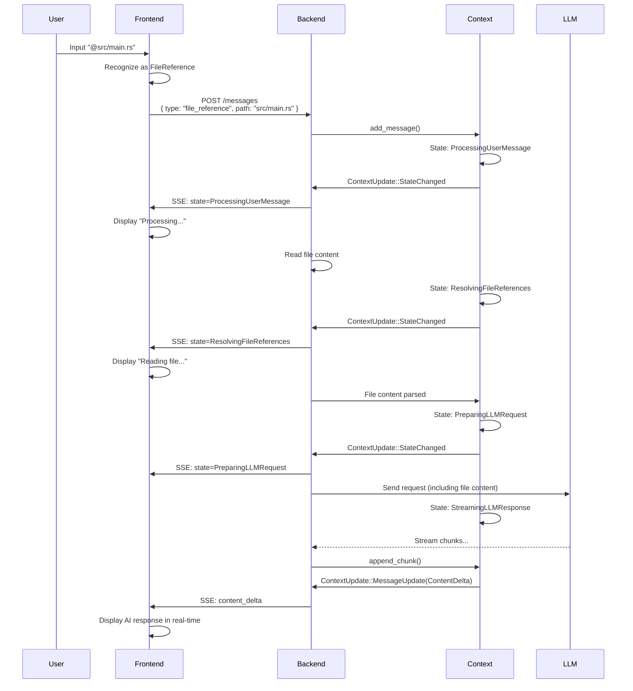
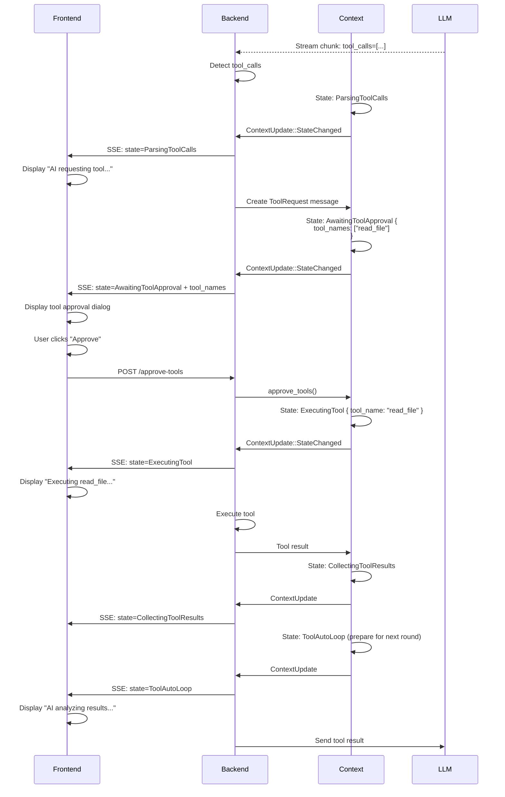
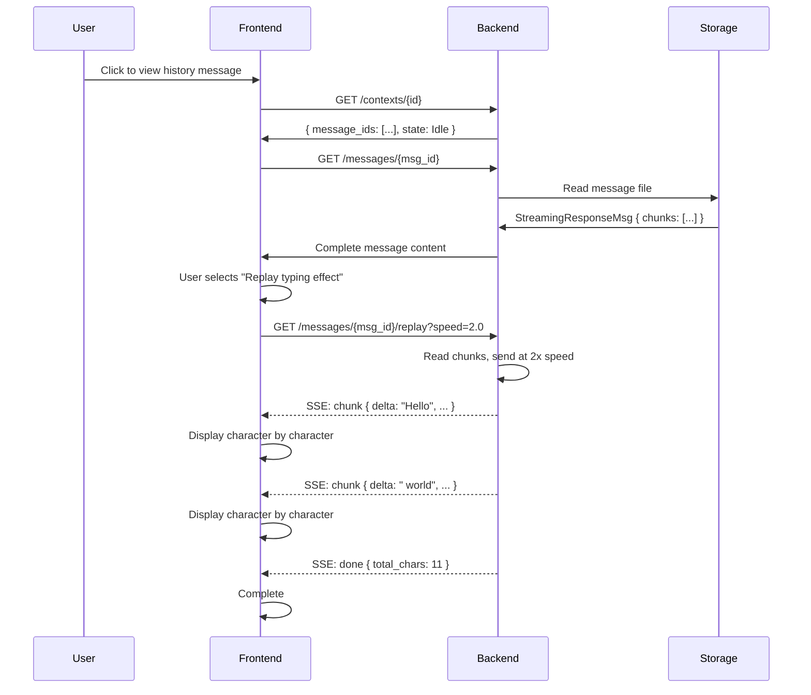

# Frontend-Backend State Synchronization Mechanism Review

**Date**: 2025-11-08
**Purpose**: Review the match between existing design and user's "frontend-backend state exchange" concept

---

## I. User Concept Summary

### Core Concept
> **Context is the state manager, Message is the data carrier, frontend and backend collaborate through state exchange**

### Key Processes

#### Process 1: Frontend Sends Message (Frontend → Backend)
```
User Action → Frontend identifies type → Sends message with metadata
   ↓
  @file     →  FileReference
  /command  →  Workflow
  image     →  Image
  attachment →  Attachment
```

#### Process 2: Backend Processes Streaming Response (Backend → Frontend)
```
LLM Stream → Detect tool call → Update Context Status → SSE push
   ↓
Frontend receives Status → Render UI → User approves → Send approval → Backend executes
   ↓
Execution complete → Update Status → Frontend renders result → AI summarizes
```

#### Key Points
1. **Message has its own metadata** (records source, type, display method)
2. **Context manages state** (does not save message content)
3. **SSE pushes state changes** (frontend renders UI accordingly)
4. **Bidirectional state exchange** (frontend approval → backend execution → frontend update)

---

## II. Existing Design Comparison

### ✅ Already Existing and Matching Design

#### 1. Frontend Sending Contract (design.md:645-696)

```rust
// ✅ Existing: Frontend explicitly informs message type
pub struct SendMessageRequest {
    pub session_id: Uuid,
    pub payload: MessagePayload,
    pub client_metadata: ClientMessageMetadata,  // ✅ Supports metadata
}

pub enum MessagePayload {
    Text { content: String, display: Option<String> },
    FileReference { path: String, range: Option<FileRange>, display_text: Option<String> },
    Workflow { workflow: String, parameters: HashMap<...>, display_text: Option<String> },
    ToolResult { tool_name: String, result: Value, display_text: Option<String> },
    // ⚠️ Missing: Image, Attachment
}

pub struct ClientMessageMetadata {
    pub display_text: Option<String>,
    pub trace_id: Option<String>,
    pub extra: HashMap<String, Value>,
}
```

**Assessment**:
- ✅ Frontend can explicitly specify message type
- ✅ Supports custom display text
- ⚠️ Missing Image, Attachment types

#### 2. Fine-Grained State Machine (design.md:79-220)

```rust
// ✅ Existing: Detailed state enum
pub enum ContextState {
    Idle,
    ProcessingUserMessage,
    ResolvingFileReferences,     // ✅ Processing file references
    StreamingLLMResponse { ... }, // ✅ Streaming response
    ParsingToolCalls,             // ✅ Detecting tool calls
    AwaitingToolApproval { ... }, // ✅ Awaiting approval
    ExecutingTool { ... },        // ✅ Executing tool
    ToolAutoLoop { ... },         // ✅ Auto loop
    // ...
}
```

**Assessment**:
- ✅ Very fine-grained states
- ✅ Covers complete tool call lifecycle
- ✅ Frontend can render UI based on state

#### 3. SSE Push Mechanism (design.md:2680-2821)

```rust
// ✅ Existing: ContextUpdate SSE stream
pub enum ContextUpdate {
    StateChanged { new_state: ContextState },
    MessageUpdate { message_id: Uuid, update: MessageUpdate },
    MetadataUpdate { ... },
}

pub enum MessageUpdate {
    Created { message_id: Uuid, role: Role },
    ContentDelta { delta: String, accumulated: String },
    Completed { final_message: InternalMessage },
    StatusChanged { new_status: MessageStatus },
}
```

**Assessment**:
- ✅ Supports state change push
- ✅ Supports message incremental updates
- ✅ Frontend can respond in real-time

---

## III. Parts Needing Extension

#### 1. MessageMetadata Not Complete Enough

**Current Implementation** (metadata.rs:14-23):
```rust
pub struct MessageMetadata {
    pub created_at: Option<DateTime<Utc>>,
    pub duration_ms: Option<u64>,
    pub tokens: Option<TokenUsage>,
    pub extra: Option<HashMap<String, Value>>,
}
```

**Issues**:
- ❌ Does not record message source (user input vs AI generated vs tool result)
- ❌ Does not record frontend sending type information (@ file or / command)
- ❌ Does not record display hint (display_hint)
- ❌ Missing streaming response metadata (chunks, speed, etc.)

**Suggested Extension**:
```rust
pub struct MessageMetadata {
    // Existing fields
    pub created_at: Option<DateTime<Utc>>,
    pub duration_ms: Option<u64>,
    pub tokens: Option<TokenUsage>,

    // ✨ New: Message source
    pub source: Option<MessageSource>,

    // ✨ New: Display hint
    pub display_hint: Option<DisplayHint>,

    // ✨ New: Frontend original input (for echo)
    pub original_input: Option<String>,

    // ✨ New: Associated frontend trace_id
    pub trace_id: Option<String>,

    // ✨ New: Streaming response metadata (if StreamingResponse)
    pub streaming: Option<StreamingMetadata>,

    // Keep extension fields
    pub extra: Option<HashMap<String, Value>>,
}

pub enum MessageSource {
    UserInput,           // User direct input
    UserFileReference,   // User @ file
    UserWorkflow,        // User / command
    UserImageUpload,     // User uploaded image
    AIGenerated,         // AI generated response
    ToolExecution,       // Tool execution result
    SystemControl,       // System control message
}

pub struct DisplayHint {
    /// Frontend display summary text
    pub summary: Option<String>,

    /// Whether to collapse display
    pub collapsed: bool,

    /// Icon hint (e.g., file icon, tool icon)
    pub icon: Option<String>,

    /// Custom style class
    pub style_class: Option<String>,
}

pub struct StreamingMetadata {
    pub chunks: Vec<StreamChunk>,
    pub started_at: DateTime<Utc>,
    pub completed_at: DateTime<Utc>,
    pub total_duration_ms: u64,
    pub model: Option<String>,
    pub usage: Option<TokenUsage>,
}
```

#### 2. MessagePayload Missing Types

**Current** (design.md:666-691):
```rust
pub enum MessagePayload {
    Text { ... },
    FileReference { ... },
    Workflow { ... },
    ToolResult { ... },
    // ❌ Missing
}
```

**Suggested Supplement**:
```rust
pub enum MessagePayload {
    // Existing types
    Text { content: String, display: Option<String> },
    FileReference { path: String, range: Option<FileRange>, display_text: Option<String> },
    Workflow { workflow: String, parameters: HashMap<...>, display_text: Option<String> },
    ToolResult { tool_name: String, result: Value, display_text: Option<String> },

    // ✨ New types
    Image {
        data: ImageData,  // Url | Base64 | FilePath
        caption: Option<String>,
        display_text: Option<String>,
    },
    Attachment {
        file_path: String,
        mime_type: String,
        size_bytes: u64,
        display_text: Option<String>,
    },
    Audio {
        data: AudioData,
        transcript: Option<String>,
        display_text: Option<String>,
    },
}

pub enum ImageData {
    Url(String),
    Base64 { mime_type: String, data: String },
    FilePath(PathBuf),
}

pub enum AudioData {
    Url(String),
    Base64 { mime_type: String, data: String },
    FilePath(PathBuf),
}
```

---

## IV. State Exchange Process Verification

### Scenario 1: User @ File Reference



**Verification**: ✅ **Process complete, state machine supports**

---

### Scenario 2: AI Returns Tool Call



**Verification**: ✅ **Process complete, state machine supports**

---

### Scenario 3: Frontend Replay Streaming Effect



**Verification**: ✅ **New feature, needs implementation**

---

## V. Gap Summary

### ✅ Already Complete
1. **Frontend Sending Contract** - MessagePayload enum (Text, FileReference, Workflow, ToolResult)
2. **Fine-Grained State Machine** - ContextState enum (20+ states)
3. **SSE Push Mechanism** - ContextUpdate stream
4. **Tool Call Lifecycle** - Complete state from detection to approval to execution

### ⚠️ Needs Extension
1. **MessageMetadata Fields**
   - Add `source: MessageSource` (record source)
   - Add `display_hint: DisplayHint` (display hint)
   - Add `streaming: StreamingMetadata` (streaming metadata)
   - Add `original_input` (frontend original input)

2. **MessagePayload Types**
   - Add `Image` type
   - Add `Attachment` type
   - Add `Audio` type (optional)

3. **StreamingResponse**
   - New RichMessageType variant
   - Implement streaming record and replay

### 🆕 Needs New Addition
1. **Streaming Replay API**
   - `GET /messages/{id}/replay?speed=<float>`
   - SSE stream returns chunks

2. **API Architecture Documentation**
   - Clear division between Context API and Message API
   - Frontend-backend state synchronization protocol

---

## VI. Key Questions (Need Your Confirmation)

### Question 1: MessageMetadata Extension

Does my suggested new field meet your requirements?

```rust
pub struct MessageMetadata {
    // Existing
    pub created_at: Option<DateTime<Utc>>,
    pub tokens: Option<TokenUsage>,

    // ✨ New
    pub source: Option<MessageSource>,        // Source type
    pub display_hint: Option<DisplayHint>,    // Display hint
    pub original_input: Option<String>,       // Frontend original input
    pub trace_id: Option<String>,             // Trace ID
    pub streaming: Option<StreamingMetadata>, // Streaming metadata
}
```

**Questions**:
- Are these fields sufficient? Need other fields?
- Does `display_hint` design (summary, collapsed, icon) meet frontend needs?

---

### Question 2: MessagePayload Types

Do these types need to be added?

```rust
pub enum MessagePayload {
    // Existing
    Text, FileReference, Workflow, ToolResult,

    // ✨ New
    Image {
        data: ImageData,  // Url | Base64 | FilePath
        caption: Option<String>,
    },
    Attachment {
        file_path: String,
        mime_type: String,
    },
    Audio { ... },  // Optional
}
```

**Questions**:
- Is Image type needed? If yes, which formats to support (URL/Base64/File path)?
- Is Attachment type needed?
- What is the priority of Audio type (can be added later)?

---

### Question 3: Frontend → Backend Metadata Passing

When frontend sends message, does `ClientMessageMetadata` need extension?

**Current**:
```rust
pub struct ClientMessageMetadata {
    pub display_text: Option<String>,
    pub trace_id: Option<String>,
    pub extra: HashMap<String, Value>,
}
```

**Questions**:
- What additional information does frontend need to pass?
- For example: User trigger method (@, /, button click)?
- For example: Frontend UI state (collapsed/expanded)?

---

### Question 4: StreamingResponse Design

Does my previously designed StreamingResponse meet requirements?

```rust
pub struct StreamingResponseMsg {
    pub content: String,
    pub chunks: Vec<StreamChunk>,
    pub started_at: DateTime<Utc>,
    pub completed_at: DateTime<Utc>,
    pub total_duration_ms: u64,
    pub model: Option<String>,
    pub usage: Option<TokenUsage>,
    pub finish_reason: Option<String>,
}

pub struct StreamChunk {
    pub sequence: u64,
    pub delta: String,
    pub timestamp: DateTime<Utc>,
    pub accumulated_chars: usize,
    pub interval_ms: Option<u64>,
}
```

**Questions**:
- Need to record other information?
- Is replay API's speed parameter reasonable (0=instant, 1.0=original speed, 2.0=2x speed)?

---

## VII. Next Action Plan (Pending Confirmation)

### Plan A: Complete Message Metadata (Recommended)

```
1. Update MessageMetadata structure (add source, display_hint, etc.)
2. Extend MessagePayload (add Image, Attachment)
3. Add StreamingResponse type
4. Implement streaming replay API
5. Update design.md and spec delta
6. Write tests
```

**Estimated Effort**: 2-3 days (including tests)

### Plan B: Step-by-Step Implementation

```
Step 1: MessageMetadata Extension (1 day)
  - Add source, display_hint, streaming fields
  - Update existing code

Step 2: StreamingResponse (1-2 days)
  - Add StreamingResponseMsg
  - Implement streaming record
  - Implement replay API

Step 3: New MessagePayload Types (1 day)
  - Image, Attachment
  - Frontend integration
```

---

## VIII. Summary

### ✅ Existing Design is Already Very Complete
- Frontend sending contract ✓
- Fine-grained state machine ✓
- SSE push mechanism ✓
- Tool call flow ✓

### 📝 Places Needing Extension
1. **MessageMetadata** - Add source, display_hint, streaming
2. **MessagePayload** - Add Image, Attachment
3. **StreamingResponse** - New message type
4. **API Documentation** - Clarify frontend-backend protocol

### 🔍 Your Concept Highly Matches the Design!

Only need to supplement:
- Message's own metadata needs to be more complete
- StreamingResponse needs to be added as a new type

---

**Please Confirm**:
1. Does MessageMetadata extension plan meet requirements?
2. Are Image/Attachment types needed?
3. Is StreamingResponse design reasonable?
4. Choose Plan A (complete at once) or Plan B (step-by-step)?

After confirmation, we will immediately update design.md and start implementation!

