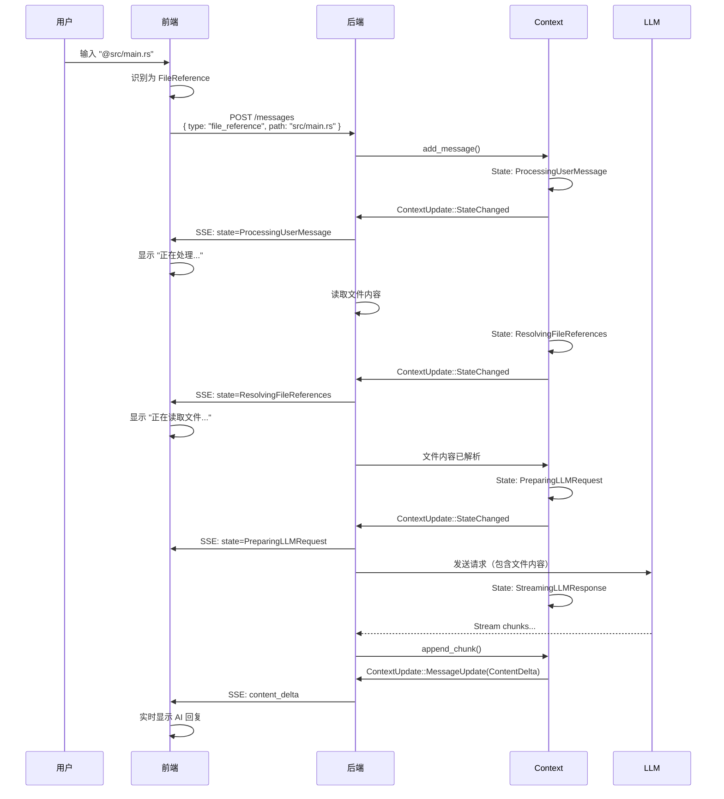
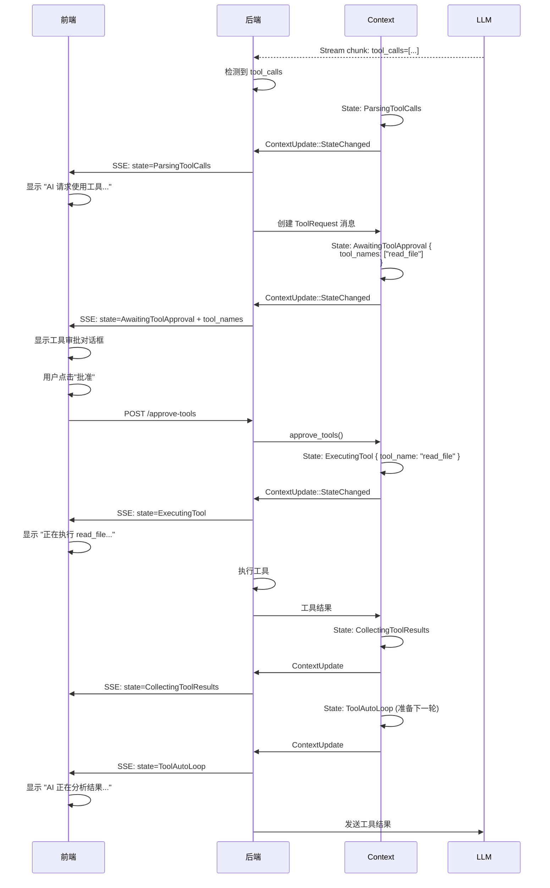
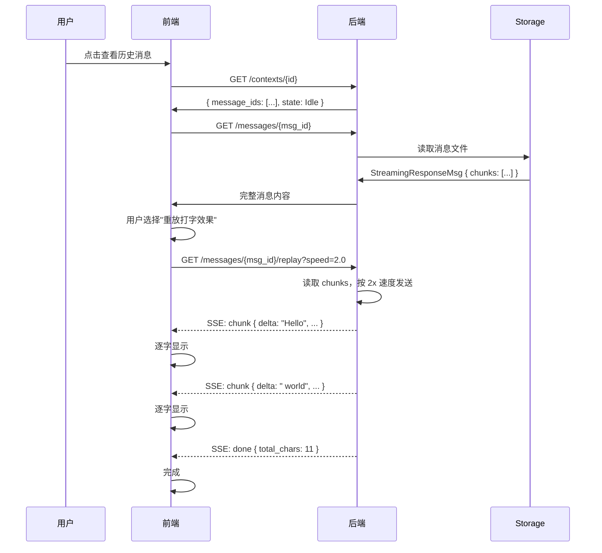

# 前后端状态同步机制 Review

**日期**: 2025-11-08  
**目的**: Review 现有设计与用户提出的"前后端状态交换"构想的匹配度

---

## 一、用户构想总结

### 核心理念
> **Context 是状态管理者，Message 是数据载体，前后端通过状态交换协作**

### 关键流程

#### 流程 1: 前端发送消息（前端→后端）
```
用户操作 → 前端识别类型 → 发送带 metadata 的消息
   ↓
  @文件     →  FileReference
  /命令     →  Workflow
  图片      →  Image
  附件      →  Attachment
```

#### 流程 2: 后端处理流式响应（后端→前端）
```
LLM Stream → 检测 tool call → 更新 Context Status → SSE 推送
   ↓
前端收到 Status → 渲染 UI → 用户批准 → 发送批准 → 后端执行
   ↓
执行完成 → 更新 Status → 前端渲染结果 → AI 总结
```

#### 关键点
1. **Message 有自己的 metadata**（记录来源、类型、展示方式）
2. **Context 管理状态**（不保存消息内容）
3. **SSE 推送状态变更**（前端据此渲染 UI）
4. **双向状态交换**（前端批准 → 后端执行 → 前端更新）

---

## 二、现有设计对比

### ✅ 已有且匹配的设计

#### 1. 前端发送契约 (design.md:645-696)

```rust
// ✅ 已有：前端明确告知消息类型
pub struct SendMessageRequest {
    pub session_id: Uuid,
    pub payload: MessagePayload,
    pub client_metadata: ClientMessageMetadata,  // ✅ 支持元数据
}

pub enum MessagePayload {
    Text { content: String, display: Option<String> },
    FileReference { path: String, range: Option<FileRange>, display_text: Option<String> },
    Workflow { workflow: String, parameters: HashMap<...>, display_text: Option<String> },
    ToolResult { tool_name: String, result: Value, display_text: Option<String> },
    // ⚠️ 缺少: Image, Attachment
}

pub struct ClientMessageMetadata {
    pub display_text: Option<String>,
    pub trace_id: Option<String>,
    pub extra: HashMap<String, Value>,
}
```

**评估**: 
- ✅ 前端可以明确消息类型
- ✅ 支持自定义展示文本
- ⚠️ 缺少 Image, Attachment 类型

#### 2. 细粒度状态机 (design.md:79-220)

```rust
// ✅ 已有：详细的状态枚举
pub enum ContextState {
    Idle,
    ProcessingUserMessage,
    ResolvingFileReferences,     // ✅ 处理文件引用
    StreamingLLMResponse { ... }, // ✅ 流式响应
    ParsingToolCalls,             // ✅ 检测工具调用
    AwaitingToolApproval { ... }, // ✅ 等待批准
    ExecutingTool { ... },        // ✅ 执行工具
    ToolAutoLoop { ... },         // ✅ 自动循环
    // ...
}
```

**评估**: 
- ✅ 状态非常细粒度
- ✅ 覆盖了工具调用的完整生命周期
- ✅ 前端可以根据状态渲染 UI

#### 3. SSE 推送机制 (design.md:2680-2821)

```rust
// ✅ 已有：ContextUpdate SSE 流
pub enum ContextUpdate {
    StateChanged { new_state: ContextState },
    MessageUpdate { message_id: Uuid, update: MessageUpdate },
    MetadataUpdate { ... },
}

pub enum MessageUpdate {
    Created { message_id: Uuid, role: Role },
    ContentDelta { delta: String, accumulated: String },
    Completed { final_message: InternalMessage },
    StatusChanged { new_status: MessageStatus },
}
```

**评估**: 
- ✅ 支持状态变更推送
- ✅ 支持消息增量更新
- ✅ 前端可以实时响应

---

### ⚠️ 需要扩展的部分

#### 1. MessageMetadata 不够完整

**当前实现** (metadata.rs:14-23):
```rust
pub struct MessageMetadata {
    pub created_at: Option<DateTime<Utc>>,
    pub duration_ms: Option<u64>,
    pub tokens: Option<TokenUsage>,
    pub extra: Option<HashMap<String, Value>>,
}
```

**问题**:
- ❌ 没有记录消息来源（用户输入 vs AI 生成 vs 工具结果）
- ❌ 没有记录前端发送的类型信息（是 @ 文件还是 / 命令）
- ❌ 没有记录展示提示（display_hint）
- ❌ 缺少流式响应的元数据（chunks, speed 等）

**建议扩展**:
```rust
pub struct MessageMetadata {
    // 现有字段
    pub created_at: Option<DateTime<Utc>>,
    pub duration_ms: Option<u64>,
    pub tokens: Option<TokenUsage>,
    
    // ✨ 新增：消息来源
    pub source: Option<MessageSource>,
    
    // ✨ 新增：展示提示
    pub display_hint: Option<DisplayHint>,
    
    // ✨ 新增：前端原始输入（用于回显）
    pub original_input: Option<String>,
    
    // ✨ 新增：关联的前端 trace_id
    pub trace_id: Option<String>,
    
    // ✨ 新增：流式响应元数据（如果是 StreamingResponse）
    pub streaming: Option<StreamingMetadata>,
    
    // 保留扩展字段
    pub extra: Option<HashMap<String, Value>>,
}

pub enum MessageSource {
    UserInput,           // 用户直接输入
    UserFileReference,   // 用户 @ 文件
    UserWorkflow,        // 用户 / 命令
    UserImageUpload,     // 用户上传图片
    AIGenerated,         // AI 生成的回复
    ToolExecution,       // 工具执行结果
    SystemControl,       // 系统控制消息
}

pub struct DisplayHint {
    /// 前端展示的缩略文本
    pub summary: Option<String>,
    
    /// 是否折叠显示
    pub collapsed: bool,
    
    /// 图标提示（如文件图标、工具图标）
    pub icon: Option<String>,
    
    /// 自定义样式类
    pub style_class: Option<String>,
}

pub struct StreamingMetadata {
    pub chunks: Vec<StreamChunk>,
    pub started_at: DateTime<Utc>,
    pub completed_at: DateTime<Utc>,
    pub total_duration_ms: u64,
    pub model: Option<String>,
    pub usage: Option<TokenUsage>,
}
```

#### 2. MessagePayload 缺少类型

**当前** (design.md:666-691):
```rust
pub enum MessagePayload {
    Text { ... },
    FileReference { ... },
    Workflow { ... },
    ToolResult { ... },
    // ❌ 缺少
}
```

**建议补充**:
```rust
pub enum MessagePayload {
    // 现有类型
    Text { content: String, display: Option<String> },
    FileReference { path: String, range: Option<FileRange>, display_text: Option<String> },
    Workflow { workflow: String, parameters: HashMap<...>, display_text: Option<String> },
    ToolResult { tool_name: String, result: Value, display_text: Option<String> },
    
    // ✨ 新增类型
    Image {
        data: ImageData,  // Url | Base64 | FilePath
        caption: Option<String>,
        display_text: Option<String>,
    },
    Attachment {
        file_path: String,
        mime_type: String,
        size_bytes: u64,
        display_text: Option<String>,
    },
    Audio {
        data: AudioData,
        transcript: Option<String>,
        display_text: Option<String>,
    },
}

pub enum ImageData {
    Url(String),
    Base64 { mime_type: String, data: String },
    FilePath(PathBuf),
}

pub enum AudioData {
    Url(String),
    Base64 { mime_type: String, data: String },
    FilePath(PathBuf),
}
```

---

## 三、状态交换流程验证

### 场景 1: 用户 @ 文件引用



**验证**: ✅ **流程完整，状态机支持**

---

### 场景 2: AI 返回工具调用



**验证**: ✅ **流程完整，状态机支持**

---

### 场景 3: 前端重放流式效果



**验证**: ✅ **新增功能，需要实现**

---

## 四、差距总结

### ✅ 已有且完善
1. **前端发送契约** - MessagePayload 枚举（Text, FileReference, Workflow, ToolResult）
2. **细粒度状态机** - ContextState 枚举（20+ 状态）
3. **SSE 推送机制** - ContextUpdate 流
4. **工具调用生命周期** - 从检测到批准到执行的完整状态

### ⚠️ 需要扩展
1. **MessageMetadata 字段**
   - 添加 `source: MessageSource`（记录来源）
   - 添加 `display_hint: DisplayHint`（展示提示）
   - 添加 `streaming: StreamingMetadata`（流式元数据）
   - 添加 `original_input`（前端原始输入）

2. **MessagePayload 类型**
   - 添加 `Image` 类型
   - 添加 `Attachment` 类型
   - 添加 `Audio` 类型（可选）

3. **StreamingResponse**
   - 新增 RichMessageType 变体
   - 实现流式记录和重放

### 🆕 需要新增
1. **流式重放 API**
   - `GET /messages/{id}/replay?speed=<float>`
   - SSE 流返回 chunks

2. **API 架构文档**
   - Context API vs Message API 的明确划分
   - 前后端状态同步协议

---

## 五、关键问题（需要您确认）

### 问题 1: MessageMetadata 的扩展

我建议的新字段是否符合您的需求？

```rust
pub struct MessageMetadata {
    // 现有
    pub created_at: Option<DateTime<Utc>>,
    pub tokens: Option<TokenUsage>,
    
    // ✨ 新增
    pub source: Option<MessageSource>,        // 来源类型
    pub display_hint: Option<DisplayHint>,    // 展示提示
    pub original_input: Option<String>,       // 前端原始输入
    pub trace_id: Option<String>,             // 追踪 ID
    pub streaming: Option<StreamingMetadata>, // 流式元数据
}
```

**问题**:
- 这些字段是否足够？还需要其他字段吗？
- `display_hint` 的设计（summary, collapsed, icon）是否满足前端需求？

---

### 问题 2: MessagePayload 的类型

是否需要添加这些类型？

```rust
pub enum MessagePayload {
    // 现有
    Text, FileReference, Workflow, ToolResult,
    
    // ✨ 新增
    Image {
        data: ImageData,  // Url | Base64 | FilePath
        caption: Option<String>,
    },
    Attachment {
        file_path: String,
        mime_type: String,
    },
    Audio { ... },  // 可选
}
```

**问题**:
- Image 类型是否需要？如果需要，支持哪些格式（URL/Base64/文件路径）？
- Attachment 类型是否需要？
- Audio 类型优先级如何（可以后续添加）？

---

### 问题 3: 前端 → 后端的 metadata 传递

前端发送消息时，`ClientMessageMetadata` 是否需要扩展？

**当前**:
```rust
pub struct ClientMessageMetadata {
    pub display_text: Option<String>,
    pub trace_id: Option<String>,
    pub extra: HashMap<String, Value>,
}
```

**问题**:
- 前端需要传递哪些额外信息？
- 例如：用户触发方式（@、/、点击按钮）？
- 例如：前端的 UI 状态（折叠/展开）？

---

### 问题 4: StreamingResponse 的设计

我之前设计的 StreamingResponse 是否满足需求？

```rust
pub struct StreamingResponseMsg {
    pub content: String,
    pub chunks: Vec<StreamChunk>,
    pub started_at: DateTime<Utc>,
    pub completed_at: DateTime<Utc>,
    pub total_duration_ms: u64,
    pub model: Option<String>,
    pub usage: Option<TokenUsage>,
    pub finish_reason: Option<String>,
}

pub struct StreamChunk {
    pub sequence: u64,
    pub delta: String,
    pub timestamp: DateTime<Utc>,
    pub accumulated_chars: usize,
    pub interval_ms: Option<u64>,
}
```

**问题**:
- 是否需要记录其他信息？
- 重放 API 的 speed 参数是否合理（0=instant, 1.0=原速, 2.0=2倍速）？

---

## 六、下一步行动计划（待确认）

### 方案 A: 完善 Message Metadata（推荐）

```
1. 更新 MessageMetadata 结构（添加 source, display_hint 等）
2. 扩展 MessagePayload（添加 Image, Attachment）
3. 添加 StreamingResponse 类型
4. 实现流式重放 API
5. 更新 design.md 和 spec delta
6. 编写测试
```

**预计工作量**: 2-3 天（包括测试）

### 方案 B: 分步实施

```
Step 1: MessageMetadata 扩展（1天）
  - 添加 source, display_hint, streaming 字段
  - 更新现有代码

Step 2: StreamingResponse（1-2天）
  - 添加 StreamingResponseMsg
  - 实现流式记录
  - 实现重放 API

Step 3: 新增 MessagePayload 类型（1天）
  - Image, Attachment
  - 前端集成
```

---

## 七、总结

### ✅ 现有设计已经很完善
- 前端发送契约 ✓
- 细粒度状态机 ✓
- SSE 推送机制 ✓
- 工具调用流程 ✓

### 📝 需要扩展的地方
1. **MessageMetadata** - 添加 source, display_hint, streaming
2. **MessagePayload** - 添加 Image, Attachment
3. **StreamingResponse** - 新增消息类型
4. **API 文档** - 明确前后端协议

### 🔍 您的构想与设计高度契合！

唯一需要补充的是：
- Message 自己的 metadata 需要更完整
- StreamingResponse 需要作为新类型添加

---

**请确认**:
1. MessageMetadata 的扩展方案是否满足需求？
2. 是否需要 Image/Attachment 类型？
3. StreamingResponse 的设计是否合理？
4. 选择方案 A（一次性完成）还是方案 B（分步实施）？

确认后我们立即更新 design.md 和开始实现！

