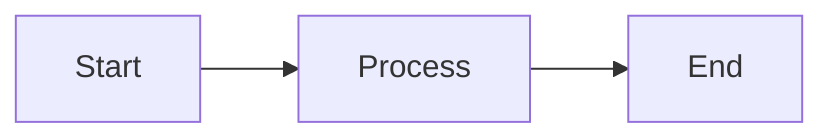
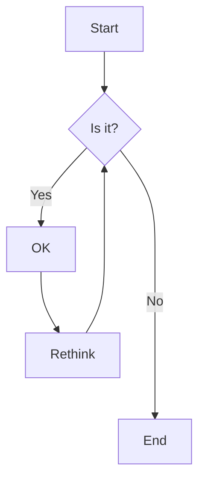
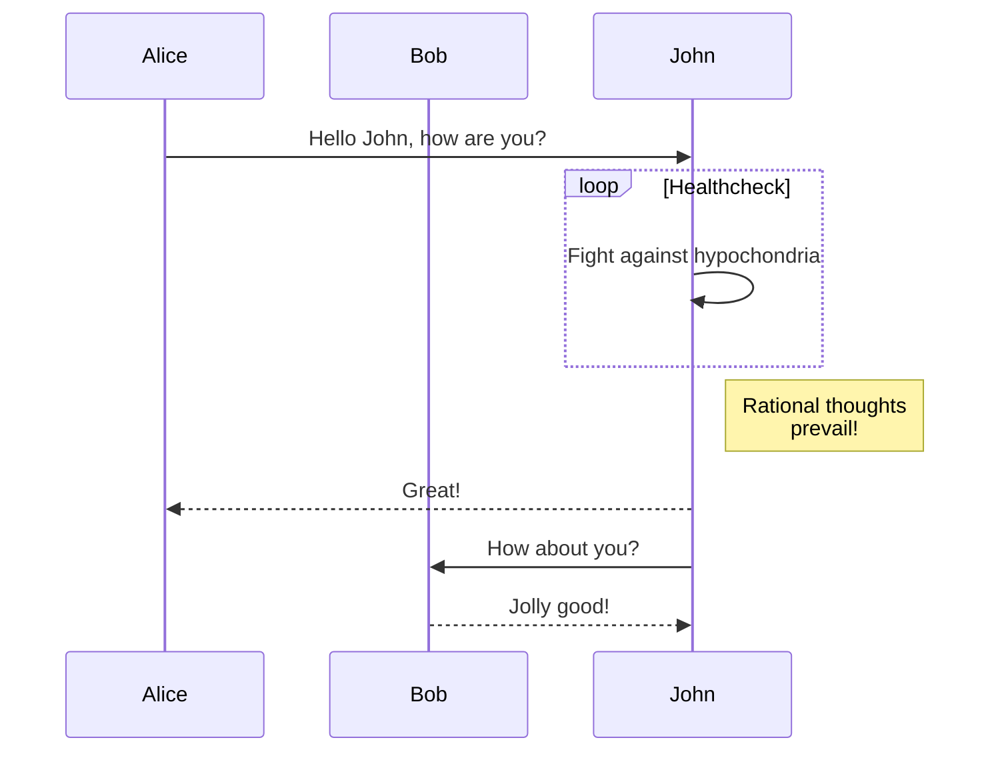
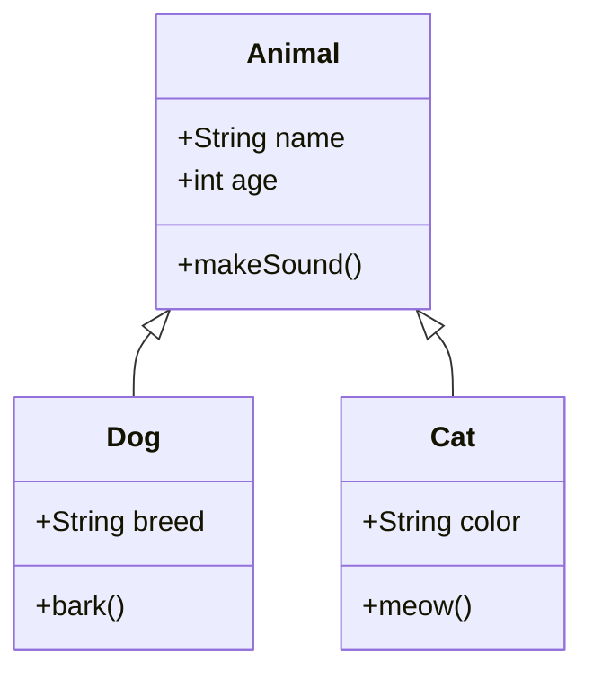
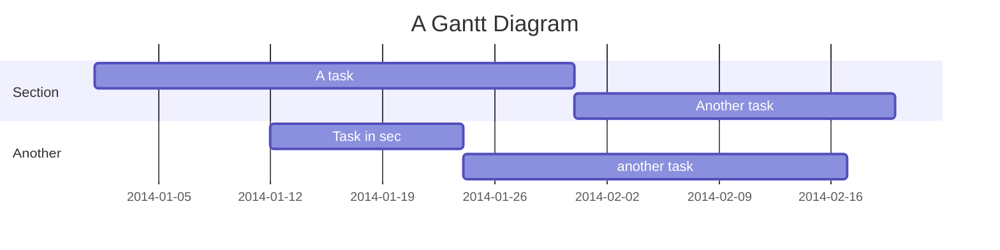
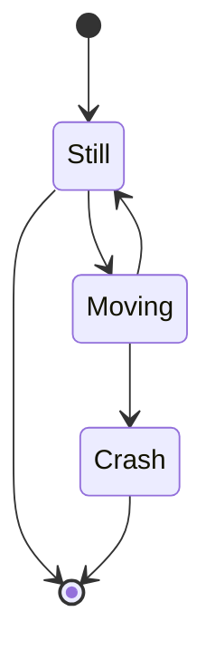
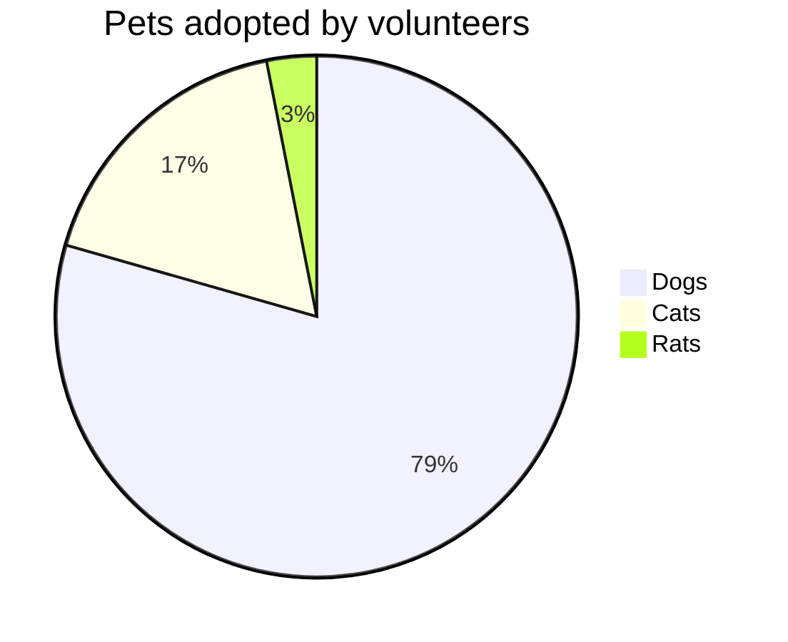
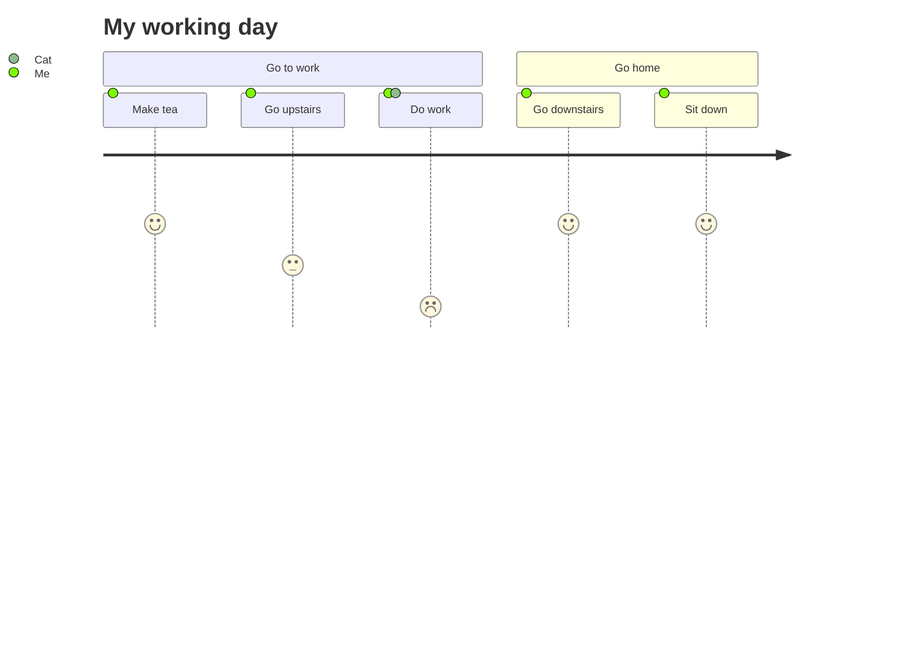

# Mermaid Examples for Testing

Here are some example Mermaid diagrams you can test in your MessageCard component:

## Simple Test (Use this first to test the fix)



## Flowchart Example



## Sequence Diagram Example



## Class Diagram Example



## Gantt Chart Example



## State Diagram Example



## Pie Chart Example



## Git Graph Example

```mermaid
gitgraph
    commit
    commit
    branch develop
    checkout develop
    commit
    commit
    checkout main
    merge develop
    commit
    commit
```

## User Journey Example



## Testing Instructions

1. Copy any of the above Mermaid code blocks
2. Paste them into a message in your chat application
3. The MessageCard component should automatically detect the `mermaid` language and render the diagram
4. If there are any syntax errors in the Mermaid code, an error message should be displayed instead

## Notes

- The Mermaid integration supports all standard Mermaid diagram types
- Diagrams are rendered with a dark theme to match the application's styling
- Error handling is included for invalid Mermaid syntax
- The diagrams are responsive and will adapt to the container width
