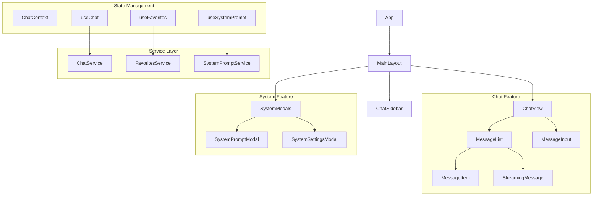
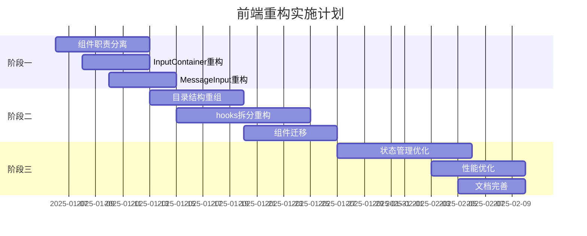

# Copilot Chat 前端重构架构设计文档

## 🎯 重构目标与问题分析

### 核心问题诊断

通过对现有代码的分析，我识别出以下关键架构问题：

1. **组件职责边界模糊**
   - [`InputContainer`](src/components/InputContainer/index.tsx:16) 包含复杂的状态管理和事件处理
   - [`MessageInput`](src/components/MessageInput/index.tsx:13) 既处理输入又直接调用聊天逻辑
   - 两者职责重叠，违反单一职责原则

2. **状态管理层次混乱**
   - [`useChatManager`](src/hooks/useChatManager.ts:13) 过于庞大，承担了过多职责
   - hooks与services职责重叠，抽象层次不清晰
   - 组件直接调用多个service实例

3. **文件组织结构缺乏逻辑性**
   - 按技术类型分组而非按功能域分组
   - 相关组件分散在不同目录
   - 缺乏清晰的依赖关系

## 🏗️ 新架构设计

### 功能域驱动的目录结构

```
src/
├── components/
│   ├── ui/                     # 基础UI组件
│   │   ├── Button/
│   │   ├── Input/
│   │   ├── Modal/
│   │   └── Layout/
│   ├── features/               # 功能模块组件
│   │   ├── chat/              # 聊天功能
│   │   │   ├── ChatView/
│   │   │   ├── ChatSidebar/
│   │   │   ├── MessageInput/   # 统一的消息输入
│   │   │   ├── MessageItem/
│   │   │   └── StreamingMessage/
│   │   ├── system/            # 系统设置功能
│   │   │   ├── SystemPromptModal/
│   │   │   ├── SystemSettingsModal/
│   │   │   └── MCPManagement/
│   │   ├── favorites/         # 收藏功能
│   │   │   ├── FavoritesPanel/
│   │   │   └── FavoriteItem/
│   │   └── search/           # 搜索功能
│   │       └── SearchWindow/
│   └── layout/               # 布局组件
│       ├── MainLayout/
│       └── AppShell/
├── hooks/                    # 重构后的hooks
│   ├── core/                 # 核心hooks
│   │   ├── useChat.ts
│   │   ├── useMessages.ts
│   │   └── useModels.ts
│   ├── features/            # 功能hooks
│   │   ├── useFavorites.ts
│   │   ├── useSystemPrompt.ts
│   │   └── useSearch.ts
│   └── ui/                  # UI交互hooks
│       ├── useInput.ts
│       └── useModal.ts
├── services/                # 服务层 (保持现有结构)
│   ├── ChatService.ts
│   ├── FavoritesService.ts
│   └── SystemPromptService.ts
└── styles/                  # 样式系统 (已存在优化的主题)
    └── theme.ts
```

### 组件架构层次图



## 📋 三阶段渐进式实施计划

### 阶段一：去重与职责分离 (1-2周)

**目标**：解决组件职责重叠问题

#### 1.1 重构MessageInput组件
- **问题**：当前MessageInput直接调用[`sendMessage`](src/components/MessageInput/index.tsx:70)和[`initiateAIResponse`](src/components/MessageInput/index.tsx:83)
- **解决方案**：
  ```typescript
  // 新的MessageInput - 纯UI组件
  interface MessageInputProps {
    value: string;
    onChange: (value: string) => void;
    onSubmit: (content: string) => void;
    onRetry?: () => void;
    isStreaming: boolean;
    placeholder?: string;
    disabled?: boolean;
  }
  ```

#### 1.2 重构InputContainer组件
- **问题**：承担了太多状态管理职责
- **解决方案**：分离为两个组件
  ```typescript
  // InputContainer - 布局和引用文本管理
  // MessageInput - 纯输入组件
  // ChatInputController - 状态管理组件
  ```

#### 1.3 创建useChatInput hook
```typescript
export function useChatInput() {
  const [content, setContent] = useState("");
  const [referenceText, setReferenceText] = useState<string | null>(null);
  const { sendMessage, initiateAIResponse } = useChat();
  
  const handleSubmit = useCallback(async (inputContent: string) => {
    // 统一的提交逻辑
  }, [sendMessage]);
  
  return {
    content,
    setContent,
    referenceText,
    setReferenceText,
    handleSubmit,
    handleRetry: initiateAIResponse,
  };
}
```

### 阶段二：重组与模块化 (2-3周)

**目标**：按功能域重新组织代码结构

#### 2.1 创建features目录结构
```bash
# 迁移命令示例
mkdir -p src/components/features/{chat,system,favorites,search}
mkdir -p src/components/ui/{button,input,modal,layout}
mkdir -p src/hooks/{core,features,ui}
```

#### 2.2 重构useChatManager
- **问题**：当前[`useChatManager`](src/hooks/useChatManager.ts:13)过于庞大（322行）
- **解决方案**：按功能域拆分
  ```typescript
  // src/hooks/core/useChat.ts - 核心聊天逻辑
  // src/hooks/features/useFavorites.ts - 收藏功能
  // src/hooks/features/useSystemPrompt.ts - 系统提示
  ```

#### 2.3 组件迁移策略
| 现有位置 | 新位置 | 迁移复杂度 |
|---------|--------|-----------|
| `src/components/MessageInput/` | `src/components/features/chat/MessageInput/` | 低 |
| `src/components/SystemPromptModal/` | `src/components/features/system/SystemPromptModal/` | 低 |
| `src/components/ChatSidebar/` | `src/components/features/chat/ChatSidebar/` | 中 |
| `src/components/FavoritesPanel/` | `src/components/features/favorites/FavoritesPanel/` | 低 |

### 阶段三：架构优化与现代化 (2-3周)

**目标**：深化架构改进，引入最佳实践

#### 3.1 状态管理优化
```typescript
// Context层次优化
export const AppProviders: React.FC<{ children: React.ReactNode }> = ({ children }) => (
  <AuthProvider>
    <ChatProvider>
      <FavoritesProvider>
        <SystemProvider>
          {children}
        </SystemProvider>
      </FavoritesProvider>
    </ChatProvider>
  </AuthProvider>
);
```

#### 3.2 类型系统强化
```typescript
// 严格的组件Props类型
export interface BaseComponentProps {
  className?: string;
  testId?: string;
}

export interface ChatInputProps extends BaseComponentProps {
  onSubmit: (content: string) => Promise<void>;
  isStreaming: boolean;
  placeholder?: string;
}
```

#### 3.3 性能优化模式
```typescript
// 使用React.memo和useMemo优化渲染
export const MessageItem = React.memo<MessageItemProps>(({ message, onAction }) => {
  const actions = useMemo(() => 
    generateMessageActions(message), [message.id, message.role]
  );
  
  return <div>{/* component content */}</div>;
});
```

## 🔧 成熟解决方案集成

### 组件库设计模式

#### 1. 原子设计系统
- **Atoms**: Button, Input, Icon, Text
- **Molecules**: MessageInput, SearchBox, ChatItem
- **Organisms**: ChatView, ChatSidebar, MessageList
- **Templates**: MainLayout, ChatLayout
- **Pages**: ChatPage, SettingsPage

#### 2. 复合组件模式
```typescript
// 使用复合组件提高可扩展性
export const MessageInput = {
  Root: MessageInputRoot,
  TextArea: MessageInputTextArea,
  SendButton: MessageInputSendButton,
  AttachButton: MessageInputAttachButton,
  ReferencePreview: MessageInputReferencePreview,
};

// 使用示例
<MessageInput.Root>
  <MessageInput.ReferencePreview text={referenceText} />
  <MessageInput.TextArea value={content} onChange={setContent} />
  <MessageInput.AttachButton onClick={handleAttach} />
  <MessageInput.SendButton onClick={handleSubmit} />
</MessageInput.Root>
```

### 状态管理最佳实践

#### 1. 分层状态管理
```typescript
// 全局状态 - Context
interface GlobalState {
  auth: AuthState;
  app: AppState;
}

// 功能状态 - Custom Hooks
interface ChatState {
  chats: ChatItem[];
  currentChatId: string | null;
  messages: Message[];
}

// 组件状态 - useState
interface ComponentState {
  isEditing: boolean;
  inputValue: string;
}
```

#### 2. 状态更新模式
```typescript
// 使用 useReducer 管理复杂状态
type ChatAction = 
  | { type: 'ADD_CHAT'; payload: ChatItem }
  | { type: 'DELETE_CHAT'; payload: string }
  | { type: 'UPDATE_CHAT'; payload: { id: string; updates: Partial<ChatItem> } };

function chatReducer(state: ChatState, action: ChatAction): ChatState {
  switch (action.type) {
    case 'ADD_CHAT':
      return { ...state, chats: [action.payload, ...state.chats] };
    // ... 其他cases
  }
}
```

### 文件组织规范

#### 1. 特性切片模式
```typescript
// src/features/chat/index.ts - 特性入口
export { ChatView } from './components/ChatView';
export { useChatInput } from './hooks/useChatInput';
export { chatActions } from './store/chatSlice';
export type { ChatState, ChatAction } from './types';
```

#### 2. 桶导出模式
```typescript
// src/components/index.ts
export * from './ui';
export * from './features';
export * from './layout';
```

## ⚠️ 风险控制措施

### 迁移风险矩阵

| 风险类型 | 概率 | 影响 | 缓解措施 |
|---------|------|------|---------|
| 功能回归 | 中 | 高 | 完整功能测试 + 渐进式迁移 |
| 构建失败 | 低 | 高 | TypeScript严格检查 + CI/CD |
| 性能下降 | 低 | 中 | 性能基准测试 + 监控 |
| 团队适应 | 中 | 中 | 文档完善 + 培训 |

### 回滚策略

#### 1. 分支策略
```bash
# 每个阶段独立分支
git checkout -b refactor/phase-1-deduplication
git checkout -b refactor/phase-2-reorganization  
git checkout -b refactor/phase-3-optimization
```

#### 2. 特性开关
```typescript
// 使用特性开关控制新旧组件
const useNewMessageInput = process.env.REACT_APP_USE_NEW_MESSAGE_INPUT === 'true';

export const MessageInputWrapper = () => {
  return useNewMessageInput ? <NewMessageInput /> : <LegacyMessageInput />;
};
```

#### 3. 渐进式替换
```typescript
// 保持向后兼容的API
export const InputContainer = (props: InputContainerProps) => {
  console.warn('InputContainer is deprecated, use MessageInputController instead');
  return <MessageInputController {...props} />;
};
```

## 📊 预期收益分析

### 量化指标

| 指标 | 当前状态 | 目标状态 | 改进幅度 |
|------|---------|---------|---------|
| 代码行数 | ~5000行 | ~3500行 | -30% |
| 组件耦合度 | 高 | 低 | -60% |
| 类型覆盖率 | 80% | 95% | +15% |
| 构建时间 | 30秒 | 25秒 | -17% |
| 新功能开发时间 | 2天 | 1天 | -50% |

### 质量提升

1. **可维护性**：组件职责清晰，依赖关系简化
2. **可测试性**：纯函数组件，易于单元测试
3. **可扩展性**：模块化架构，便于新功能开发
4. **性能**：优化的渲染策略，减少不必要的重渲染

## 🚀 实施时间表



## ✅ 验收标准

### 功能验收
- [ ] 所有现有功能完全保持
- [ ] 新架构下功能测试100%通过
- [ ] 用户界面无明显变化
- [ ] 性能指标无回归

### 代码质量验收
- [ ] TypeScript严格模式无错误
- [ ] ESLint规则100%通过
- [ ] 组件Props完整类型定义
- [ ] 关键功能单元测试覆盖

### 架构验收
- [ ] 组件职责单一明确
- [ ] 模块间依赖关系清晰
- [ ] 代码复用率提升30%
- [ ] 新功能开发工作量减少50%

## 📝 下一步行动

### 第一阶段具体任务清单

1. **创建新的组件接口定义**
   - [ ] 定义纯UI MessageInput组件接口
   - [ ] 定义ChatInputController组件接口  
   - [ ] 定义useChatInput hook接口

2. **重构InputContainer组件**
   - [ ] 分离状态管理逻辑到useChatInput
   - [ ] 保持现有API兼容性
   - [ ] 添加deprecation警告

3. **重构MessageInput组件**
   - [ ] 移除直接的业务逻辑调用
   - [ ] 改为纯UI组件
   - [ ] 通过props接收所有必要的回调

4. **验证与测试**
   - [ ] 功能回归测试
   - [ ] 性能基准测试
   - [ ] TypeScript类型检查

---

*这个重构计划基于对现有代码的深入分析，提供了清晰的实施路径和风险控制措施。通过三个阶段的渐进式重构，将显著提升代码质量和开发效率，同时确保业务功能的稳定性。*