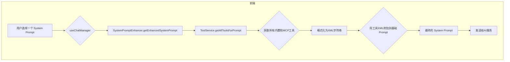

# 系统模式

## 架构概述

本应用采用**混合架构**，并通过Tauri进行打包。

- **前端 (React/TypeScript)**: 作为一个标准的Web应用，负责所有用户界面和客户端状态管理。
- **后端 (Rust/Tauri)**:
  - **Web 服务 (actix-web)**: 在Tauri应用内部启动一个本地的 `actix-web` 服务器。前端通过标准的HTTP请求 (`fetch`) 与这个本地服务器通信，以执行核心业务逻辑（如AI交互、工具执行）。
  - **Tauri 原生桥**: 对于少数需要直接与操作系统交互的功能（如剪贴板操作），仍然使用Tauri的JS-Rust互操作桥 (`invoke`)。

这种架构将核心业务逻辑与桌面应用框架解耦，提高了可移植性和可测试性，同时保留了Tauri在原生集成方面的优势。

## 核心流程：动态 Prompt 构建

这是一个在每次与AI交互之前运行的关键流程，确保AI拥有最新的上下文和工具信息。

这个流程的核心是 `SystemPromptEnhancer` 服务，它负责将用户选择的静态 prompt 与动态生成的工具列表结合起来，形成一个完整的、上下文感知的 system prompt。

## 关键设计模式

- **服务工厂 (`ServiceFactory`)**: 在前端，`ServiceFactory` 用于根据当前模式（例如Tauri模式或Web模式）动态提供服务实现。这使得核心业务逻辑与具体实现分离。
- **状态机 (`chatInteractionMachine`)**: 使用XState管理聊天交互的复杂状态，如空闲、等待AI响应、等待用户批准等。这使得UI状态的管理更加可预测和健壮。
- **客户端持久化 (`StorageService` + Zustand)**:
    - **`StorageService`**: 封装了所有与 `localStorage` 的交互，为上层提供了一个干净的异步API来存储和检索数据，如聊天记录和用户自定义的 System Prompts。
    - **Zustand Slices (例如 `promptSlice`, `chatSessionSlice`)**: 作为应用状态的单一数据源。它们负责调用 `StorageService` 来加载初始数据，并通过定义的 actions（增、删、改）来更新状态和持久化存储。这种模式将状态管理和数据持久化清晰地分离开来。
- **统一错误处理 (Rust/actix-web)**: 后端采用统一的 `AppError` 枚举和 `ResponseError` trait 实现，将业务逻辑错误（如“工具未找到”）与服务器内部错误分离，并自动转换为合适的HTTP响应。
- **自定义 Hooks 抽象 (React)**: 在前端，复杂的UI逻辑（如图片处理、拖放）被从组件中提取到专门的自定义Hooks（如 `useImageHandler`, `useDragAndDrop`）中。这使得组件更轻量，逻辑更易于复用和测试。
- **命令模式**: 后端的Tauri命令（`#[tauri::command]`）将前端请求封装为独立的、可执行的操作。
- **模块化 (`crates`)**: Rust后端被分解为多个`crates`（如 `copilot_client`, `tool_system`, `web_service`），每个`crate`负责一个特定的功能领域，遵循单一职责原则。最近的重构将 `tool_system` 的创建和管理封装在 `web_service` crate 内部，增强了模块的内聚性和独立性。

## 组件关系

- **`ChatView`**: 核心UI组件，展示聊天消息。
- **`MessageInput`**: 用户输入框，处理文本和附件。
- **`SystemPromptManager`**: 允许用户CRUD自定义System Prompts的UI组件。
- **`SystemPromptSelector`**: 允许用户在开始新聊天时选择一个基础System Prompt的模态框。
- **`ChatControllerContext`**: React Context，为整个应用提供对聊天管理器的访问。
- **`useChatManager`**: 自定义Hook，封装了与聊天交互状态机和后端服务通信的主要逻辑。
- **`TauriService`**: 封装了所有与Tauri后端通信的细节。
