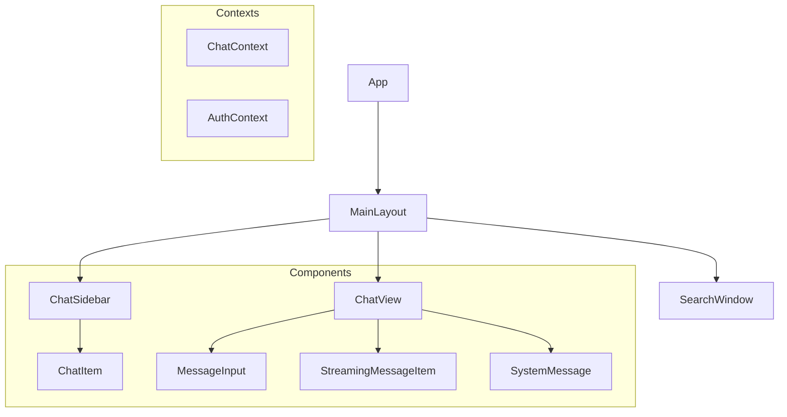
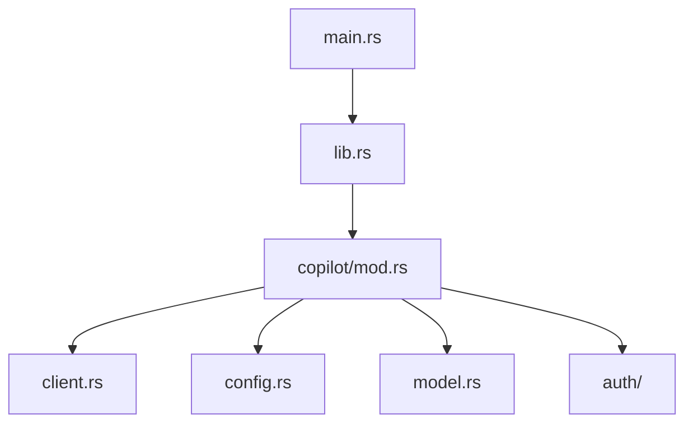

# System Patterns: Copilot Chat

## Architecture Overview

### Frontend Architecture


### Backend Architecture


## Key Design Patterns

1. Context-based State Management
   - ChatContext for chat state and operations (consumes selected model from `useModels`).
   - AuthContext for authentication state.
   - React Context API for global state.
   - Custom hooks for state access (e.g., `useModels` now handles model fetching, selection, and persistence to `localStorage`).

2. Component Architecture
   - Functional components with TypeScript
   - Component-specific styling
   - Reusable UI components
   - Clear component hierarchy

3. Data Flow Patterns
   - Unidirectional data flow
   - Context-based state updates
   - Event-driven updates
   - Streaming message handling

4. Backend Integration
   - Tauri commands for IPC
   - Rust-based API client
   - Secure authentication handling
   - Message streaming support

## Implementation Patterns

1. Frontend Patterns
   - Custom hooks for logic reuse (e.g., `useModels` for model management).
   - `localStorage` for simple client-side persistence of user preferences (e.g., selected model).
   - CSS modules for styling
   - TypeScript interfaces for type safety
   - Component composition

2. Backend Patterns
   - Module-based organization
   - Trait implementations
   - Error handling with Result
   - Async/await for I/O

3. State Management
   - Context providers
   - Reducer patterns
   - Immutable state updates
   - Local component state

4. Communication Patterns
   - IPC via Tauri commands
   - Event emission/listening
   - Message streaming
   - Error propagation

## Critical Implementation Paths

1. Authentication Flow
   ```mermaid
   sequenceDiagram
       Frontend->>AuthContext: Init auth
       AuthContext->>Tauri: Check auth
       Tauri->>Copilot: Validate
       Copilot-->>Frontend: Auth result
   ```

2. Message Flow
   ```mermaid
   sequenceDiagram
       Frontend->>ChatContext: Send message
       ChatContext->>Tauri: Process message
       Tauri->>Copilot: API request
       Copilot-->>Frontend: Stream response
   ```

## Component Relationships

1. Layout Structure
   - MainLayout as container
   - Sidebar for navigation
   - ChatView for messages
   - Modals for settings/prompts

2. Context Usage
   - Providers wrap application
   - Consumers use custom hooks
   - Components subscribe to updates
   - State updates trigger re-renders

## Technical Decisions

1. Framework Choices
   - Tauri for native capabilities
   - React for UI components
   - TypeScript for type safety
   - Ant Design for UI components

2. State Management
   - React Context over Redux
   - Custom hooks for abstraction
   - Local state when appropriate
   - Immutable patterns

3. Styling Approach
   - CSS modules for scoping
   - Component-level styles
   - Consistent naming
   - Responsive design

4. Backend Design
   - Modular Rust code
   - Clear separation of concerns
   - Robust error handling
   - Efficient API integration
