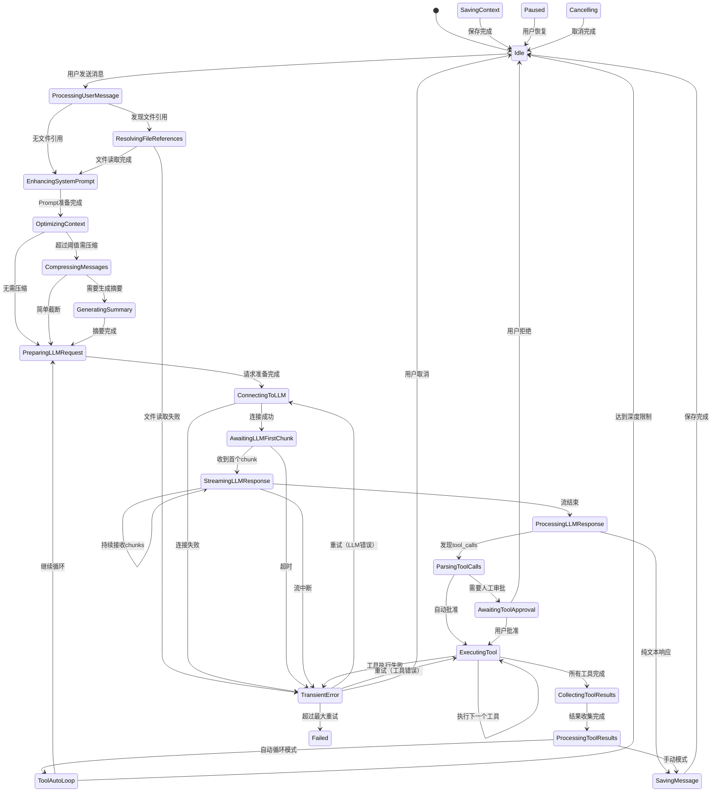

# Context Manager & Session Manager Architecture Design

## Context

当前系统经历了多次功能扩展，包括文件引用、工具调用、Agent角色系统、Workflow系统等。这些新功能的加入使得原有的Context Manager和Session Manager的职责边界变得模糊，生命周期管理变得复杂。我们需要重新设计这两个核心组件，使其更好地支持当前和未来的功能需求。

### Current Pain Points

1. **逻辑分散在web_service**：大量的状态机逻辑、流式输出处理、消息组装等核心逻辑在web_service中，而不是在context_manager中，导致职责不清
2. **消息处理逻辑分散**：文件读取、工具调用、普通对话等处理逻辑分布在不同的模块，缺乏统一的抽象
3. **消息类型不够丰富**：内部消息类型不够详细，无法充分记录处理过程中的所有细节，不利于多LLM适配
4. **上下文传递不完整**：流式输出时只传递文本增量，前端无法获取完整的Context状态，无法基于状态做智能渲染
5. **工具调用需要多次手动交互**：每次工具调用都需要用户确认，无法实现连续的自动化任务执行
6. **存储性能问题**：整个ChatContext（包括所有历史消息）作为单一JSON保存，导致序列化/反序列化开销大
7. **前端状态管理混乱**：用户的会话状态（打开的对话、UI状态）没有统一的管理机制
8. **System Prompt静态化**：System Prompt在创建时固定，无法根据对话上下文动态调整
9. **上下文优化不足**：没有智能机制来选择和压缩上下文，导致token浪费或关键信息丢失

## Goals / Non-Goals

### Goals

1. **清晰的职责划分和逻辑集中**：
   - Context Manager: 成为真正的核心，管理对话上下文、消息生命周期、状态机、流式输出、工具调用循环
   - web_service: 简化为API层，只做请求转发和响应格式化
   - Session Manager: 管理用户会话状态、UI偏好、会话持久化

1.5. **模块化文件组织**：
   - 按功能划分模块，每个文件尽可能小（< 300行）
   - 功能相关的代码group在一起
   - 每个模块都可以独立测试
   - 避免大文件（几千行），提升可维护性和可读性
   - **新增标准**：所有“上下文/消息”领域模型结构体统一定义在 `context_manager`，web_service 只允许：
     1. 使用这些领域结构体（或通过 `dto` 做轻量转换）；
     2. 定义与 HTTP/Transport 强相关的 Request/Query VO（如分页参数）。
     这样可避免 controller/service 私自扩张领域模型，保持单一来源。如本次新增的 `MessageContentSlice` 和 `message_content_slice` helper 由 `context_manager` 提供，controller 仅复用并序列化输出。
   
2. **统一的消息处理Pipeline**：
   - 所有消息类型通过统一的pipeline处理
   - 支持可插拔的消息处理器（Processor）
   - 明确的消息生命周期：创建 → 验证 → 增强 → 执行 → 存储
   
3. **智能工具调用**：
   - 支持工具调用的自动循环执行
   - 可配置的审批策略（自动/手动/混合）
   - 工具调用结果自动反馈给LLM
   
4. **性能优化**：
   - 消息内容与元数据分离存储
   - 支持消息的增量加载
   - 优化大对话的序列化性能
   
5. **灵活的System Prompt**：
   - 支持模式切换（Plan/Act）时动态更新
   - 支持上下文增强（工具列表、文件上下文等）
   - 支持分支级别的Prompt定制

### Non-Goals

1. **消息搜索和索引**：暂不实现全文搜索，留待后续版本
2. **实时协作**：暂不支持多用户同时编辑同一对话
3. **消息版本控制**：暂不实现消息的版本历史和回滚
4. **分布式部署**：设计聚焦单实例场景

## Decisions

### Decision -1: Fine-Grained State Machine Design

**What**: 设计非常详细的状态机，每个细微操作都有明确的状态，不使用额外字段来表达状态

**Why**:
- 前端需要明确知道当前在做什么，才能渲染正确的UI
- 避免通过组合字段来判断状态（如`isStreaming && isWaitingApproval`）
- 每个状态都是自解释的，代码更易理解
- 便于调试和追踪状态流转
- 测试时可以验证精确的状态序列

**How**:
```rust
/// 详细的Context状态枚举
#[derive(Debug, Clone, Serialize, Deserialize, PartialEq, Eq)]
pub enum ContextState {
    // ========== 空闲和准备 ==========
    /// 空闲状态，等待用户输入
    Idle,
    
    // ========== 消息处理阶段 ==========
    /// 正在处理用户消息（验证、解析）
    ProcessingUserMessage,
    
    /// 正在处理文件引用（读取文件内容）
    ResolvingFileReferences,
    
    /// 正在增强System Prompt（注入工具定义、上下文）
    EnhancingSystemPrompt,
    
    /// 正在优化上下文（token计数、压缩）
    OptimizingContext,
    
    // ========== LLM交互阶段 ==========
    /// 准备发送请求到LLM
    PreparingLLMRequest,
    
    /// 等待LLM连接建立
    ConnectingToLLM,
    
    /// 等待LLM首次响应
    AwaitingLLMFirstChunk,
    
    /// 正在接收LLM流式响应
    StreamingLLMResponse {
        /// 已接收的chunk数量
        chunks_received: usize,
        /// 累积的字符数
        chars_accumulated: usize,
    },
    
    /// LLM响应接收完毕，正在处理
    ProcessingLLMResponse,
    
    // ========== 工具调用阶段 ==========
    /// 解析到工具调用请求，正在准备
    ParsingToolCalls,
    
    /// 等待用户审批工具调用
    AwaitingToolApproval {
        /// 待审批请求的ID列表
        pending_requests: Vec<Uuid>,
        /// 工具名称列表
        tool_names: Vec<String>,
    },
    
    /// 正在执行单个工具调用
    ExecutingTool {
        /// 当前工具名称
        tool_name: String,
        /// 当前尝试次数（1-based）
        attempt: u8,
    },
    
    /// 工具执行完成，正在收集结果
    CollectingToolResults,
    
    /// 正在处理工具结果（格式化、验证）
    ProcessingToolResults,
    
    /// 工具自动循环中（准备下一轮LLM调用）
    ToolAutoLoop {
        /// 当前循环深度
        depth: usize,
        /// 已执行的工具总数
        tools_executed: usize,
    },
    
    // ========== Branch操作阶段 ==========
    /// 正在切换Branch
    SwitchingBranch {
        from: String,
        to: String,
    },
    
    /// 正在合并Branch
    MergingBranches {
        source: String,
        target: String,
        strategy: String, // "Append" | "CherryPick" | "Rebase"
    },
    
    // ========== 存储操作阶段 ==========
    /// 正在保存Context到存储
    SavingContext,
    
    /// 正在保存单个消息
    SavingMessage {
        message_id: String,
    },
    
    /// 正在加载历史消息
    LoadingMessages {
        loaded: usize,
        total: usize,
    },
    
    // ========== 优化阶段 ==========
    /// 正在压缩历史消息
    CompressingMessages {
        messages_to_compress: usize,
    },
    
    /// 正在生成消息总结（调用LLM）
    GeneratingSummary,
    
    // ========== 错误和恢复 ==========
    /// 瞬态错误（可重试）
    TransientError {
        error_type: String,
        retry_count: usize,
        max_retries: usize,
    },
    
    /// 等待错误恢复
    WaitingForRecovery,
    
    /// 不可恢复的错误（终止状态）
    Failed {
        error_message: String,
        failed_at: String, // ISO timestamp
    },
    
    // ========== 特殊状态 ==========
    /// 正在初始化（首次创建）
    Initializing,
    
    /// 暂停状态（用户请求暂停）
    Paused,
    
    /// 正在取消当前操作
    Cancelling,
}
```

**状态转换示例**:
```rust
// 完整的发送消息流程状态序列
Idle 
  → ProcessingUserMessage          // 处理用户输入
  → ResolvingFileReferences        // 如果有文件引用
  → EnhancingSystemPrompt          // 增强prompt
  → OptimizingContext              // 优化上下文
  → PreparingLLMRequest            // 准备请求
  → ConnectingToLLM                // 连接LLM
  → AwaitingLLMFirstChunk          // 等待首个响应
  → StreamingLLMResponse {chunks: 1, chars: 15}  // 流式接收
  → StreamingLLMResponse {chunks: 2, chars: 42}
  → StreamingLLMResponse {chunks: 3, chars: 78}
  → ProcessingLLMResponse          // 处理完整响应
  → ParsingToolCalls               // 发现工具调用
  → AwaitingToolApproval {pending_requests: [...], tool_names: ["read_file", "codebase_search"]}
  → ExecutingTool {tool_name: "read_file", attempt: 1}
  → ExecutingTool {tool_name: "codebase_search", attempt: 1}
  → CollectingToolResults          // 收集结果
  → ProcessingToolResults          // 处理结果
  → ToolAutoLoop {depth: 1, executed: 2}  // 准备下一轮
  → PreparingLLMRequest            // 再次调用LLM
  → ConnectingToLLM
  → StreamingLLMResponse {...}
  → ProcessingLLMResponse
  → Idle                           // 完成
```

**前端UI渲染示例**:
```typescript
// 前端可以根据精确的状态渲染UI
function renderStateIndicator(state: ContextState) {
    switch (state) {
        case 'Idle':
            return null; // 不显示任何指示器
            
        case 'ProcessingUserMessage':
            return <Spinner text="正在处理消息..." />;
            
        case 'ResolvingFileReferences':
            return <Spinner text="正在读取文件..." />;
            
        case 'EnhancingSystemPrompt':
            return <Spinner text="正在准备对话上下文..." />;
            
        case 'OptimizingContext':
            return <Spinner text="正在优化对话历史..." />;
            
        case 'ConnectingToLLM':
            return <Spinner text="正在连接到AI..." />;
            
        case 'AwaitingLLMFirstChunk':
            return <Spinner text="AI正在思考..." />;
            
        case 'StreamingLLMResponse':
            return <StreamingIndicator 
                text="AI正在回复..." 
                chunks={state.chunks_received}
                chars={state.chars_accumulated}
            />;
            
        case 'ParsingToolCalls':
            return <Spinner text="AI请求使用工具..." />;
            
        case 'AwaitingToolApproval':
            return <ApprovalDialog 
                pendingCount={state.pending_requests.length}
                tools={state.tool_names}
                onApprove={handleApprove}
                onDeny={handleDeny}
            />;
            
        case 'ExecutingTool':
            return <ToolExecutionProgress 
                current={state.attempt}
                total={state.attempt}
                currentTool={state.tool_name}
            />;
            
        case 'CollectingToolResults':
            return <Spinner text="正在收集工具执行结果..." />;
            
        case 'ProcessingToolResults':
            return <Spinner text="正在处理工具返回的数据..." />;
            
        case 'ToolAutoLoop':
            return <AutoLoopIndicator 
                depth={state.depth}
                toolsExecuted={state.tools_executed}
                message="AI正在自动处理多步任务..."
            />;
            
        case 'SwitchingBranch':
            return <Spinner text={`正在切换到 ${state.to}...`} />;
            
        case 'MergingBranches':
            return <MergeProgress 
                source={state.source}
                target={state.target}
                strategy={state.strategy}
            />;
            
        case 'SavingContext':
            return <Spinner text="正在保存..." />;
            
        case 'CompressingMessages':
            return <Spinner text={`正在压缩 ${state.messages_to_compress} 条历史消息...`} />;
            
        case 'GeneratingSummary':
            return <Spinner text="正在生成对话摘要..." />;
            
        case 'TransientError':
            return <ErrorRetry 
                error={state.error_type}
                retryCount={state.retry_count}
                maxRetries={state.max_retries}
                onRetry={handleRetry}
            />;
            
        case 'Failed':
            return <ErrorMessage 
                message={state.error_message}
                timestamp={state.failed_at}
            />;
            
        default:
            return <Spinner text="处理中..." />;
    }
}
```

**状态的完全自解释性**:
```rust
// ❌ 错误做法：通过组合字段判断状态
struct BadContextState {
    is_streaming: bool,
    is_waiting_approval: bool,
    is_executing_tools: bool,
    current_tool_index: Option<usize>,
    // ... 难以理解当前到底在做什么
}

// ✅ 正确做法：状态本身就说明一切
enum ContextState {
    StreamingLLMResponse { chunks_received: usize, chars_accumulated: usize },
    // 一看就知道：正在流式接收，已收到多少chunks，累积了多少字符
    
    ExecutingTool { tool_name: String, attempt: u8 },
    // 一看就知道：正在执行工具，当前第几个，总共几个，在执行哪个工具
}
```

**Benefits**:
- 前端根据状态名就知道该显示什么UI
- 调试时看状态日志就知道执行到哪一步
- 测试时可以验证精确的状态序列
- 不需要额外的"是否正在XXX"字段
- 状态转换逻辑清晰，不会出现不一致

**Complete State Transition Map**:


**状态携带的上下文信息**:
```rust
// 某些状态携带额外信息，使状态更加明确
match context.current_state {
    ContextState::StreamingLLMResponse { chunks_received: 42, chars_accumulated: 1337 } => {
        // 明确知道已接收42个chunks，累积了1337个字符
        // 前端可以显示进度
    }
    
    ContextState::AwaitingToolApproval { pending_requests, tool_names } => {
        // 明确知道有3个工具等待审批，分别是哪些
        // 前端可以显示详细的审批列表
        assert_eq!(pending_requests.len(), 3);
        assert_eq!(tool_names, vec!["read_file", "codebase_search", "workspace_search"]);
    }
    
    ContextState::ExecutingTool { tool_name, attempt } => {
        // 明确知道正在执行第2个工具（共3个），当前是read_file
        // 前端可以显示："正在执行工具 2/3: read_file"
        assert_eq!(tool_name, "read_file");
        assert_eq!(attempt, 2);
    }
    
    ContextState::ToolAutoLoop { depth: 2, tools_executed: 5 } => {
        // 明确知道当前在第2层循环，已执行5个工具
        // 前端可以显示："自动处理中（第2轮，已执行5个工具）"
    }
}
```

**Benefits**:
- 🎯 **自解释**: 看状态名就知道在做什么
- 🎨 **精确UI**: 前端可以渲染非常精确的进度提示
- 🧪 **易测试**: 验证精确的状态序列
- 🐛 **易调试**: 状态日志清晰展示执行流程
- 📊 **可观测**: 每个状态都可以监控和统计

**Alternatives Considered**:
- **粗粒度状态 + 额外字段**: 状态不够清晰，容易不一致
- **字符串状态**: 不类型安全，容易拼写错误

### Decision -0.5: Modular File Organization

**What**: 按功能组织代码，每个文件尽可能小（<300行），功能相关的代码group在一起

**Why**:
- 大文件（几千行）难以理解和维护
- 小文件便于测试（一个文件测试一个功能）
- 功能分组清晰，新人容易上手
- 代码Review更容易
- 减少merge冲突

**How**:
```
crates/context_manager/src/
├── lib.rs                    # 公共导出（< 100行）
│
├── context/                  # Context核心模块
│   ├── mod.rs               # 模块导出
│   ├── chat_context.rs      # ChatContext结构和基础方法（< 300行）
│   ├── operations.rs        # Context操作方法（add_message, etc.）（< 300行）
│   ├── lifecycle.rs         # 生命周期方法（init, destroy）（< 200行）
│   └── query.rs             # 查询方法（get_messages, etc.）（< 200行）
│
├── state/                   # 状态机模块
│   ├── mod.rs
│   ├── states.rs            # ContextState枚举定义（< 200行）
│   ├── transitions.rs       # 状态转换逻辑（< 300行）
│   ├── validators.rs        # 状态转换验证（< 200行）
│   └── events.rs            # ContextUpdate事件（< 200行）
│
├── messages/                # 消息模块
│   ├── mod.rs
│   ├── types.rs             # MessageType枚举（< 300行）
│   ├── text.rs              # TextMessage实现（< 150行）
│   ├── image.rs             # ImageMessage + Vision/OCR（< 300行）
│   ├── file_ref.rs          # FileReference实现（< 200行）
│   ├── tool_request.rs      # ToolRequest实现（< 200行）
│   ├── tool_result.rs       # ToolResult实现（< 200行）
│   ├── mcp_resource.rs      # MCPResource实现（< 200行）
│   ├── system_control.rs    # SystemControl实现（< 200行）
│   └── validation.rs        # 消息验证（< 200行）
│
├── pipeline/                # 消息处理Pipeline模块
│   ├── mod.rs
│   ├── pipeline.rs          # Pipeline核心（< 250行）
│   ├── processor_trait.rs   # Processor trait定义（< 100行）
│   └── processors/          # 各个Processor实现
│       ├── mod.rs
│       ├── validation.rs    # ValidationProcessor（< 200行）
│       ├── file_resolver.rs # FileReferenceProcessor（< 250行）
│       ├── tool_enhancer.rs # ToolEnhancementProcessor（< 250行）
│       ├── prompt_builder.rs# SystemPromptProcessor（< 300行）
│       └── image_processor.rs# ImageProcessor（< 300行）
│
├── tools/                   # 工具系统模块
│   ├── mod.rs
│   ├── registry.rs          # ToolRegistry（< 300行）
│   ├── tool_trait.rs        # Tool trait定义（< 150行）
│   ├── metadata.rs          # ToolMetadata（< 150行）
│   ├── executor.rs          # 工具执行器（< 250行）
│   ├── auto_loop.rs         # 自动循环逻辑（< 300行）
│   ├── approval.rs          # 审批策略（< 200行）
│   ├── builtin/             # 内置工具
│   │   ├── mod.rs
│   │   ├── read_file.rs     # ReadFileTool（< 200行）
│   │   ├── write_file.rs    # WriteFileTool（< 200行）
│   │   ├── list_dir.rs      # ListDirectoryTool（< 200行）
│   │   └── execute_cmd.rs   # ExecuteCommandTool（< 250行）
│   ├── codebase/            # Codebase工具
│   │   ├── mod.rs
│   │   ├── search.rs        # CodebaseSearchTool（< 300行）
│   │   ├── find_def.rs      # FindDefinitionTool（< 250行）
│   │   ├── find_refs.rs     # FindReferencesTool（< 250行）
│   │   ├── indexer.rs       # CodebaseIndexer（< 300行）
│   │   └── overview.rs      # ProjectOverview（< 200行）
│   └── mcp/                 # MCP集成
│       ├── mod.rs
│       ├── server.rs        # MCPServer（< 300行）
│       ├── client.rs        # MCPClient（< 300行）
│       ├── tool_wrapper.rs  # MCPToolWrapper（< 200行）
│       └── resource.rs      # MCPResourceManager（< 250行）
│
├── optimization/            # 上下文优化模块
│   ├── mod.rs
│   ├── optimizer.rs         # ContextOptimizer（< 250行）
│   ├── strategies.rs        # 优化策略（< 250行）
│   ├── token_counter.rs     # Token计数（< 200行）
│   ├── compressor.rs        # 消息压缩（< 250行）
│   └── summarizer.rs        # 消息总结（< 200行）
│
├── storage/                 # 存储模块
│   ├── mod.rs
│   ├── provider.rs          # StorageProvider trait（< 150行）
│   ├── file_storage.rs      # 文件系统实现（< 300行）
│   ├── metadata.rs          # 元数据处理（< 200行）
│   ├── message_storage.rs   # 消息存储（< 250行）
│   ├── index.rs             # 索引管理（< 250行）
│   └── migration.rs         # 数据迁移（< 300行）
│
├── branch/                  # Branch管理模块
│   ├── mod.rs
│   ├── branch.rs            # Branch结构（< 200行）
│   ├── operations.rs        # Branch操作（< 250行）
│   ├── merge.rs             # Branch合并（< 300行）
│   └── merge_strategies.rs  # 合并策略（< 250行）
│
├── streaming/               # 流式处理模块
│   ├── mod.rs
│   ├── sse_handler.rs       # SSE解析（< 250行）
│   ├── chunk_accumulator.rs # Chunk累积（< 200行）
│   └── stream_builder.rs    # ContextUpdate流构建（< 250行）
│
└── testing/                 # 测试辅助模块
    ├── mod.rs
    ├── mock_llm.rs          # MockLLMClient（< 250行）
    ├── mock_tools.rs        # Mock工具（< 200行）
    ├── fixtures.rs          # 测试数据（< 200行）
    └── assertions.rs        # 状态断言辅助（< 200行）
```

**每个模块的测试**:
```
tests/
├── context_tests.rs         # Context模块测试
├── state_machine_tests.rs   # 状态机测试
├── message_tests.rs         # 消息类型测试
├── pipeline_tests.rs        # Pipeline测试
├── tool_system_tests.rs     # 工具系统测试
├── storage_tests.rs         # 存储测试
├── optimization_tests.rs    # 优化测试
├── streaming_tests.rs       # 流式处理测试
└── integration/             # 集成测试
    ├── full_conversation_test.rs
    ├── tool_auto_loop_test.rs
    └── branch_merge_test.rs
```

**Benefits**:
- 📁 **小文件**: 每个文件 < 300行，易于理解
- 🎯 **功能分组**: 相关代码在一起，易于查找
- 🧪 **易测试**: 每个模块独立测试
- 👥 **协作友好**: 不同人可以并行开发不同模块
- 🔍 **易Review**: Code Review更聚焦

**Alternatives Considered**:
- **按类型组织**: 不够直观，功能分散
- **单一大文件**: 难以维护（当前问题）

### Decision -0.25: Structured Message Payload Contract

**What**: 定义前端→后端的消息输入契约，使用显式枚举结构体传递所有必要信息，避免后端解析自由文本

**Why**:
- 消除 `parse_incoming_message` 这类脆弱的字符串解析逻辑
- 让前端明确声明消息类型、参数、展示文本
- 便于扩展新的消息类型（图片、音频、MCP资源等）
- 让 Context Manager 直接消费结构化数据，统一处理流程

**How**:
```rust
/// API层接收的发送消息请求
#[derive(Debug, Deserialize)]
pub struct SendMessageRequest {
    pub session_id: Uuid,
    pub payload: MessagePayload,
    #[serde(default)]
    pub client_metadata: ClientMessageMetadata,
}

#[derive(Debug, Deserialize, Default)]
pub struct ClientMessageMetadata {
    pub display_text: Option<String>,
    pub trace_id: Option<String>,
    #[serde(default)]
    pub extra: HashMap<String, serde_json::Value>,
}

/// 消息负载，前端必须明确告诉后端具体类型
#[derive(Debug, Deserialize)]
#[serde(tag = "type", rename_all = "snake_case")]
pub enum MessagePayload {
    Text {
        content: String,
        #[serde(default)]
        display: Option<String>,
    },
    FileReference {
        path: String,
        #[serde(default)]
        range: Option<FileRange>,
        #[serde(default)]
        display_text: Option<String>,
    },
    Workflow {
        workflow: String,
        #[serde(default)]
        parameters: HashMap<String, serde_json::Value>,
        #[serde(default)]
        display_text: Option<String>,
    },
    ToolResult {
        tool_name: String,
        result: serde_json::Value,
        #[serde(default)]
        display_text: Option<String>,
    },
    // 未来可以扩展: Image, Audio, MCPResource, 等等
}

#[derive(Debug, Deserialize)]
pub struct FileRange {
    pub start_line: Option<usize>,
    pub end_line: Option<usize>,
}
```

**Flow**:
1. 前端构造 `SendMessageRequest`，根据消息类型填充 payload
2. `web_service` 直接将 `MessagePayload` 传递给 Context Manager
3. `ChatContext::send_message(IncomingMessage { payload, metadata })` 内部路由到不同处理器
4. 新的消息类型只需在枚举中新增 variant + 对应处理模块

**Benefits**:
- 结构化、类型安全
- 移除所有"猜测"逻辑
- 便于文档化和测试
- Context Manager 可以专注于业务流程

**Alternatives Considered**:
- **继续解析JSON字符串**：错误脆弱，难以扩展
- **取决于前端传任意内容**：缺乏约束，容易出现不兼容

### Decision 0: Logic Migration from web_service to context_manager

**What**: 将核心的状态机和流式处理逻辑从 web_service 迁移到 context_manager

**Why**: 
- 当前 web_service 包含了太多业务逻辑，违反了单一职责原则
- context_manager 应该是对话生命周期的核心，而不仅仅是数据结构
- 将逻辑集中后，更容易维护和测试
- 便于适配不同的服务层（Tauri、Web、gRPC等）

**How**:
```rust
// Before: web_service 中有大量状态机逻辑
impl ChatService {
    async fn send_message(&self, ...) {
        // 状态转换逻辑
        // 流式处理逻辑
        // 消息组装逻辑
        // ...大量业务代码
    }
}

// After: context_manager 管理所有核心逻辑
impl ChatContext {
    pub async fn send_message(&mut self, content: String) 
        -> Result<impl Stream<Item = ContextUpdate>, Error> {
        // 状态机自动转换
        self.transition_to(ContextState::ProcessingMessage)?;
        
        // 通过pipeline处理消息
        let message = self.pipeline.process(content).await?;
        
        // 调用LLM并返回流式更新
        self.stream_llm_response().await
    }
    
    // 流式处理内置
    async fn stream_llm_response(&mut self) 
        -> impl Stream<Item = ContextUpdate> {
        // SSE解析、chunk累积、状态更新等
        // 返回ContextUpdate而非纯文本
    }
}

// web_service 变得非常简单
impl ChatController {
    async fn send_message(ctx_id: Uuid, content: String) -> Response {
        let context = session_manager.load(ctx_id).await?;
        let stream = context.write().await.send_message(content).await?;
        
        // 仅做格式转换
        Ok(sse_response(stream))
    }
}
```

**Benefits**:
- web_service 从 2000+ 行简化到 ~500 行
- 核心逻辑可以被不同的服务层复用
- 更容易测试（不需要模拟HTTP层）
- 状态管理更集中和可靠

**Alternatives Considered**:
- **保持现状**: 不利于维护和扩展
- **创建独立的 orchestrator crate**: 增加不必要的抽象层


### Decision 1: Message Type System (Extended)

**What**: 建立基于枚举的强类型消息类型系统，包括图片、文本、文件引用、工具调用等多种类型

**Why**: 
- 当前消息类型通过字段的存在与否来判断（如`tool_calls`字段），不够明确
- 新增消息类型（如FileReference）需要修改核心结构
- 类型安全性差，容易出现不一致状态

**How**:
```rust
pub enum MessageType {
    Text(TextMessage),                    // 普通文本消息
    Image(ImageMessage),                  // 图片消息
    FileReference(FileRefMessage),        // 文件引用（单个文件）
    ProjectStructure(ProjectStructMsg),   // 项目结构信息（NEW）
    ToolRequest(ToolRequestMessage),      // 普通工具调用请求
    ToolResult(ToolResultMessage),        // 普通工具执行结果
    MCPToolRequest(MCPToolRequestMsg),    // MCP工具调用请求（NEW）
    MCPToolResult(MCPToolResultMsg),      // MCP工具执行结果（NEW）
    MCPResource(MCPResourceMessage),      // MCP资源
    WorkflowExecution(WorkflowExecMsg),   // Workflow执行状态（NEW）
    SystemControl(SystemMessage),         // 系统控制消息
    Processing(ProcessingMessage),        // 处理中消息
}

// 项目结构消息（NEW）
pub struct ProjectStructMsg {
    pub root_path: PathBuf,
    pub structure_type: StructureType,
    pub content: ProjectStructureContent,
    pub generated_at: DateTime<Utc>,
    pub excluded_patterns: Vec<String>,  // 排除的文件模式
}

pub enum StructureType {
    Tree,        // 树形结构
    FileList,    // 文件列表
    Dependencies, // 依赖关系图
}

pub enum ProjectStructureContent {
    Tree(DirectoryNode),
    FileList(Vec<FileInfo>),
    Dependencies(DependencyGraph),
}

pub struct DirectoryNode {
    pub name: String,
    pub path: PathBuf,
    pub children: Vec<DirectoryNode>,
    pub files: Vec<FileInfo>,
}

pub struct FileInfo {
    pub path: PathBuf,
    pub size_bytes: u64,
    pub mime_type: Option<String>,
    pub language: Option<String>,
}

// MCP工具调用请求（NEW）
pub struct MCPToolRequestMsg {
    pub server_name: String,
    pub tool_name: String,
    pub arguments: HashMap<String, serde_json::Value>,
    pub request_id: String,
    pub approval_status: ApprovalStatus,
    pub requested_at: DateTime<Utc>,
}

// MCP工具执行结果（NEW）
pub struct MCPToolResultMsg {
    pub server_name: String,
    pub tool_name: String,
    pub request_id: String,
    pub result: serde_json::Value,
    pub status: ExecutionStatus,
    pub executed_at: DateTime<Utc>,
    pub duration_ms: u64,
    pub error: Option<ErrorDetail>,
}

// MCP资源消息
pub struct MCPResourceMessage {
    pub server_name: String,
    pub resource_uri: String,
    pub content: String,
    pub mime_type: Option<String>,
    pub retrieved_at: DateTime<Utc>,
}

// Workflow执行状态消息（NEW）
pub struct WorkflowExecMsg {
    pub workflow_name: String,
    pub execution_id: String,
    pub status: WorkflowStatus,
    pub current_step: Option<String>,
    pub total_steps: usize,
    pub completed_steps: usize,
    pub started_at: DateTime<Utc>,
    pub updated_at: DateTime<Utc>,
    pub result: Option<serde_json::Value>,
    pub error: Option<ErrorDetail>,
}

pub enum WorkflowStatus {
    Pending,      // 等待执行
    Running,      // 执行中
    Paused,       // 已暂停
    Completed,    // 成功完成
    Failed,       // 执行失败
    Cancelled,    // 已取消
}

// 图片消息结构
pub struct ImageMessage {
    pub image_data: ImageData,
    pub recognition_mode: ImageRecognitionMode,
    pub recognized_text: Option<String>,  // OCR结果
    pub vision_analysis: Option<String>,  // Vision分析结果
    pub error: Option<String>,
}

pub enum ImageRecognitionMode {
    Vision,  // 使用LLM的vision能力（如GPT-4V）
    OCR,     // 使用OCR引擎（如Tesseract）
    Auto,    // 自动选择：优先Vision，不支持则降级到OCR
}

pub enum ImageData {
    Url(String),           // 图片URL
    Base64(String),        // Base64编码
    FilePath(PathBuf),     // 本地文件路径
}

pub struct InternalMessage {
    pub id: Uuid,
    pub timestamp: DateTime<Utc>,
    pub role: Role,
    pub message_type: MessageType,
    pub metadata: MessageMetadata,
}
```

**Alternatives Considered**:
- **继续使用Optional字段**: 保持现状，但会导致代码继续复杂化
- **使用trait object**: 更灵活但性能和类型安全性较差

### Decision 1.5: Rich Internal Message Types vs LLM Message Format

**What**: 内部使用丰富详细的消息类型，发送给LLM时转换为简化格式

**Why**: 
- 不同LLM的消息格式不同（OpenAI、Claude、Gemini等）
- 内部需要记录完整的处理细节，便于调试、审计和多LLM适配
- LLM只需要看到核心的User/Assistant对话，不需要知道内部实现细节

**How**:
```rust
// 内部消息类型（丰富、详细）
pub enum MessageType {
    Text(TextMessage),
    FileReference {
        path: String,
        line_range: Option<(usize, usize)>,
        resolved_content: Option<String>,
        resolved_at: Option<DateTime<Utc>>,
        resolution_error: Option<String>,
    },
    ToolRequest {
        calls: Vec<ToolCall>,
        approval_status: ApprovalStatus,
        requested_at: DateTime<Utc>,
        approved_at: Option<DateTime<Utc>>,
        approved_by: Option<String>, // future: user ID
    },
    ToolResult {
        request_id: String,
        result: serde_json::Value,
        status: ExecutionStatus,
        executed_at: DateTime<Utc>,
        duration_ms: u64,
        error: Option<ErrorDetail>,
    },
    Processing {
        stage: ProcessingStage,
        started_at: DateTime<Utc>,
        metadata: HashMap<String, Value>,
    },
    SystemControl {
        control_type: ControlType,
        parameters: HashMap<String, Value>,
    },
}

// Adapter将内部消息转换为LLM格式
impl OpenAIAdapter {
    fn convert_to_llm_messages(&self, context: &ChatContext) 
        -> Vec<OpenAIMessage> {
        context.get_active_branch()
            .message_ids
            .iter()
            .filter_map(|id| {
                let msg = context.message_pool.get(id)?;
                match &msg.message.message_type {
                    // 普通消息直接转换
                    MessageType::Text(text) => Some(OpenAIMessage {
                        role: msg.message.role.to_string(),
                        content: text.content.clone(),
                    }),
                    // 文件引用：只发送resolved内容
                    MessageType::FileReference { resolved_content, .. } => {
                        resolved_content.as_ref().map(|content| OpenAIMessage {
                            role: "user".to_string(),
                            content: content.clone(),
                        })
                    },
                    // 工具调用：转换为OpenAI工具格式
                    MessageType::ToolRequest { calls, .. } => {
                        Some(OpenAIMessage {
                            role: "assistant".to_string(),
                            tool_calls: Some(convert_tool_calls(calls)),
                            content: None,
                        })
                    },
                    MessageType::ToolResult { .. } => {
                        Some(/* 转换为tool message */)
                    },
                    // 内部消息不发送给LLM
                    MessageType::Processing { .. } => None,
                    MessageType::SystemControl { .. } => None,
                }
            })
            .collect()
    }
}
```

**Benefits**:
- 完整记录内部状态，便于调试和审计
- 易于适配不同LLM（每个LLM一个Adapter）
- 可以根据LLM能力选择性发送信息
- 保留所有历史细节，便于未来分析

**Alternatives Considered**:
- **内部外部使用相同格式**: 丢失重要细节，难以调试
- **为每个LLM单独存储**: 存储冗余，难以维护

### Decision 2: Message Processing Pipeline

**What**: 实现可组合的消息处理Pipeline

**Why**:
- 不同消息类型需要不同的处理逻辑
- 处理步骤可能需要动态组合（如：验证 → 文件读取 → 工具增强）
- 便于测试和扩展

**How**:
```rust
pub trait MessageProcessor: Send + Sync {
    async fn process(&self, context: &mut ChatContext, message: &mut InternalMessage) 
        -> Result<ProcessResult, ProcessError>;
}

pub enum ProcessResult {
    Continue,           // 继续下一个processor
    Complete,           // 处理完成，可以发送给LLM
    NeedsApproval,      // 需要用户审批
    ExecuteTools,       // 需要执行工具
    Error(String),      // 处理错误
}

// Pipeline组装
let pipeline = MessagePipeline::new()
    .add(ValidationProcessor::new())
    .add(FileReferenceProcessor::new())
    .add(ToolEnhancementProcessor::new())
    .add(SystemPromptProcessor::new());
```

**Alternatives Considered**:
- **单一大函数**: 简单但难以维护和测试
- **Event-driven architecture**: 过于复杂，增加调试难度

### Decision 3: Storage Separation

**Status**: ⚠️ **SUPERSEDED** by Decision 3.1 (Context-Local Message Pool)

~~**What**: 分离消息内容存储和上下文元数据存储~~

原设计存在以下问题：
- 分支合并时需要复制文件
- 删除 Context 时需要复杂的 GC 逻辑
- 按分支组织导致跨分支查询困难

**请参考 Decision 3.1 了解最终确定的存储架构。**

---

### Decision 3.1: Context-Local Message Pool（上下文本地消息池）

**Status**: ✅ **APPROVED** - 最终存储架构

**What**: 每个 Context 是一个完全自包含的文件夹，所有消息（无论属于哪个分支）都存储在内部的 `messages_pool` 文件夹中。

**Why**:
- **高封装性**: 备份、迁移或删除一个对话，只需操作一个文件夹，无任何副作用
- **无垃圾回收**: 彻底避免了"全局消息池"方案在删除 Context 时所需的复杂引用计数和 GC 逻辑
- **分支效率**: 完美支持 Decision 7（分支合并）。合并/创建分支只是在 `metadata.json` 中操纵 `message_ids` 列表，**不涉及任何文件 I/O**
- **性能**: 同一 Context 下的所有消息在同一目录，文件系统缓存效率高

**How**:

```
Storage Structure:
contexts/
  └── {context_id}/
      ├── metadata.json       # Context 元数据、分支定义、状态
      └── messages_pool/      # 本地消息池（所有分支共享）
          ├── {msg_id_A}.json
          ├── {msg_id_B}.json
          └── {msg_id_C}.json
```

**`metadata.json` 结构**:

```json
{
  "context_id": "ctx-uuid",
  "current_state": "Idle",
  "active_branch": "main",
  "branches": {
    "main": {
      "name": "main",
      "message_ids": ["msg-A", "msg-C"],
      "parent_branch": null,
      "created_at": "2025-11-08T10:00:00Z"
    },
    "feature-x": {
      "name": "feature-x",
      "message_ids": ["msg-A", "msg-B"],
      "parent_branch": "main",
      "created_at": "2025-11-08T11:00:00Z"
    }
  },
  "config": {
    "system_prompt_id": "...",
    "model": "gpt-4",
    "temperature": 0.7
  }
}
```

**分支操作示例**:

```rust
// 创建分支 - 只需在 metadata.json 中复制 message_ids
impl ChatContext {
    pub fn create_branch(&mut self, new_name: &str, from: &str) -> Result<()> {
        let source_branch = self.branches.get(from)?;
        let new_branch = Branch {
            name: new_name.to_string(),
            message_ids: source_branch.message_ids.clone(), // ✅ 只复制引用
            parent_branch: Some(from.to_string()),
            created_at: Utc::now(),
        };
        self.branches.insert(new_name.to_string(), new_branch);
        self.mark_dirty(); // ✅ 只需保存 metadata.json
        Ok(())
    }
}

// 删除 Context - 只需删除文件夹
fn delete_context(context_id: Uuid) -> Result<()> {
    let context_dir = format!("contexts/{}", context_id);
    std::fs::remove_dir_all(context_dir)?; // ✅ 一步完成，无需 GC
    Ok(())
}
```

**Benefits**:
- ✅ **封装性**: 一个 Context = 一个文件夹
- ✅ **简单性**: 无需索引、无需 GC
- ✅ **分支高效**: 分支操作不涉及文件 I/O
- ✅ **并发友好**: 不同 Context 的消息完全隔离

**Trade-offs**:
- ⚠️ 消息不能在 Context 之间共享（实际上这是合理的，每个对话应该独立）
- ⚠️ 文件数量相对较多（但现代文件系统处理这个没问题）

**Alternatives Considered**:
- ❌ **全局消息池**: 需要复杂的 GC，删除 Context 时需要检查引用计数
- ❌ **按分支存储**: 分支合并需要复制文件，效率低
- ❌ **SQLite**: 引入数据库依赖，增加部署复杂度

### Decision 4: Tool Auto-Loop Strategy

**What**: 实现可配置的工具自动循环执行

**Why**:
- 用户希望让AI自主完成多步骤任务
- 当前每次工具调用都需要手动确认，打断连续性
- 但某些工具（如文件删除）需要保留审批机制

**How**:
```rust
pub enum ToolApprovalPolicy {
    AutoApprove,                    // 自动批准所有工具
    Manual,                         // 全部手动审批
    WhiteList(Vec<String>),         // 白名单自动，其他手动
    LimitedAuto { max_depth: usize }, // 自动但限制调用深度
}

pub struct ToolExecutionContext {
    policy: ToolApprovalPolicy,
    current_depth: usize,
    executed_tools: Vec<String>,
}
```

**Safety Measures**:
- 最大循环深度限制（默认5次）
- 超时保护（单次循环最长时间）
- 危险操作强制审批（删除、写文件等）
- 用户可随时中断

**Alternatives Considered**:
- **完全自动**: 安全风险太大
- **完全手动**: 无法实现自动化目标

### Decision 4.5: Streaming Context Updates to Frontend (Delta-as-signal)

**What**: 再次收紧 SSE 的职责。`context_update` 继续广播结构化状态；`content_delta` / `content_final` 事件只携带 `context_id`、`message_id`、`sequence`、`is_final` 等元信息，不再包含任何文本。真实内容通过新的 `GET /contexts/{id}/messages/{message_id}/content` API 获取，支持 `from_sequence` 增量读取。

**Why**:
- 彻底剥离大 payload，SSE 高频也不会挤爆网络缓冲。
- 消息正文只保存在 `context_manager`，REST API 是单一真源，避免 SSE 与存储状态不一致。
- 工具 / workflow / agent loop 等所有消息统一走“事件通知 + 内容拉取”路径，体验一致。
- 前端仍是事件驱动：收到信号后立即拉取内容，延迟只取决于一次 HTTP 往返。

**How**:
- `context_update` 事件 payload 仍是 `ContextUpdate`，但默认在发送前剥离 `message_update`，只保留状态与元数据。
- `content_delta` 事件 payload（仅示意）：
  ```json
  {
    "context_id": "<uuid>",
    "message_id": "<uuid>",
    "sequence": 7,
    "is_final": false
  }
  ```
- `content_final` 事件 payload：
  ```json
  {
    "context_id": "<uuid>",
    "message_id": "<uuid>",
    "sequence": 19,
    "is_final": true
  }
  ```
- 新增 `GET /contexts/{ctx}/messages/{msg}/content?from_sequence=...` 接口：返回 `{"context_id","message_id","sequence","content"}`，实现增量合并或全量重放。
- 工具/Workflow/审批等非流式场景不再直接把文本塞进 SSE，统一发送 `content_final` 元事件，再由前端调用内容 API。

> 这意味着 `MessageUpdate::ContentDelta` 仍用于内部状态与持久化，但在对外事件中被完全剥离；SSE 只做“通知”，内容交付交给 REST。

**Frontend处理**:
```typescript
// 前端可以根据ContextUpdate做智能渲染
function handleContextUpdate(update: ContextUpdate) {
    // 更新Context状态显示
    updateContextState(update.currentState);
    
    // 根据状态显示不同的UI
    switch (update.currentState) {
        case 'ProcessingMessage':
            showProcessingIndicator();
            break;
        case 'StreamingLLMResponse':
            // 实时显示流式内容
            if (update.messageUpdate?.type === 'ContentDelta') {
                appendMessageDelta(
                    update.messageUpdate.messageId,
                    update.messageUpdate.delta
                );
            }
            break;
        case 'AwaitingToolApproval':
            showToolApprovalDialog(update.metadata);
            break;
        case 'ToolAutoLoop':
            showAutoLoopProgress(update.metadata);
            break;
    }
}
```

**Benefits**:
- 前端可以基于状态做智能UI渲染
- 减少前后端状态不一致的问题
- 支持更复杂的交互模式（如工具审批、auto-loop进度）
- 更好的用户体验（清晰的状态指示）

**Alternatives Considered**:
- **仅传递文本**: 无法支持复杂交互
- **前端自己维护状态**: 容易出现不一致
- **WebSocket双向通信**: 增加复杂度，SSE足够

---

### Decision 4.5.1: Signal-Pull Synchronization Model（信令-拉取同步模型）

**Status**: ✅ **APPROVED** - 最终前后端同步架构

**What**: 前后端状态同步**严格分离"信令"和"数据"**。后端通过 **SSE** 高频发送轻量级**通知**（信令），前端收到信令后**主动通过 REST API 拉取**所需数据。

**Why**:
- **健壮性（自愈）**: 前端可轻易处理 SSE 信令丢失。如果本地序列号是 3，但收到序列号为 7 的信令，前端只需调用一次 API 拉取 3→7 的所有数据，状态自动恢复
- **性能（负载分离）**: SSE 通道保持轻量，只传信令。工具返回的 1MB JSON 等"重数据"通过 REST 传输，二者互不阻塞
- **单一真相来源（SSOT）**: REST API 是唯一的"真相来源"，SSE 只是"缓存失效"通知，极大简化了状态一致性问题
- **可扩展性**: 新增数据类型不影响 SSE 协议，只需扩展 REST API

**How**:

#### 1. SSE 信令通道（仅推送通知）

**Endpoint**: `GET /contexts/{context_id}/stream`

**事件类型**:

| Event              | Payload                                           | 描述                        |
|--------------------|---------------------------------------------------|---------------------------|
| `StateChanged`     | `{ "state": ContextState }`                       | Context 状态变更（包含完整状态） |
| `MessageCreated`   | `{ "message_id": "...", "role": "user\|assistant" }` | 新消息创建（空消息气泡）        |
| `ContentDelta`     | `{ "message_id": "...", "sequence": N }`          | **核心信令**：内容有更新（不含文本） |
| `MessageCompleted` | `{ "message_id": "...", "final_sequence": N }`    | 消息流式传输结束            |
| `Error`            | `{ "error_message": "..." }`                      | 错误通知                    |

**关键设计**:
- ✅ `ContentDelta` **只包含 message_id 和 sequence**，不包含文本
- ✅ `StateChanged` 可以包含完整的 `ContextState` 枚举（因为状态本身就是数据）
- ✅ 所有事件 payload < 1KB，保证 SSE 通道高速

#### 2. REST 拉取 API（按需获取数据）

##### 2.1 获取 Context 元数据

```
GET /contexts/{context_id}
```

**响应**:
```json
{
  "context_id": "ctx-uuid",
  "current_state": "Idle",
  "active_branch": "main",
  "branches": {
    "main": {
      "name": "main",
      "message_ids": ["msg-A", "msg-C"],
      "parent_branch": null
    }
  },
  "config": { ... }
}
```

**用途**: 初始化、切换分支、获取消息列表

##### 2.2 批量获取消息完整内容

```
GET /contexts/{context_id}/messages?ids={id1},{id2},...
```

**响应**:
```json
[
  {
    "message_id": "msg-A",
    "role": "user",
    "content": "...",
    "metadata": { ... }
  },
  {
    "message_id": "msg-C",
    "role": "assistant",
    "message_type": "streaming_response",
    "streaming_response": {
      "content": "完整内容",
      "chunks": [ ... ],
      "model": "gpt-4"
    }
  }
]
```

**用途**: 加载历史记录

##### 2.3 增量拉取消息内容（核心）

```
GET /contexts/{context_id}/messages/{message_id}/content?from_sequence={N}
```

**查询参数**:
- `from_sequence`: 起始序列号（不含），返回所有 > N 的内容块

**响应**:
```json
[
  { "sequence": 5, "delta": "Hello" },
  { "sequence": 6, "delta": " world" },
  { "sequence": 7, "delta": "!" }
]
```

**用途**: 响应 `ContentDelta` 信令，实现增量内容同步

#### 3. 前端处理逻辑（Rust 客户端示例）

```rust
// 前端状态管理
struct FrontendContextStore {
    context_id: Uuid,
    current_state: ContextState,
    message_pool: HashMap<Uuid, Message>,
    // 关键：跟踪每个消息的本地序列号
    message_sequence: HashMap<Uuid, u64>,
    event_source: Option<EventSource>,
}

impl FrontendContextStore {
    // 处理 ContentDelta 信令
    async fn handle_content_delta(&mut self, message_id: Uuid, server_sequence: u64) {
        let local_sequence = self.message_sequence.get(&message_id).copied().unwrap_or(0);
        
        // 关键逻辑：只有当服务器序列号 > 本地序列号时才拉取
        if server_sequence > local_sequence {
            // 拉取增量内容
            match self.pull_content(message_id, local_sequence).await {
                Ok(chunks) => {
                    // 应用所有增量块
                    if let Some(message) = self.message_pool.get_mut(&message_id) {
                        for chunk in chunks {
                            message.content.push_str(&chunk.delta);
                        }
                    }
                    // 更新本地序列号
                    self.message_sequence.insert(message_id, server_sequence);
                }
                Err(e) => {
                    error!("Pull content failed: {}, will retry on next signal", e);
                    // ✅ 失败不更新 message_sequence
                    // 下一个 ContentDelta 信令会自动触发重试
                }
            }
        }
    }
    
    async fn pull_content(&self, message_id: Uuid, from_sequence: u64) 
        -> Result<Vec<ContentChunk>> 
    {
        let url = format!(
            "/contexts/{}/messages/{}/content?from_sequence={}",
            self.context_id, message_id, from_sequence
        );
        let response = reqwest::get(&url).await?;
        let chunks: Vec<ContentChunk> = response.json().await?;
        Ok(chunks)
    }
}

struct ContentChunk {
    sequence: u64,
    delta: String,
}
```

#### 4. 自愈机制示例

```
时刻 T0: LLM 返回 chunk (seq: 1, delta: "你")
         后端发送 SSE: ContentDelta { msg_id, seq: 1 }
         前端收到 → 拉取 from_sequence=0 → 获取 [seq:1] → 显示"你"
         local_seq[msg_id] = 1

时刻 T1: LLM 返回 chunk (seq: 2, delta: "好")
         后端发送 SSE: ContentDelta { msg_id, seq: 2 }
         🔴 网络抖动，前端未收到信令

时刻 T2: LLM 返回 chunk (seq: 3, delta: "！")
         后端发送 SSE: ContentDelta { msg_id, seq: 3 }
         ✅ 前端收到 seq: 3
         
         前端检查：server_seq (3) > local_seq (1)
         前端拉取：GET .../content?from_sequence=1
         后端返回：[{seq:2, "好"}, {seq:3, "！"}]
         前端应用：追加"好"和"！"
         更新：local_seq[msg_id] = 3
         
         ✅ 状态自动恢复！
```

**Benefits**:
- ✅ **自愈性**: 信令丢失不影响最终一致性
- ✅ **性能**: SSE 轻量，重数据走 REST
- ✅ **简单性**: 前端逻辑清晰，后端无状态
- ✅ **可调试**: REST API 可以独立测试和调试

**Trade-offs**:
- ⚠️ 每个 `ContentDelta` 信令触发一次 HTTP 请求（实际影响很小，因为批量拉取）
- ⚠️ 前端需要维护 `message_sequence` 映射（内存开销可忽略）

**Alternatives Considered**:
- ❌ **SSE 包含完整数据**: 无法处理大 payload，SSE 通道容易阻塞
- ❌ **WebSocket 双向通信**: 增加复杂度，需要处理重连、心跳等
- ❌ **轮询**: 浪费资源，实时性差

---

### Decision 4.6: Context Optimization for LLM

**What**: 智能选择和压缩上下文，在token限制内尽可能保留有用信息

**Why**:
- LLM都有token限制（如GPT-4的8K/32K）
- 长对话可能超出限制
- 需要在保留完整信息和控制token之间平衡
- 不同类型的消息重要性不同

**How**:
```rust
pub struct ContextOptimizer {
    max_tokens: usize,
    strategy: OptimizationStrategy,
}

pub enum OptimizationStrategy {
    // 保留最近N条消息
    RecentN(usize),
    // 智能压缩：保留关键消息，压缩中间消息
    Intelligent {
        keep_system_prompts: bool,
        keep_tool_calls: bool,
        compress_old_text: bool,
        summarize_threshold: usize, // 超过多少条时触发总结
    },
    // 基于重要性评分
    ImportanceScoring {
        scorer: Box<dyn MessageScorer>,
    },
}

impl ContextOptimizer {
    pub fn optimize(&self, context: &ChatContext) -> OptimizedContext {
        match &self.strategy {
            OptimizationStrategy::Intelligent { .. } => {
                let messages = context.get_active_branch_messages();
                let token_count = self.estimate_tokens(&messages);
                
                if token_count <= self.max_tokens {
                    return OptimizedContext::from(messages);
                }
                
                // 分层保留策略
                let mut optimized = Vec::new();
                
                // 1. 始终保留system prompt
                optimized.push(messages.first().unwrap().clone());
                
                // 2. 保留最近5条消息（保持对话连贯性）
                let recent = messages.iter().rev().take(5).rev();
                optimized.extend(recent.cloned());
                
                // 3. 保留所有工具调用和结果（重要上下文）
                let tool_messages = messages.iter()
                    .filter(|m| matches!(
                        m.message_type,
                        MessageType::ToolRequest { .. } | 
                        MessageType::ToolResult { .. }
                    ));
                optimized.extend(tool_messages.cloned());
                
                // 4. 对剩余的老消息进行总结
                let old_messages = messages[1..messages.len()-5].to_vec();
                if old_messages.len() > 10 {
                    let summary = self.summarize_messages(&old_messages);
                    optimized.push(summary);
                }
                
                OptimizedContext::new(optimized)
            }
        }
    }
    
    fn summarize_messages(&self, messages: &[InternalMessage]) 
        -> InternalMessage {
        // 调用LLM生成总结
        // "以上是之前的对话内容总结：[用户询问了X，助手回答了Y...]"
    }
}
```

**Benefits**:
- 长对话不会因token限制而失败
- 保留最重要的上下文信息
- 可配置的优化策略
- 对用户透明（在UI中可显示"历史对话已总结"）

**Alternatives Considered**:
- **硬截断**: 丢失重要信息
- **总是总结**: 增加延迟和成本
- **手动分页**: 用户体验差

### Decision 5: Backend Session Manager

**What**: Session Manager 在后端统一管理，前端通过 API 进行增删改查

**Why**:
- 多客户端需要状态同步（Web、Tauri、可能的移动端）
- 前端独立存储会导致多端状态不一致
- 后端管理便于备份、迁移和多用户支持
- 避免前端依赖特定平台的存储API

**How**:
```rust
// 后端Session Manager管理的状态
pub struct UserSession {
    pub user_id: Option<String>,  // 未来多用户支持
    pub active_context_id: Option<Uuid>,
    pub open_contexts: Vec<OpenContext>,
    pub ui_state: UIState,
    pub preferences: UserPreferences,
    pub last_updated: DateTime<Utc>,
}

pub struct OpenContext {
    pub context_id: Uuid,
    pub title: String,
    pub last_access_time: DateTime<Utc>,
    pub order: usize,  // 标签页顺序
}

pub struct UIState {
    pub sidebar_collapsed: bool,
    pub sidebar_width: u32,
    pub context_expanded: HashMap<Uuid, bool>,
    pub active_panel: Option<String>,
}

pub struct UserPreferences {
    pub theme: Theme,
    pub font_size: u32,
    pub auto_save: bool,
    pub default_model: String,
    pub tool_approval_policy: ToolApprovalPolicy,
}

// Session Manager API
impl ChatSessionManager {
    // 获取用户会话
    pub async fn get_session(&self) -> Result<UserSession>;
    
    // 更新会话
    pub async fn update_session(&self, session: UserSession) -> Result<()>;
    
    // 设置活动对话
    pub async fn set_active_context(&self, ctx_id: Uuid) -> Result<()>;
    
    // 打开对话（添加到标签页）
    pub async fn open_context(&self, ctx_id: Uuid) -> Result<()>;
    
    // 关闭对话（从标签页移除）
    pub async fn close_context(&self, ctx_id: Uuid) -> Result<()>;
    
    // 更新UI状态
    pub async fn update_ui_state(&self, ui_state: UIState) -> Result<()>;
    
    // 更新用户偏好
    pub async fn update_preferences(&self, prefs: UserPreferences) -> Result<()>;
}
```

**前端集成**:
```typescript
// 前端通过API获取和更新会话状态
class SessionService {
    async getSession(): Promise<UserSession> {
        return await fetch('/api/session').then(r => r.json());
    }
    
    async setActiveContext(contextId: string): Promise<void> {
        await fetch('/api/session/active-context', {
            method: 'PUT',
            body: JSON.stringify({ contextId }),
        });
    }
    
    async openContext(contextId: string): Promise<void> {
        await fetch('/api/session/open-contexts', {
            method: 'POST',
            body: JSON.stringify({ contextId }),
        });
    }
    
    async updateUIState(uiState: UIState): Promise<void> {
        await fetch('/api/session/ui-state', {
            method: 'PUT',
            body: JSON.stringify(uiState),
        });
        // 可以debounce以减少请求频率
    }
}

// 前端状态管理（薄层）
const useSession = () => {
    const [session, setSession] = useState<UserSession | null>(null);
    
    useEffect(() => {
        // 初始加载
        sessionService.getSession().then(setSession);
    }, []);
    
    const setActiveContext = async (id: string) => {
        await sessionService.setActiveContext(id);
        // 刷新会话状态
        const updated = await sessionService.getSession();
        setSession(updated);
    };
    
    return { session, setActiveContext, ... };
};
```

**存储**:
```
user_sessions/
  default_session.json  # 单用户模式
  # 或 {user_id}_session.json 用于多用户
```

**Benefits**:
- 多客户端自动同步
- 便于备份和迁移
- 支持未来的多用户功能
- 前端无状态，更简单
- 可以实现跨设备访问

**Alternatives Considered**:
- **前端独立管理**: 多端状态不一致，已否决
- **混合管理**: 增加复杂度，容易出错

### Decision 6: Unified Tool System with MCP Support

**What**: 设计统一的工具系统架构，支持内置工具、自定义工具和 MCP（Model Context Protocol）集成

**Why**:
- 工具是 LLM 扩展能力的核心机制
- MCP 是未来趋势，需要提前支持
- 需要可扩展的架构支持多种工具源
- 工具定义需要动态注入到上下文中

**How**:
```rust
// 统一的工具系统架构
pub struct ToolRegistry {
    tools: HashMap<String, Arc<dyn Tool>>,
    mcp_servers: HashMap<String, MCPServer>,
    tool_metadata: HashMap<String, ToolMetadata>,
}

pub trait Tool: Send + Sync {
    fn name(&self) -> &str;
    fn description(&self) -> &str;
    fn parameters_schema(&self) -> serde_json::Value;
    async fn execute(&self, args: serde_json::Value) -> Result<ToolResult, ToolError>;
    fn requires_approval(&self) -> bool { true }
    fn category(&self) -> ToolCategory;
}

pub enum ToolCategory {
    FileSystem,      // 文件读写
    CodeAnalysis,    // Codebase搜索、符号查找
    SystemControl,   // 系统控制命令
    External,        // 外部API调用
    MCP,             // MCP服务器提供的工具
}

// MCP集成
pub struct MCPServer {
    pub name: String,
    pub protocol_version: String,
    pub capabilities: MCPCapabilities,
    client: MCPClient,
}

pub struct MCPCapabilities {
    pub supports_tools: bool,
    pub supports_resources: bool,
    pub supports_prompts: bool,
    pub supports_sampling: bool,
}

impl MCPServer {
    pub async fn list_tools(&self) -> Result<Vec<MCPTool>> {
        self.client.list_tools().await
    }
    
    pub async fn call_tool(&self, name: &str, args: serde_json::Value) 
        -> Result<serde_json::Value> {
        self.client.call_tool(name, args).await
    }
    
    pub async fn list_resources(&self) -> Result<Vec<MCPResource>> {
        self.client.list_resources().await
    }
    
    pub async fn read_resource(&self, uri: &str) -> Result<String> {
        self.client.read_resource(uri).await
    }
}

// 工具注册和发现
impl ToolRegistry {
    pub fn new() -> Self {
        let mut registry = Self {
            tools: HashMap::new(),
            mcp_servers: HashMap::new(),
            tool_metadata: HashMap::new(),
        };
        
        // 注册内置工具
        registry.register_builtin_tools();
        
        registry
    }
    
    fn register_builtin_tools(&mut self) {
        // 文件系统工具
        self.register(Box::new(ReadFileTool::new()));
        self.register(Box::new(WriteFileTool::new()));
        self.register(Box::new(ListDirectoryTool::new()));
        
        // Codebase工具
        self.register(Box::new(CodebaseSearchTool::new()));
        self.register(Box::new(FindDefinitionTool::new()));
        self.register(Box::new(FindReferencesTool::new()));
        
        // 系统工具
        self.register(Box::new(ExecuteCommandTool::new()));
    }
    
    pub fn register(&mut self, tool: Box<dyn Tool>) {
        let name = tool.name().to_string();
        self.tool_metadata.insert(name.clone(), ToolMetadata {
            name: name.clone(),
            description: tool.description().to_string(),
            parameters_schema: tool.parameters_schema(),
            category: tool.category(),
            requires_approval: tool.requires_approval(),
        });
        self.tools.insert(name, Arc::from(tool));
    }
    
    pub async fn register_mcp_server(&mut self, config: MCPServerConfig) 
        -> Result<()> {
        let server = MCPServer::connect(config).await?;
        
        // 自动注册MCP服务器提供的工具
        let mcp_tools = server.list_tools().await?;
        for mcp_tool in mcp_tools {
            self.register(Box::new(MCPToolWrapper {
                server_name: server.name.clone(),
                tool: mcp_tool,
            }));
        }
        
        self.mcp_servers.insert(server.name.clone(), server);
        Ok(())
    }
    
    // 获取适用于当前上下文的工具列表
    pub fn get_available_tools(&self, context: &ChatContext) -> Vec<&ToolMetadata> {
        self.tool_metadata.values()
            .filter(|tool| {
                // 根据Agent角色过滤工具
                match context.config.agent_role {
                    AgentRole::Planner => {
                        // Planner只能使用只读工具
                        !matches!(tool.category, 
                            ToolCategory::SystemControl | 
                            ToolCategory::FileSystem if tool.name.contains("write"))
                    }
                    AgentRole::Actor => true, // Actor可以使用所有工具
                }
            })
            .collect()
    }
    
    pub async fn execute_tool(&self, name: &str, args: serde_json::Value) 
        -> Result<ToolResult> {
        let tool = self.tools.get(name)
            .ok_or(ToolError::NotFound)?;
        tool.execute(args).await
    }
}

// Context Manager中的工具集成
impl ChatContext {
    pub fn get_tool_definitions_for_llm(&self, registry: &ToolRegistry) 
        -> Vec<serde_json::Value> {
        registry.get_available_tools(self)
            .iter()
            .map(|tool| json!({
                "type": "function",
                "function": {
                    "name": tool.name,
                    "description": tool.description,
                    "parameters": tool.parameters_schema,
                }
            }))
            .collect()
    }
    
    // 在System Prompt中注入工具信息
    pub fn enhance_system_prompt_with_tools(&self, 
        base_prompt: &str, 
        registry: &ToolRegistry
    ) -> String {
        let available_tools = registry.get_available_tools(self);
        
        let tools_description = available_tools.iter()
            .map(|tool| format!("- {}: {}", tool.name, tool.description))
            .collect::<Vec<_>>()
            .join("\n");
        
        format!(
            "{}\n\n## Available Tools\n\nYou have access to the following tools:\n{}\n\n\
             Use these tools when needed to accomplish user requests.",
            base_prompt,
            tools_description
        )
    }
}

// MCP Resource支持
pub struct MCPResourceManager {
    servers: HashMap<String, MCPServer>,
}

impl MCPResourceManager {
    // 将MCP资源作为特殊的消息类型注入到上下文
    pub async fn inject_resource(&self, 
        context: &mut ChatContext, 
        server: &str, 
        resource_uri: &str
    ) -> Result<()> {
        let server = self.servers.get(server)
            .ok_or(MCPError::ServerNotFound)?;
        
        let content = server.read_resource(resource_uri).await?;
        
        // 创建特殊的Resource消息
        let message = InternalMessage {
            role: Role::System,
            message_type: MessageType::MCPResource {
                server_name: server.name.clone(),
                resource_uri: resource_uri.to_string(),
                content,
                mime_type: None,
            },
            ...
        };
        
        context.add_message_to_branch(&context.active_branch_name, message);
        Ok(())
    }
}
```

**配置MCP服务器**:
```json
// mcp_servers.json
{
  "servers": [
    {
      "name": "filesystem",
      "command": "mcp-server-filesystem",
      "args": ["--workspace", "/path/to/workspace"],
      "capabilities": ["tools", "resources"]
    },
    {
      "name": "github",
      "command": "mcp-server-github",
      "env": {
        "GITHUB_TOKEN": "..."
      },
      "capabilities": ["tools", "resources"]
    },
    {
      "name": "custom-tools",
      "command": "python",
      "args": ["-m", "my_mcp_server"],
      "capabilities": ["tools"]
    }
  ]
}
```

**Benefits**:
- 统一的工具接口，内置和MCP工具使用相同API
- 工具自动发现和注册
- 动态注入到System Prompt
- 支持MCP的全部能力（tools, resources, prompts, sampling）
- 可扩展架构，易于添加新工具源

**MCP Integration Points**:
1. **Tool Discovery**: 启动时自动连接MCP服务器并发现工具
2. **Tool Definitions**: 工具定义自动注入到LLM请求中
3. **Tool Execution**: 统一的执行接口，无论工具来源
4. **Resource Access**: MCP资源可以作为消息注入到上下文
5. **Context Awareness**: 工具可以访问ChatContext信息

**Alternatives Considered**:
- **单独的MCP集成**: 增加复杂度，工具调用不统一
- **仅支持内置工具**: 不够灵活，无法利用MCP生态

### Decision 6.1: Tool System UX Principles - Tools are Invisible to Users

**What**: 工具系统对用户完全透明，用户通过自然语言描述需求，AI自主决定调用哪些工具

**Why**:
- 用户不需要理解技术细节（什么是"read_file"、"codebase_search"）
- 降低认知负担，用户只需用自然语言表达意图
- AI可以组合多个工具完成复杂任务
- 避免用户手动选择工具带来的错误

**How**:
```rust
// 工具能力通过System Prompt告知AI，而非UI展示给用户
impl ChatContext {
    pub fn build_system_prompt_with_capabilities(&self, 
        base_prompt: &str,
        registry: &ToolRegistry,
        context_hints: &ContextHints
    ) -> String {
        let mut prompt = base_prompt.to_string();
        
        // 1. 告知AI可用的工具能力
        prompt.push_str("\n\n## Your Capabilities\n\n");
        prompt.push_str("You have access to the following capabilities:\n\n");
        
        let tools = registry.get_available_tools(self);
        for tool in tools {
            // 用自然语言描述工具能力，而非技术术语
            let capability_desc = match tool.category {
                ToolCategory::FileSystem => {
                    format!("- **File Operations**: You can read and analyze files. \
                            When user asks about file contents, use the '{}' capability.",
                            tool.name)
                }
                ToolCategory::CodeAnalysis => {
                    format!("- **Code Understanding**: You can search the codebase, \
                            find definitions and references. When user asks about code, \
                            use the '{}' capability.", tool.name)
                }
                ToolCategory::SystemControl => {
                    format!("- **System Commands**: You can execute system commands. \
                            Use with caution. Tool: '{}'", tool.name)
                }
                _ => format!("- {}: {}", tool.name, tool.description)
            };
            prompt.push_str(&capability_desc);
            prompt.push_str("\n");
        }
        
        // 2. 主动注入当前上下文信息
        if let Some(workspace) = &context_hints.workspace_overview {
            prompt.push_str("\n\n## Current Workspace Context\n\n");
            prompt.push_str(&format!("You are currently in workspace: {}\n", workspace.root_path));
            prompt.push_str("\nDirectory structure:\n```\n");
            prompt.push_str(&workspace.tree_summary);
            prompt.push_str("\n```\n");
            
            if !workspace.recent_files.is_empty() {
                prompt.push_str("\nRecently accessed files:\n");
                for file in &workspace.recent_files {
                    prompt.push_str(&format!("- {}\n", file));
                }
            }
        }
        
        // 3. 告知AI如何使用工具
        prompt.push_str("\n\n## How to Use Your Capabilities\n\n");
        prompt.push_str("When the user asks a question:\n");
        prompt.push_str("1. Understand their intent from natural language\n");
        prompt.push_str("2. Decide which capabilities to use (you may combine multiple)\n");
        prompt.push_str("3. Call the appropriate tools to gather information\n");
        prompt.push_str("4. Synthesize the results into a helpful response\n\n");
        prompt.push_str("**Important**: Don't ask the user which tool to use. \
                        You should autonomously decide based on their request.\n");
        
        prompt
    }
}

// 上下文提示结构
pub struct ContextHints {
    pub workspace_overview: Option<WorkspaceOverview>,
    pub recent_context: Option<RecentContext>,
    pub active_files: Vec<String>,
}

pub struct WorkspaceOverview {
    pub root_path: String,
    pub tree_summary: String,        // 目录树摘要（前2-3层）
    pub main_languages: Vec<String>,
    pub entry_points: Vec<String>,   // 主入口文件
    pub recent_files: Vec<String>,   // 最近访问的文件
}
```

**用户交互示例**:
```
用户: "这个项目的主要入口文件在哪？"
（用户没有说"请用find_definition工具"）

AI内部:
1. 理解意图：用户想知道入口文件
2. 查看System Prompt中的workspace_overview.entry_points
3. 或者调用codebase_search寻找main/index文件
4. 组合信息回答

AI回复: "这个项目的主要入口文件是 src/main.rs，它是应用的启动点..."
（用户看到的是自然语言回答，不知道AI调用了什么工具）
```

**前端不展示工具列表**:
```typescript
// ❌ 错误做法：给用户展示工具选择器
<ToolSelector tools={availableTools} onSelect={...} />

// ✅ 正确做法：用户只看到对话框
<ChatInput 
  placeholder="描述你想做什么，AI会自动选择合适的方式..." 
  onSend={sendMessage}
/>
```

**Benefits**:
- 用户体验简单直观
- AI可以智能组合工具
- 降低用户学习成本
- 工具系统可以随时扩展而不影响用户

**Trade-offs**:
- 用户可能不知道AI的能力边界（需要在欢迎界面说明）
- AI可能误解用户意图（需要好的System Prompt设计）

### Decision 6.2: Proactive Context Injection Strategy

**What**: 主动向上下文注入有用的环境信息，让AI有基本认知

**Why**:
- AI需要了解当前环境才能给出准确建议
- 避免AI频繁询问基本信息
- 减少不必要的工具调用
- 提升首次响应的质量

**How**:
```rust
pub struct ContextInjectionStrategy {
    pub inject_workspace_overview: bool,   // 注入workspace概览
    pub inject_recent_files: bool,         // 注入最近访问的文件
    pub inject_open_files: bool,           // 注入当前打开的文件
    pub max_tree_depth: usize,             // 目录树最大深度
    pub max_recent_files: usize,           // 最多显示多少个最近文件
}

impl ChatContext {
    // 在对话开始时或用户切换workspace时主动注入
    pub async fn inject_workspace_context(&mut self, 
        workspace_root: &Path,
        strategy: &ContextInjectionStrategy
    ) -> Result<()> {
        let mut context_parts = Vec::new();
        
        // 1. 注入workspace概览
        if strategy.inject_workspace_overview {
            let overview = self.generate_workspace_overview(
                workspace_root, 
                strategy.max_tree_depth
            ).await?;
            context_parts.push(format!(
                "Current workspace: {}\n\n\
                 Directory structure:\n```\n{}\n```",
                workspace_root.display(),
                overview.tree
            ));
        }
        
        // 2. 注入最近访问的文件
        if strategy.inject_recent_files {
            let recent = self.get_recent_files(strategy.max_recent_files).await?;
            if !recent.is_empty() {
                context_parts.push(format!(
                    "Recently accessed files:\n{}",
                    recent.iter()
                        .map(|f| format!("- {}", f))
                        .collect::<Vec<_>>()
                        .join("\n")
                ));
            }
        }
        
        // 3. 注入当前打开的文件
        if strategy.inject_open_files {
            let open_files = self.get_open_files().await?;
            if !open_files.is_empty() {
                context_parts.push(format!(
                    "Currently open files:\n{}",
                    open_files.iter()
                        .map(|f| format!("- {}", f))
                        .collect::<Vec<_>>()
                        .join("\n")
                ));
            }
        }
        
        // 创建一个特殊的系统消息注入上下文
        let context_message = InternalMessage {
            role: Role::System,
            message_type: MessageType::SystemControl(SystemMessage::ContextInjection {
                content: context_parts.join("\n\n"),
                injected_at: Utc::now(),
            }),
            ...
        };
        
        self.add_message_to_branch(&self.active_branch_name, context_message);
        Ok(())
    }
    
    // 生成简洁的目录树（不是完整的，而是摘要）
    async fn generate_workspace_overview(&self, root: &Path, max_depth: usize) 
        -> Result<WorkspaceOverview> {
        let mut tree = String::new();
        let mut stack = vec![(root.to_path_buf(), 0)];
        let mut important_files = Vec::new();
        
        while let Some((path, depth)) = stack.pop() {
            if depth >= max_depth {
                continue;
            }
            
            let entries = fs::read_dir(&path).await?;
            for entry in entries {
                let entry = entry?;
                let name = entry.file_name().to_string_lossy().to_string();
                
                // 跳过常见的忽略目录
                if matches!(name.as_str(), "node_modules" | "target" | ".git" | "dist") {
                    continue;
                }
                
                let indent = "  ".repeat(depth);
                if entry.path().is_dir() {
                    tree.push_str(&format!("{}📁 {}/\n", indent, name));
                    stack.push((entry.path(), depth + 1));
                } else {
                    tree.push_str(&format!("{}📄 {}\n", indent, name));
                    
                    // 识别重要文件
                    if matches!(name.as_str(), 
                        "main.rs" | "lib.rs" | "index.ts" | "App.tsx" | 
                        "package.json" | "Cargo.toml" | "README.md"
                    ) {
                        important_files.push(entry.path());
                    }
                }
            }
        }
        
        Ok(WorkspaceOverview {
            root_path: root.display().to_string(),
            tree_summary: tree,
            main_languages: detect_languages(root).await?,
            entry_points: important_files.iter()
                .map(|p| p.display().to_string())
                .collect(),
            recent_files: vec![],
        })
    }
}
```

**注入时机**:
1. **对话开始时**: 用户创建新对话，自动注入workspace概览
2. **切换workspace时**: 用户切换工作目录，重新注入
3. **用户请求时**: 用户说"给我项目概览"，手动触发
4. **定期更新**: 每隔N条消息，刷新一次（可选）

**注入内容优先级**:
```
高优先级（总是注入）:
- Workspace根路径
- 目录结构摘要（2-3层）
- 主要编程语言

中优先级（根据情况）:
- 最近访问的文件（最近5个）
- 当前打开的文件

低优先级（按需）:
- 完整目录树
- 所有文件列表
```

**Token控制**:
```rust
// 如果注入内容超过token限制，智能裁剪
if estimated_tokens > MAX_CONTEXT_INJECTION_TOKENS {
    // 优先保留重要信息
    overview.tree_summary = truncate_tree(overview.tree_summary, max_lines: 20);
    overview.recent_files = overview.recent_files[..5].to_vec();
}
```

**Benefits**:
- AI首次响应就很准确
- 减少"我需要先看看项目结构"这类回复
- 用户感觉AI"懂"项目
- 减少工具调用次数

**Trade-offs**:
- 消耗token（但值得，因为提升体验）
- 需要维护注入内容的时效性

### Decision 6.3: Tool System Redesign - Explicit Registration

**What**: 重新设计工具系统，采用显式注册而非自动注入，避免之前的问题

**Why**:
- 之前的自动注入可能导致工具定义不清晰
- 需要更好的控制哪些工具在哪些情况下可用
- 工具之间可能有依赖关系需要明确
- 需要支持工具的动态启用/禁用

**How**:
```rust
// 新的工具注册系统
pub struct ToolRegistryBuilder {
    tools: Vec<Box<dyn Tool>>,
    categories: HashMap<ToolCategory, Vec<String>>,
    dependencies: HashMap<String, Vec<String>>,
}

impl ToolRegistryBuilder {
    pub fn new() -> Self {
        Self {
            tools: Vec::new(),
            categories: HashMap::new(),
            dependencies: HashMap::new(),
        }
    }
    
    // 显式注册工具
    pub fn register_tool(mut self, tool: Box<dyn Tool>) -> Self {
        let name = tool.name().to_string();
        let category = tool.category();
        
        self.categories.entry(category)
            .or_insert_with(Vec::new)
            .push(name.clone());
        
        self.tools.push(tool);
        self
    }
    
    // 注册工具依赖
    pub fn with_dependency(mut self, tool: &str, depends_on: &str) -> Self {
        self.dependencies.entry(tool.to_string())
            .or_insert_with(Vec::new)
            .push(depends_on.to_string());
        self
    }
    
    // 构建最终的registry
    pub fn build(self) -> ToolRegistry {
        // 验证依赖关系
        for (tool, deps) in &self.dependencies {
            for dep in deps {
                if !self.tools.iter().any(|t| t.name() == dep) {
                    panic!("Tool {} depends on {}, but {} is not registered", 
                           tool, dep, dep);
                }
            }
        }
        
        ToolRegistry {
            tools: self.tools.into_iter()
                .map(|t| (t.name().to_string(), Arc::from(t)))
                .collect(),
            categories: self.categories,
            dependencies: self.dependencies,
            mcp_servers: HashMap::new(),
            tool_metadata: HashMap::new(),
        }
    }
}

// 在应用启动时显式构建
pub fn build_tool_registry() -> ToolRegistry {
    ToolRegistryBuilder::new()
        // 文件系统工具
        .register_tool(Box::new(ReadFileTool::new()))
        .register_tool(Box::new(WriteFileTool::new()))
        .register_tool(Box::new(ListDirectoryTool::new()))
        
        // Codebase工具
        .register_tool(Box::new(CodebaseSearchTool::new()))
        .register_tool(Box::new(FindDefinitionTool::new()))
        .with_dependency("find_definition", "codebase_search") // 依赖索引
        .register_tool(Box::new(FindReferencesTool::new()))
        .with_dependency("find_references", "codebase_search")
        
        // 系统工具
        .register_tool(Box::new(ExecuteCommandTool::new()))
        
        .build()
}
```

**工具配置化**:
```toml
# tools.toml - 工具配置文件
[tools.file_system]
enabled = true
require_approval = true  # 写文件需要审批

[tools.codebase]
enabled = true
require_approval = false  # 读取代码不需要审批
index_on_startup = true   # 启动时建立索引

[tools.system]
enabled = false  # 默认禁用系统命令
whitelist = ["ls", "pwd"]  # 白名单

[tools.mcp]
auto_discover = true
servers = [
    { name = "github", config = "github.json" },
    { name = "slack", config = "slack.json" }
]
```

**工具生命周期管理**:
```rust
impl ToolRegistry {
    // 启动时初始化工具（如建立索引）
    pub async fn initialize(&mut self) -> Result<()> {
        for tool in self.tools.values() {
            if let Some(initializable) = tool.as_any().downcast_ref::<dyn InitializableTool>() {
                initializable.initialize().await?;
            }
        }
        Ok(())
    }
    
    // 关闭时清理工具
    pub async fn shutdown(&mut self) -> Result<()> {
        for tool in self.tools.values() {
            if let Some(shutdownable) = tool.as_any().downcast_ref::<dyn ShutdownableTool>() {
                shutdownable.shutdown().await?;
            }
        }
        Ok(())
    }
    
    // 运行时启用/禁用工具
    pub fn set_tool_enabled(&mut self, name: &str, enabled: bool) {
        if let Some(metadata) = self.tool_metadata.get_mut(name) {
            metadata.enabled = enabled;
        }
    }
}
```

**Benefits**:
- 清晰的工具注册流程
- 依赖关系明确
- 可配置化
- 易于测试和调试

**Migration from Old System**:
```rust
// 提供迁移工具
pub fn migrate_old_tool_config(old_config: OldToolConfig) -> ToolRegistryBuilder {
    let mut builder = ToolRegistryBuilder::new();
    
    for old_tool in old_config.tools {
        let new_tool = convert_old_tool(old_tool);
        builder = builder.register_tool(new_tool);
    }
    
    builder
}
```

### Decision 6.5: Codebase Tool System

**What**: 提供独立的codebase工具系统作为内置工具的一部分，让LLM能够搜索、查找和读取整个workspace

**Why**:
- LLM需要了解项目结构才能给出准确建议
- 手动提供文件内容效率低且容易遗漏
- 需要智能搜索和代码分析能力
- 这是一个复杂的子系统，需要独立设计和管理

**How**:
```rust
pub struct CodebaseTool {
    workspace_root: PathBuf,
    indexer: CodebaseIndexer,
    searcher: CodebaseSearcher,
}

pub trait CodebaseIndexer {
    async fn index_workspace(&mut self) -> Result<CodebaseIndex>;
    async fn update_index(&mut self, files: Vec<PathBuf>) -> Result<()>;
}

pub struct CodebaseIndex {
    pub files: HashMap<PathBuf, FileMetadata>,
    pub symbols: HashMap<String, Vec<SymbolLocation>>, // 函数、类、变量等
    pub dependencies: DependencyGraph,
    pub last_indexed: DateTime<Utc>,
}

impl CodebaseTool {
    // 搜索代码
    pub async fn search(&self, query: &str, options: SearchOptions) 
        -> Result<Vec<SearchResult>> {
        // 支持关键词搜索、正则搜索、语义搜索
    }
    
    // 查找符号定义
    pub async fn find_definition(&self, symbol: &str) 
        -> Result<Option<SymbolLocation>> {
        // 查找函数、类、变量的定义位置
    }
    
    // 查找符号引用
    pub async fn find_references(&self, symbol: &str) 
        -> Result<Vec<SymbolLocation>> {
        // 查找符号的所有使用位置
    }
    
    // 获取文件结构
    pub async fn get_file_structure(&self, path: &Path) 
        -> Result<FileStructure> {
        // 返回文件的函数、类、imports等结构
    }
    
    // 获取项目概览
    pub async fn get_project_overview(&self) 
        -> Result<ProjectOverview> {
        // 返回项目结构、主要文件、依赖关系等
    }
}

// 作为工具注册
fn register_codebase_tools(tool_registry: &mut ToolRegistry) {
    tool_registry.register(Tool {
        name: "codebase_search",
        description: "Search for code in the workspace",
        parameters: json_schema!({
            "query": "string",
            "file_pattern": "optional string",
            "max_results": "optional number"
        }),
        handler: Box::new(|args| {
            // 调用 CodebaseTool::search
        }),
    });
    
    tool_registry.register(Tool {
        name: "find_definition",
        description: "Find where a symbol is defined",
        // ...
    });
    
    // ... 其他工具
}
```

**Benefits**:
- LLM可以主动探索代码库
- 提供准确的代码位置
- 支持大型项目
- 可扩展的架构

**Alternatives Considered**:
- **简单的文件读取**: 不足以支持大项目
- **集成现有LSP**: 复杂度高，不够灵活

### Decision 7: Branch Merging

**What**: 支持不同分支之间的合并操作

**Why**:
- 用户可能在不同分支探索不同方向
- 需要将有价值的对话合并到主分支
- 类似于git的分支合并概念

**How**:
```rust
impl ChatContext {
    pub fn merge_branch(&mut self, 
        source: &str, 
        target: &str, 
        strategy: MergeStrategy
    ) -> Result<MergeResult> {
        let source_branch = self.branches.get(source)?;
        let target_branch = self.branches.get_mut(target)?;
        
        match strategy {
            MergeStrategy::Append => {
                // 简单追加：将source的消息追加到target末尾
                for msg_id in &source_branch.message_ids {
                    if !target_branch.message_ids.contains(msg_id) {
                        target_branch.message_ids.push(*msg_id);
                    }
                }
            }
            MergeStrategy::CherryPick(msg_ids) => {
                // 选择性合并：只合并指定的消息
                for msg_id in msg_ids {
                    if source_branch.message_ids.contains(&msg_id) {
                        target_branch.message_ids.push(msg_id);
                    }
                }
            }
            MergeStrategy::Rebase => {
                // 变基：找到共同祖先，应用source的变更
                let common_ancestor = find_common_ancestor(source_branch, target_branch);
                let source_new_msgs = source_branch.message_ids
                    .iter()
                    .skip_while(|id| **id != common_ancestor)
                    .skip(1);
                target_branch.message_ids.extend(source_new_msgs);
            }
        }
        
        self.mark_dirty();
        Ok(MergeResult { conflicts: vec![], merged_count: ... })
    }
}

pub enum MergeStrategy {
    Append,                     // 追加到末尾
    CherryPick(Vec<Uuid>),      // 选择特定消息
    Rebase,                     // 基于共同祖先变基
}
```

**Benefits**:
- 灵活的分支管理
- 保留有价值的探索
- 类似git，用户易理解

**Trade-offs**:
- 可能出现冲突（需要处理）
- 增加复杂度

### Decision 8: Testing Without Real LLM

**What**: 基于Context状态驱动，支持不依赖真实LLM的完整测试

**Why**:
- 真实LLM调用成本高、速度慢、结果不确定
- 需要快速验证状态转换逻辑
- 需要可重现的测试结果

**How**:
```rust
// Mock LLM Client用于测试
pub struct MockLLMClient {
    responses: VecDeque<MockResponse>,
}

pub struct MockResponse {
    pub content: String,
    pub tool_calls: Option<Vec<ToolCall>>,
    pub delay: Option<Duration>,  // 模拟延迟
    pub should_stream: bool,       // 是否模拟流式
}

impl LLMClient for MockLLMClient {
    async fn send_message(&self, _context: &ChatContext) 
        -> Result<impl Stream<Item = ChunkResponse>> {
        let response = self.responses.pop_front().unwrap();
        
        if response.should_stream {
            // 模拟流式响应
            Ok(stream! {
                for chunk in response.content.chars() {
                    yield ChunkResponse {
                        delta: chunk.to_string(),
                        finish_reason: None,
                    };
                    tokio::time::sleep(Duration::from_millis(10)).await;
                }
                yield ChunkResponse {
                    delta: String::new(),
                    finish_reason: Some(FinishReason::Stop),
                };
            })
        } else {
            // 模拟一次性响应
            Ok(stream::once(async {
                ChunkResponse {
                    delta: response.content,
                    finish_reason: Some(FinishReason::Stop),
                }
            }))
        }
    }
}

// 测试示例
#[tokio::test]
async fn test_tool_auto_loop_state_transitions() {
    let mut context = ChatContext::new(...);
    context.config.tool_approval_policy = ToolApprovalPolicy::AutoApprove;
    
    // 配置Mock LLM响应序列
    let mut mock_llm = MockLLMClient::new();
    mock_llm.add_response(MockResponse {
        content: "I'll read the file".to_string(),
        tool_calls: Some(vec![
            ToolCall { name: "read_file", args: json!({"path": "test.txt"}) }
        ]),
        should_stream: false,
    });
    mock_llm.add_response(MockResponse {
        content: "The file contains...".to_string(),
        tool_calls: None,
        should_stream: true,  // 测试流式响应
    });
    
    // 发送消息并验证状态转换
    let mut updates = context.send_message_with_llm(
        "Read test.txt".to_string(),
        Box::new(mock_llm)
    ).await.unwrap();
    
    // 验证状态序列
    assert_eq!(updates.next().await.unwrap().current_state, 
               ContextState::ProcessingMessage);
    assert_eq!(updates.next().await.unwrap().current_state, 
               ContextState::AwaitingLLMResponse);
    assert_eq!(updates.next().await.unwrap().current_state, 
               ContextState::ToolAutoLoop);
    // ... 继续验证
    
    // 验证最终状态
    assert_eq!(context.current_state, ContextState::Idle);
    assert_eq!(context.get_active_branch().message_ids.len(), 4);
    // 验证消息类型
    let last_msg = context.message_pool.get(
        context.get_active_branch().message_ids.last().unwrap()
    ).unwrap();
    assert!(matches!(last_msg.message.message_type, MessageType::Text(_)));
}
```

**Benefits**:
- 快速、可重现的测试
- 不依赖外部服务
- 可以测试边界情况和错误处理
- 验证状态机逻辑正确性

**Trade-offs**:
- Mock可能无法完全模拟真实LLM行为
- 仍需少量端到端测试验证真实集成

### Decision 9: Compression Trigger Strategy

**What**: 消息压缩支持阈值自动触发和用户手动触发两种方式

**Why**:
- 长对话会超出token限制
- 自动压缩提升用户体验
- 用户手动控制提供灵活性

**How**:
```rust
pub struct CompressionConfig {
    pub auto_trigger_threshold: Option<usize>, // token数阈值
    pub strategy: CompressionStrategy,
    pub keep_recent_count: usize,              // 保留最近N条
}

impl ChatContext {
    // 检查是否需要压缩
    pub fn should_compress(&self) -> bool {
        if let Some(threshold) = self.config.compression_config.auto_trigger_threshold {
            let token_count = self.estimate_token_count();
            token_count > threshold
        } else {
            false
        }
    }
    
    // 自动压缩（在发送消息前检查）
    pub async fn auto_compress_if_needed(&mut self) -> Result<()> {
        if self.should_compress() {
            self.compress_messages().await?;
        }
        Ok(())
    }
    
    // 手动压缩（用户触发）
    pub async fn compress_messages(&mut self) -> Result<CompressionResult> {
        let branch = self.get_active_branch_mut().unwrap();
        let config = &self.config.compression_config;
        
        // 保留最近的消息
        let messages = branch.message_ids.clone();
        let to_compress = &messages[..messages.len().saturating_sub(config.keep_recent_count)];
        
        // 调用LLM生成总结
        let summary = self.generate_summary(to_compress).await?;
        
        // 创建总结消息
        let summary_msg = InternalMessage {
            role: Role::System,
            message_type: MessageType::SystemControl(SystemMessage::Summary {
                original_count: to_compress.len(),
                summary_content: summary,
                compressed_at: Utc::now(),
            }),
            ...
        };
        
        // 替换旧消息
        let summary_id = Uuid::new_v4();
        self.message_pool.insert(summary_id, MessageNode {
            id: summary_id,
            message: summary_msg,
            parent_id: None,
        });
        
        // 更新branch
        branch.message_ids = vec![summary_id];
        branch.message_ids.extend(&messages[messages.len()-config.keep_recent_count..]);
        
        self.mark_dirty();
        Ok(CompressionResult {
            original_count: to_compress.len(),
            compressed_to: 1,
            tokens_saved: ...,
        })
    }
}
```

**前端UI**:
```typescript
// 显示压缩提示
{tokenCount > threshold && (
    <CompressionSuggestion
        currentTokens={tokenCount}
        threshold={threshold}
        onCompress={() => compressContext()}
    />
)}

// 手动压缩按钮
<Button onClick={() => compressContext()}>
    压缩历史对话
</Button>

// 压缩指示器
{context.hasCompressedHistory && (
    <Badge>历史已压缩</Badge>
)}
```

**Benefits**:
- 自动处理常见情况
- 用户可主动控制
- 透明的压缩指示

**Trade-offs**:
- 压缩会调用LLM，产生成本
- 总结可能丢失细节

## Risks / Trade-offs

### Risk 1: Data Migration Complexity

**Risk**: 现有对话数据需要迁移到新的存储结构

**Mitigation**:
- 提供自动迁移工具
- 支持双模式运行（旧格式和新格式）
- 渐进式迁移：首次访问时迁移单个对话
- 保留旧数据备份

### Risk 2: Breaking Changes

**Risk**: API变更影响现有客户端

**Mitigation**:
- 提供兼容层保持旧API可用
- 版本化API endpoint (`/v2/chat/...`)
- 充分的文档和迁移指南
- Beta测试期

### Risk 3: Performance Regression

**Risk**: 新架构可能引入性能问题

**Mitigation**:
- 性能基准测试（对比旧版本）
- 压力测试（长对话、大量工具调用）
- 分阶段rollout
- 监控关键指标

### Risk 4: Increased Code Complexity

**Risk**: Pipeline和类型系统增加代码复杂度

**Mitigation**:
- 完善的文档和示例
- 单元测试覆盖
- 代码Review严格把关
- 逐步重构，保持可回滚

## Migration Plan

### Phase 1: Foundation (Week 1-2)
- 实现新的MessageType枚举
- 创建MessageProcessor trait和Pipeline
- 向后兼容的转换层

### Phase 2: Context Manager Enhancement (Week 3-4)
- 增强FSM状态机
- 集成MessagePipeline
- 实现FileReferenceProcessor
- 实现ToolProcessor

### Phase 3: Storage Separation (Week 5-6)
- 实现新的Storage层
- 创建数据迁移工具
- 性能测试和优化

### Phase 4: Tool Auto-Loop (Week 7-8)
- 实现ToolApprovalPolicy
- 实现自动循环逻辑
- 安全机制和限制
- 集成测试

### Phase 5: Frontend Session Manager (Week 9-10)
- 创建SessionStore
- 实现状态持久化
- UI组件迁移
- E2E测试

### Phase 6: Integration & Polish (Week 11-12)
- 系统集成测试
- 性能优化
- 文档完善
- Beta发布

### Rollback Strategy
- 每个Phase独立可回滚
- 保持feature flag控制新功能
- 旧代码逐步标记为deprecated，但不立即删除

### Decision 10: Frontend Context State Management

**What**: 前端为每个对话维护完整的Context副本，切换对话时加载新Context，流式更新需要特殊处理逻辑

**Why**:
- 保持前端UI响应性，不需要每次都查询后端
- 对话切换时清晰的状态边界
- 流式更新可以直接修改本地Context副本
- 简化前端状态管理逻辑

**How**:
```typescript
// 前端Context状态管理
interface FrontendContextStore {
    // 当前活动的Context（完整副本）
    activeContext: ChatContext | null;
    
    // 纯UI临时状态（可以有）
    uiState: {
        inputText: string;              // 输入框内容
        scrollPosition: number;         // 滚动位置
        isStreaming: boolean;           // 流式状态
        showingApprovalDialog: boolean; // 审批弹窗
    };
}

// 对话切换流程
async function switchToContext(contextId: string) {
    // 1. 如果当前context有未保存修改，先保存
    if (activeContext?.isDirty) {
        await saveContext(activeContext);
    }
    
    // 2. 从后端加载新的context（完整的）
    const newContext = await api.getContext(contextId);
    
    // 3. 替换本地Context副本
    setActiveContext(newContext);
    
    // 4. 重置UI状态
    setUIState({
        inputText: '',
        scrollPosition: 0,
        isStreaming: false,
        showingApprovalDialog: false,
    });
    
    // 5. 通知后端更新Session的active_context_id
    await sessionApi.setActiveContext(contextId);
}

// 流式更新处理
function handleStreamingUpdates(contextId: string) {
    const eventSource = new EventSource(`/api/context/${contextId}/stream`);
    
    eventSource.onmessage = (event) => {
        const update: ContextUpdate = JSON.parse(event.data);
        
        // 根据update类型更新本地Context副本
        setActiveContext(current => {
            if (!current || current.id !== update.context_id) {
                return current; // 不是当前context，忽略
            }
            
            const updated = { ...current };
            
            // 更新状态
            updated.current_state = update.current_state;
            
            // 处理消息更新
            if (update.message_update) {
                switch (update.message_update.type) {
                    case 'Created':
                        // 创建新消息节点
                        updated.message_pool[update.message_update.message_id] = {
                            id: update.message_update.message_id,
                            role: update.message_update.role,
                            content: [],
                            // ...
                        };
                        break;
                        
                    case 'ContentDelta':
                        // 流式追加内容
                        const msg = updated.message_pool[update.message_update.message_id];
                        if (msg) {
                            // 使用accumulated而不是自己累积
                            msg.content = update.message_update.accumulated;
                        }
                        break;
                        
                    case 'Completed':
                        // 消息完成，替换为最终版本
                        updated.message_pool[update.message_update.message_id] = 
                            update.message_update.final_message;
                        break;
                        
                    case 'StatusChanged':
                        // 更新消息状态（如工具调用审批）
                        const msg = updated.message_pool[update.message_update.message_id];
                        if (msg) {
                            msg.status = update.message_update.new_status;
                        }
                        break;
                }
            }
            
            return updated;
        });
        
        // 根据状态更新UI
        switch (update.current_state) {
            case 'ProcessingMessage':
                setUIState(s => ({ ...s, isStreaming: false }));
                showProcessingIndicator();
                break;
            case 'StreamingLLMResponse':
                setUIState(s => ({ ...s, isStreaming: true }));
                break;
            case 'AwaitingToolApproval':
                setUIState(s => ({ ...s, showingApprovalDialog: true }));
                break;
            case 'Idle':
                setUIState(s => ({ ...s, isStreaming: false }));
                hideProcessingIndicator();
                break;
        }
    };
}

// 定期同步（可选，防止前端状态漂移）
useEffect(() => {
    const syncInterval = setInterval(async () => {
        if (!activeContext) return;
        
        // 获取后端的最新状态
        const serverContext = await api.getContext(activeContext.id);
        
        // 如果服务器版本更新，且本地无未保存修改，则同步
        if (serverContext.last_updated > activeContext.last_updated && !activeContext.isDirty) {
            setActiveContext(serverContext);
        }
    }, 30000); // 每30秒
    
    return () => clearInterval(syncInterval);
}, [activeContext]);
```

**流式更新的关键点**:
1. **使用accumulated字段**: 后端在ContentDelta中提供累积的完整内容，前端直接使用，不需要自己拼接
2. **状态同步**: ContextUpdate包含完整的状态信息，前端直接更新本地副本
3. **Context切换时关闭流**: 切换对话时关闭之前的EventSource
4. **错误恢复**: 流中断时，可以从后端重新加载完整Context

**Benefits**:
- 前端UI响应快（本地副本）
- 状态始终与后端同步（通过ContextUpdate）
- 对话切换清晰（加载-替换-UI重置）
- 流式更新简单可靠（后端提供accumulated）

**Alternatives Considered**:
- **每次都查询后端**: UI响应慢
- **前端完全独立管理**: 状态不一致风险高

## Open Questions

以下问题已在设计中解答，无遗留问题：

1. ✅ **消息内容压缩**: 通过智能优化和总结机制处理（Decision 4.6, 9）
2. ✅ **消息retention策略**: 存储分离架构支持消息归档（Decision 3）
3. ✅ **多设备同步**: Session Manager后端管理，自动同步（Decision 5）
4. ✅ **工具调用审计**: MessageType包含详细的工具执行元数据（Decision 1.5）
5. ✅ **Branch合并**: 支持三种合并策略（Decision 7）
6. ✅ **前端状态边界**: 纯UI状态可以，业务状态通过API（Decision 10）
7. ✅ **前端Context管理**: 维护当前对话的完整副本，通过ContextUpdate同步（Decision 10）

