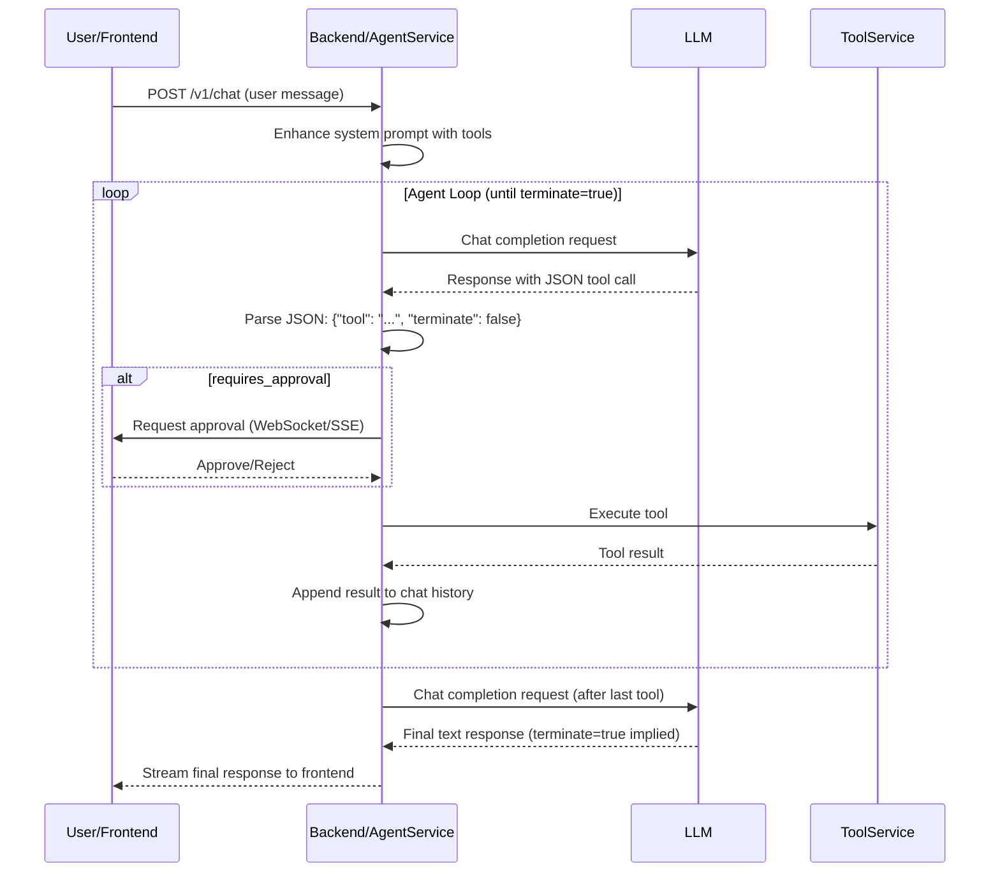

# Tools to LLM Agent Mode - Design Document

## Context

The current system requires users to manually invoke tools with `/command` syntax. Tools are exposed to the frontend, and the frontend handles parsing, parameter extraction, and display. The LLM cannot autonomously use tools to accomplish tasks.

This refactor introduces **LLM-driven autonomous tool usage** with agent loops, while creating a separate **Workflow system** for explicit user actions.

### Stakeholders

- **Backend developers**: Implement agent loop, tool-to-prompt conversion, workflow system
- **Frontend developers**: Replace tool UI with workflow UI, simplify state machine
- **End users**: Benefit from autonomous LLM behavior and clearer workflow invocation

### Constraints

- **No backward compatibility** - Clean architectural break
- Agent loops must support approval gates (for safety)
- Tool execution must remain sandboxed and secure
- System prompt size is limited (must efficiently represent tools)

## Goals / Non-Goals

### Goals

- ✅ Enable LLM to autonomously call tools with structured JSON format
- ✅ Implement agent loops where LLM can chain multiple tool calls
- ✅ Move tool definitions and enhancement logic entirely to backend
- ✅ Create separate Workflow system for user-invoked actions
- ✅ Support termination flag to control agent execution flow
- ✅ Maintain tool approval gates for security

### Non-Goals

- ❌ Backward compatibility with existing tool system
- ❌ Streaming tool results to frontend during agent loops (show final result only)
- ❌ Complex workflow orchestration (e.g., conditional branches, loops) - Keep workflows simple initially
- ❌ MCP tool integration in this phase (can be added later)

## Decisions

### Decision 1: Strict JSON Tool Call Format

**What**: LLM must output tool calls in a strict, machine-parsable JSON format.

**Format**:

```json
{
  "tool": "read_file",
  "parameters": {
    "path": "/path/to/file",
    "encoding": "utf-8"
  },
  "terminate": false
}
```

**Why**:

- Eliminates ambiguity in parsing LLM output
- `terminate` flag explicitly controls agent loop continuation
- Easy to validate and extract from LLM response stream
- Supports both single tool calls and agent loops

**Alternatives considered**:

- **XML format** (`<tool><name>...</name>...</tool>`) - More verbose, harder to parse in streaming
- **Natural language parsing** - Too unreliable, requires additional LLM call to extract structure
- **OpenAI function calling format** - Ties us to OpenAI API format, less flexible

**System Prompt Instruction**:

```
When you need to use a tool, output ONLY a JSON object in this exact format:
{
  "tool": "tool_name",
  "parameters": { "param1": "value1", "param2": "value2" },
  "terminate": true
}

Set "terminate" to false if you need to continue working after the tool result.
Set "terminate" to true if this is your final action or you want to return a response to the user.
```

### Decision 2: Backend Agent Loop Orchestration

**What**: Backend implements the agent execution loop, not frontend.

**Flow**:

1. Frontend sends user message to backend
2. Backend calls LLM with enhanced system prompt (includes tools)
3. Backend parses LLM response for JSON tool call
4. If tool call found:
   - a. Extract tool name, parameters, terminate flag
   - b. Request user approval (via frontend modal) if `requires_approval: true`
   - c. Execute tool
   - d. If `terminate: false`: Append tool result to chat, goto step 2
   - e. If `terminate: true`: Return final result to frontend
5. If no tool call found: Return LLM text response to frontend

**Why**:

- Frontend doesn't need to know about tools (cleaner separation)
- Easier to implement approval gates in a loop
- Agent state (chat history during loop) stays on backend
- Reduces network round-trips during agent execution

**Alternatives considered**:

- **Frontend-driven loop** - More round-trips, frontend needs tool knowledge
- **Hybrid** (frontend controls loop, backend executes) - Complex state synchronization

### Decision 3: Tool vs Workflow Separation

**What**: Introduce clear distinction between Tools (LLM-invoked) and Workflows (user-invoked).

| Aspect                   | Tools                      | Workflows                              |
| ------------------------ | -------------------------- | -------------------------------------- |
| **Invoked by**           | LLM (autonomous)           | User (explicit)                        |
| **Visibility**           | Hidden from frontend       | Visible in UI selector                 |
| **Definition location**  | System prompt              | Workflow registry                      |
| **Parameter extraction** | LLM provides parameters    | Parse from user input or form          |
| **Example**              | `read_file`, `search_code` | `create_project`, `refactor_component` |

**Why**:

- Clear mental model for users ("I tell LLM what I want, it uses tools; or I invoke workflow directly")
- LLM can use tools without cluttering user UI
- Workflows can have richer UX (forms, multi-step wizards) in the future

**Migration strategy**:

- Existing tools are classified as either Tools or Workflows based on usage pattern
- Simple tools (read, write, search) → Tools (LLM-invoked)
- Complex operations (create project, refactor) → Workflows (user-invoked)

### Decision 4: Backend System Prompt Enhancement with API Path Distinction

**What**: Move system prompt enhancement (tool injection, mermaid, etc.) to backend, but **only for our context-based endpoints**.

**Two API Paths**:

1. **OpenAI-Compatible Endpoints** (Passthrough/Forwarding)
   - Paths: `/v1/models`, `/v1/chat/completions` (standard OpenAI API)
   - Used by: External clients like Cline, Continue, etc.
   - Behavior: Use **original system prompt** without enhancement
   - Reason: These clients expect standard OpenAI API behavior

2. **Context-Based Endpoints** (Our System)
   - Paths: `/context/*`, custom chat endpoints
   - Used by: Our frontend application
   - Behavior: Use **enhanced system prompt** (base + tools + mermaid)
   - Reason: Our system controls the full interaction flow

**New endpoint**: `GET /v1/system-prompts/{id}/enhanced`

- Returns base prompt + tool definitions + mermaid instructions
- Only called by our context-based endpoints
- Frontend no longer calls `SystemPromptEnhancer.ts`

**Why**:

- **Compatibility**: External clients (Cline) work unchanged
- **Separation of concerns**: Standard API vs our enhanced system
- Frontend doesn't need to know about tools
- Tool-to-prompt conversion logic is centralized
- Backend can inject context-specific tools (based on chat state)

**Implementation Strategy**:

```rust
// In OpenAI controller
async fn chat_completions(req: ChatRequest) -> Response {
    let system_prompt = if is_passthrough_mode(&req) {
        // External client (Cline, etc.) - use original prompt
        get_base_system_prompt(req.prompt_id)
    } else {
        // Our frontend via context API - use enhanced prompt
        system_prompt_enhancer.enhance(req.prompt_id)
    };
    // ... proceed with LLM call
}
```

**Detection Logic**:

- Check request source (header, path, authentication token)
- If from `/v1/chat/completions` → passthrough mode
- If from `/context/chat/*` → enhanced mode

**Alternatives considered**:

- **Frontend enhancement** - Requires exposing tools to frontend (defeats purpose)
- **Always enhance** - Breaks compatibility with external clients
- **Inline enhancement** (no separate endpoint) - Less testable, harder to debug
- **Separate ports** - More complex deployment, unnecessary

### Decision 5: Category System for Workflows

**What**: Categories now organize Workflows in the frontend UI, not Tools.

**Changes**:

- `CategoryRegistry` in backend still exists but is internal
- Tools are organized by categories in system prompt (for LLM context)
- Workflows have categories that determine UI grouping
- Frontend `/workflows/categories` endpoint returns workflow categories

**Why**:

- Categories are inherently a UI/organization concept
- Tools don't need categories visible to users (LLM decides which to use)
- Workflows benefit from categorization (helps users discover actions)

## Architecture

### Backend Components

```
┌─────────────────────────────────────────────────────────┐
│                    OpenAI Controller                    │
│  - Receives user message                                │
│  - Orchestrates agent loop                              │
│  - Handles streaming & tool call detection              │
└────────────┬────────────────────────────────────────────┘
             │
             ├─────> AgentService
             │       - Manages agent execution state
             │       - Parses tool calls from LLM output
             │       - Decides when to continue/terminate loop
             │
             ├─────> ToolService (refactored)
             │       - Executes tools
             │       - Validates tool calls
             │       - Returns results
             │       - NO LONGER exposes tools to frontend
             │
             ├─────> SystemPromptService (enhanced)
             │       - Generates enhanced prompts
             │       - Injects tool definitions
             │       - Formats tools for LLM consumption
             │
             └─────> WorkflowService (NEW)
                     - Registers workflows
                     - Exposes workflows to frontend
                     - Handles workflow execution
```

### Frontend Components

```
┌─────────────────────────────────────────────────────────┐
│                      ChatView                           │
└────────────┬────────────────────────────────────────────┘
             │
             ├─────> WorkflowSelector (NEW)
             │       - Displays available workflows
             │       - Handles workflow invocation
             │       - Extracts parameters from user input
             │
             ├─────> ApprovalModal (existing)
             │       - Shows tool call details during agent loop
             │       - User approves/rejects tool execution
             │
             ├─────> ChatInteractionMachine (simplified)
             │       - Sends messages to backend
             │       - Receives responses (text or tool approval requests)
             │       - NO LONGER parses tool calls from LLM
             │
             └─────> WorkflowService (NEW)
                     - Fetches available workflows
                     - Invokes workflows
                     - Handles parameter extraction
```

### Agent Loop Sequence



## Risks / Trade-offs

### Risk: Infinite Agent Loops

- **Risk**: LLM never sets `terminate: true`, causes infinite tool calling
- **Mitigation**:
  - Backend enforces max loop iterations (e.g., 10)
  - Timeout for total agent execution (e.g., 5 minutes)
  - Log warning and force-terminate with error message

### Risk: Tool Call Parsing Failures

- **Risk**: LLM doesn't output valid JSON, causes parsing errors
- **Mitigation**:
  - Strict JSON schema validation
  - If parsing fails, send error back to LLM asking it to retry
  - After 3 failed attempts, abort and return error to user
  - Detailed logging for debugging LLM output issues

### Risk: System Prompt Size Explosion

- **Risk**: Injecting all tools into prompt exceeds token limits
- **Mitigation**:
  - Priority-based tool selection (only inject most relevant tools)
  - Tool description compression (shorter descriptions)
  - Dynamic tool loading based on user intent (future enhancement)

### Risk: Approval Modal During Loops

- **Risk**: User sees multiple approval modals in quick succession (confusing UX)
- **Mitigation**:
  - Batch approval: "LLM wants to call 3 tools, approve all?"
  - Progressive disclosure: Show compact "Agent is working..." indicator
  - Detailed view on click shows individual tool calls

### Trade-off: Frontend Simplification vs Backend Complexity

- **Benefit**: Frontend is much simpler (no tool parsing, no state machine complexity)
- **Cost**: Backend handles more state (agent loop, chat history during execution)
- **Verdict**: Acceptable - Backend is better suited for stateful operations

## Migration Plan

### Phase 1: Backend Infrastructure (Week 1-2)

1. Create `AgentService` for loop orchestration
2. Add `terminate` flag support to tool definitions
3. Implement JSON tool call parser
4. Add `/v1/system-prompts/{id}/enhanced` endpoint
5. Create `WorkflowSystem` crate skeleton

### Phase 2: Tool-to-Prompt Conversion (Week 2-3)

1. Implement tool definition serialization for system prompt
2. Test LLM response with new prompt format
3. Tune prompt instructions for reliable JSON output
4. Handle edge cases (malformed JSON, missing fields)

### Phase 3: Frontend Refactor (Week 3-4)

1. Remove `ToolSelector` component
2. Create `WorkflowSelector` component
3. Update `ChatInteractionMachine` (remove tool parsing)
4. Create `WorkflowService` for frontend
5. Update `ApprovalModal` for agent loop context

### Phase 4: Testing & Iteration (Week 4-5)

1. End-to-end testing of agent loops
2. Load testing (multiple concurrent agent sessions)
3. Edge case handling (timeout, errors, malformed JSON)
4. UX refinement (approval flow, progress indicators)

### Rollback Plan

- Keep old tool system code in a feature flag initially
- If critical issues found, revert to feature flag
- Full removal after 2 weeks of stable operation

## Open Questions

1. **Q**: Should workflows support async/long-running operations?
   - **A**: TBD - Start with synchronous workflows, add async support if needed

2. **Q**: How to handle tool calls that produce large outputs (e.g., reading a 10MB file)?
   - **A**: TBD - Consider truncation, summarization, or streaming results

3. **Q**: Should agent loop progress be visible to user in real-time?
   - **A**: TBD - Start with hidden loops, add optional "show details" mode if requested

4. **Q**: How to handle tool calls that require user input mid-execution?
   - **A**: TBD - Not supported initially; workflows should be used for interactive operations

5. **Q**: Should categories for tools vs workflows share the same definitions?
   - **A**: TBD - Likely separate registries, but could share category metadata
