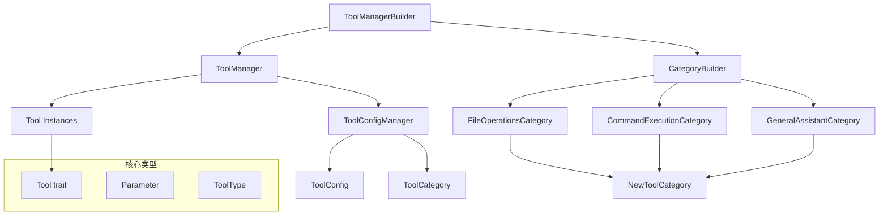
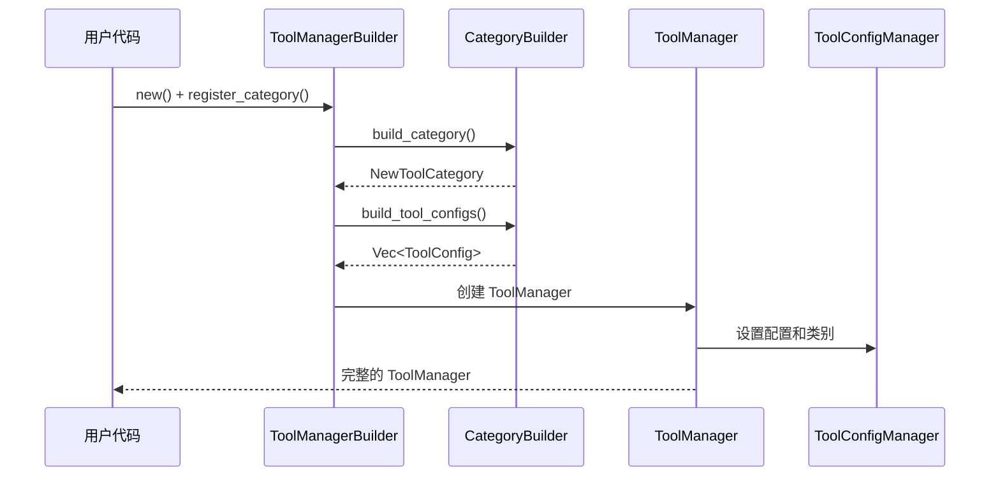

# 工具系统开发者指南

## 概览

### 系统简介
工具系统是一个基于建造者模式的现代化工具管理架构，提供零硬编码、高扩展性的工具管理功能。系统经历了多次重构，现在拥有严格模式功能、图标颜色映射等高级特性。

### 设计目标
- **零硬编码**：通过建造者模式实现完全的配置驱动
- **高扩展性**：易于添加新的工具类别和工具实例
- **类型安全**：利用 Rust 的类型系统确保编译时安全
- **权限控制**：类别级别的权限管理和工具访问控制
- **配置管理**：灵活的工具配置和类别管理

### 核心特性
- **建造者模式架构**：基于 [`CategoryBuilder`](categories/mod.rs:19) trait 的类别构建系统
- **严格工具模式**：支持限制用户只能输入 `/tools` 开头的命令
- **图标颜色映射**：自动管理工具类别的视觉表示
- **配置管理**：统一的工具和类别配置管理
- **测试支持**：完整的测试框架和验证方法

## 架构关系

### 1. 核心组件关系



#### 组件职责说明

**[`ToolManager`](tool_manager.rs:12)**
- 核心工具管理器，负责工具实例的存储和访问
- 提供工具注册、获取、配置管理等功能
- 集成配置管理器进行权限控制

**[`ToolConfigManager`](config_manager.rs:10)**
- 负责工具和类别配置的管理
- 处理工具启用/禁用状态
- 管理类别配置和工具分组

**[`CategoryBuilder`](categories/mod.rs:27)**
- 类别建造者接口，定义类别构建规范
- 每个工具类别都必须实现此 trait
- 提供类别信息、工具配置、权限控制等功能

**[`ToolManagerBuilder`](categories/mod.rs:94)**
- 工具管理器建造者，负责整个系统的构建
- 注册所有类别并生成完整配置
- 提供类别查询和过滤功能

### 2. 数据流向



### 3. 建造者模式实现

系统采用经典的建造者模式，通过 [`CategoryBuilder`](categories/mod.rs:27) trait 定义构建接口：

```rust
pub trait CategoryBuilder: Send + Sync {
    fn build_category(&self) -> NewToolCategory;
    fn build_tools(&self) -> Vec<ToolConfig>;
    fn enabled(&self) -> bool;
    fn strict_tools_mode(&self) -> bool;
    fn priority(&self) -> i32;
    fn icon(&self) -> String;
    fn color(&self) -> String;
}
```

#### 类别与工具的关系
- **NewToolCategory vs ToolCategory**：
  - [`NewToolCategory`](types.rs:74)：用于建造者模式的轻量级类别结构
  - [`ToolCategory`](tool_category.rs)：完整的类别结构，包含工具列表和系统提示
- **配置生成流程**：类别建造者 → 工具配置 → 工具管理器 → 配置管理器

## 开发接口

### 1. 核心 API

#### 创建工具管理器

```rust
use crate::tools::*;

// 使用默认配置创建
let manager = create_default_tool_manager();

// 使用建造者模式自定义创建
let manager = create_custom_tool_manager(|builder| {
    builder
        .register_category(FileOperationsCategory::new())
        .register_category(CommandExecutionCategory::new())
});

// 使用配置目录创建
let config_dir = std::path::PathBuf::from("/path/to/config");
let manager = create_tool_manager_with_config_dir(config_dir);
```

#### 获取和使用工具

```rust
// 获取工具实例
if let Some(tool) = manager.get_tool("read_file") {
    let params = vec![
        Parameter {
            name: "path".to_string(),
            description: "文件路径".to_string(),
            required: true,
            value: "example.txt".to_string(),
        }
    ];
    
    let result = tool.execute(params).await?;
    println!("执行结果: {}", result);
}

// 生成工具列表提示符
let prompt = manager.list_tools();

// 获取UI用工具信息
let ui_tools = manager.list_tools_for_ui();
```

### 2. 添加新工具类别

#### 步骤 1：实现 CategoryBuilder

```rust
use super::CategoryBuilder;
use crate::tools::types::{NewToolCategory, ToolConfig};

pub struct MyCustomCategory {
    enabled: bool,
}

impl MyCustomCategory {
    pub fn new() -> Self {
        Self { enabled: true }
    }
    
    pub fn with_enabled(mut self, enabled: bool) -> Self {
        self.enabled = enabled;
        self
    }
}

impl CategoryBuilder for MyCustomCategory {
    fn build_category(&self) -> NewToolCategory {
        NewToolCategory {
            name: "my_custom".to_string(),
            display_name: "自定义类别".to_string(),
            description: "我的自定义工具类别".to_string(),
            icon: "🔧".to_string(),
            enabled: self.enabled,
            strict_tools_mode: false,
        }
    }

    fn build_tools(&self) -> Vec<ToolConfig> {
        vec![
            ToolConfig::from_tool(Box::new(MyCustomTool)),
            // 添加更多工具...
        ]
    }

    fn enabled(&self) -> bool {
        self.enabled
    }

    fn strict_tools_mode(&self) -> bool {
        false // 或 true，取决于需求
    }

    fn priority(&self) -> i32 {
        5 // 设置优先级
    }
}
```

#### 步骤 2：注册到模块

在 [`categories/mod.rs`](categories/mod.rs:13) 中添加：

```rust
pub mod my_custom;
pub use my_custom::MyCustomCategory;
```

#### 步骤 3：使用新类别

```rust
let manager = create_custom_tool_manager(|builder| {
    builder
        .register_category(FileOperationsCategory::new())
        .register_category(MyCustomCategory::new())
});
```

### 3. 实现自定义工具

#### 实现 Tool trait

```rust
use crate::tools::{Tool, Parameter, ToolType};
use async_trait::async_trait;

#[derive(Debug)]
pub struct MyCustomTool;

#[async_trait]
impl Tool for MyCustomTool {
    fn name(&self) -> String {
        "my_custom_tool".to_string()
    }

    fn description(&self) -> String {
        "这是一个自定义工具的示例".to_string()
    }

    fn parameters(&self) -> Vec<Parameter> {
        vec![
            Parameter {
                name: "input".to_string(),
                description: "输入参数".to_string(),
                required: true,
                value: String::new(),
            }
        ]
    }

    fn required_approval(&self) -> bool {
        false
    }

    fn tool_type(&self) -> ToolType {
        ToolType::AIParameterParsing
    }

    fn parameter_regex(&self) -> Option<String> {
        // 对于 RegexParameterExtraction 类型的工具
        None
    }

    fn custom_prompt(&self) -> Option<String> {
        Some("请使用自然语言描述您的需求".to_string())
    }

    async fn execute(&self, parameters: Vec<Parameter>) -> anyhow::Result<String> {
        let input = parameters.iter()
            .find(|p| p.name == "input")
            .map(|p| &p.value)
            .unwrap_or("");
            
        Ok(format!("处理了输入: {}", input))
    }
}
```

### 4. 配置管理

#### 工具配置

```rust
let config_manager = manager.get_config_manager();

// 检查工具是否启用
if let Ok(manager) = config_manager.read() {
    let enabled = manager.is_tool_enabled("read_file");
}

// 获取工具配置
if let Ok(manager) = config_manager.read() {
    if let Some(config) = manager.get_tool_config("read_file") {
        println!("工具类型: {}", config.tool_type);
        println!("需要审批: {}", config.requires_approval);
    }
}

// 更新工具配置
if let Ok(mut manager) = config_manager.write() {
    let new_config = ToolConfig {
        name: "read_file".to_string(),
        display_name: "文件读取".to_string(),
        description: "读取文件内容".to_string(),
        category_id: "file_operations".to_string(),
        enabled: true,
        requires_approval: false,
        auto_prefix: Some("/read_file".to_string()),
        permissions: vec![],
        tool_type: "AIParameterParsing".to_string(),
        parameter_regex: None,
        custom_prompt: None,
    };
    
    manager.update_tool_config("read_file", new_config)?;
}
```

#### 严格模式配置

```rust
// 在类别建造者中设置严格模式
impl CategoryBuilder for MyCustomCategory {
    fn strict_tools_mode(&self) -> bool {
        true // 启用严格模式，用户只能输入 /tools 开头的命令
    }
}

// 或在 NewToolCategory 中设置
let category = NewToolCategory::new(
    "strict_category".to_string(),
    "严格模式类别".to_string(),
    "需要严格输入格式的类别".to_string(),
    "🔒".to_string(),
)
.with_strict_tools_mode(true);
```

## 验证测试

### 1. 运行测试

#### 运行所有测试

```bash
cd src-tauri
cargo test tools --lib
```

#### 运行特定测试模块

```bash
# 测试建造者模式
cargo test tools::tests::builder_tests --lib

# 测试配置管理
cargo test tools::tests::config_tests --lib

# 测试严格模式功能
cargo test tools::test_strict_mode_example --lib
```

#### 运行集成测试

```bash
cargo test tools::tests::integration_tests --lib
```

### 2. 验证新功能

#### 基本功能验证

```rust
#[cfg(test)]
mod tests {
    use super::*;

    #[test]
    fn test_custom_category() {
        let category = MyCustomCategory::new();
        
        // 验证类别构建
        let built_category = category.build_category();
        assert_eq!(built_category.name, "my_custom");
        assert!(built_category.enabled);
        
        // 验证工具构建
        let tools = category.build_tools();
        assert!(!tools.is_empty());
        
        // 验证权限控制
        assert!(category.enabled());
    }

    #[test]
    fn test_tool_manager_integration() {
        let manager = create_custom_tool_manager(|builder| {
            builder.register_category(MyCustomCategory::new())
        });
        
        // 验证工具可用性
        assert!(manager.get_tool("my_custom_tool").is_some());
        
        // 验证配置
        let config_manager = manager.get_config_manager();
        let config_manager = config_manager.read().unwrap();
        assert!(config_manager.is_tool_enabled("my_custom_tool"));
    }
}
```

#### 严格模式验证

参考 [`test_strict_mode_example.rs`](test_strict_mode_example.rs) 中的示例：

```rust
#[test]
fn verify_strict_mode_functionality() {
    use crate::tools::categories::*;
    
    let builder = ToolManagerBuilder::new()
        .register_category(CommandExecutionCategory::new()) // 启用严格模式
        .register_category(FileOperationsCategory::new());  // 不启用严格模式
    
    let (categories, _) = builder.build_with_categories();
    
    // 验证命令执行类别启用了严格模式
    let cmd_category = categories.iter()
        .find(|c| c.id == "command_execution")
        .expect("应该找到命令执行类别");
    assert!(cmd_category.strict_tools_mode);
    
    // 验证文件操作类别没有启用严格模式
    let file_category = categories.iter()
        .find(|c| c.id == "file_operations")
        .expect("应该找到文件操作类别");
    assert!(!file_category.strict_tools_mode);
}
```

### 3. 调试指南

#### 常见问题排查

**问题 1：工具无法找到**
```rust
// 检查工具是否注册
let manager = create_default_tool_manager();
let tools = manager.list_tools_for_ui();
for tool in tools {
    println!("可用工具: {}", tool.name);
}

// 检查工具是否启用
let config_manager = manager.get_config_manager();
if let Ok(manager) = config_manager.read() {
    if !manager.is_tool_enabled("tool_name") {
        println!("工具被禁用");
    }
}
```

**问题 2：类别配置错误**
```rust
// 检查类别构建
let category = FileOperationsCategory::new();
let built = category.build_category();
println!("类别信息: {:?}", built);

// 检查工具配置
let tools = category.build_tools();
for tool in tools {
    println!("工具配置: {:?}", tool);
}
```

**问题 3：建造者模式配置问题**
```rust
// 逐步验证建造者
let builder = ToolManagerBuilder::new();
let all_categories = builder.get_all_categories();
println!("所有类别: {:?}", all_categories);

let enabled_categories = builder.get_enabled_categories();
println!("启用类别: {:?}", enabled_categories);
```

#### 调试工具

**启用调试日志**
```rust
// 在测试中添加调试输出
#[test]
fn debug_tool_system() {
    env_logger::init(); // 如果使用 log crate
    
    let manager = create_default_tool_manager();
    
    // 输出所有配置信息
    let config_manager = manager.get_config_manager();
    if let Ok(manager) = config_manager.read() {
        let configs = manager.get_all_tool_configs();
        for (name, config) in configs {
            println!("工具 {}: {:?}", name, config);
        }
        
        let categories = manager.get_categories();
        for category in categories {
            println!("类别: {:?}", category);
        }
    }
}
```

## 最佳实践

### 1. 代码组织

#### 文件结构规范
```
src-tauri/src/tools/
├── categories/              # 工具类别实现
│   ├── mod.rs              # 类别模块导出和建造者接口
│   ├── file_operations.rs  # 文件操作类别
│   ├── command_execution.rs # 命令执行类别
│   └── my_custom.rs        # 自定义类别
├── file_tools/             # 具体工具实现
│   ├── mod.rs
│   ├── read.rs
│   └── create.rs
├── tests/                  # 测试文件
│   ├── mod.rs
│   ├── builder_tests.rs
│   └── integration_tests.rs
├── mod.rs                  # 主模块导出
├── types.rs               # 核心类型定义
├── tool_manager.rs        # 工具管理器
├── config_manager.rs      # 配置管理器
└── tool_category.rs       # 工具类别结构
```

#### 命名规范
- **类别名称**：使用小写下划线格式，如 `file_operations`
- **工具名称**：使用小写下划线格式，如 `read_file`
- **结构体名称**：使用 PascalCase，如 `FileOperationsCategory`
- **模块名称**：使用小写下划线格式

### 2. 性能优化

#### 延迟加载
```rust
// 避免在启动时创建所有工具实例
impl CategoryBuilder for MyCategory {
    fn create_tool_instances(&self) -> HashMap<String, Arc<dyn Tool>> {
        // 只在需要时创建工具实例
        let mut tools = HashMap::new();
        if self.enabled() {
            tools.insert("tool_name".to_string(), Arc::new(MyTool));
        }
        tools
    }
}
```

#### 配置缓存
```rust
// 在配置管理器中缓存经常访问的配置
impl ToolConfigManager {
    fn get_cached_tool_config(&self, tool_name: &str) -> Option<&ToolConfig> {
        // 实现配置缓存逻辑
        self.tool_configs.get(tool_name)
    }
}
```

### 3. 安全考虑

#### 权限验证
```rust
impl CategoryBuilder for SecureCategory {
    fn enabled(&self) -> bool {
        // 实现权限检查逻辑
        self.check_permissions() && self.validate_security_context()
    }
    
    fn build_tools(&self) -> Vec<ToolConfig> {
        // 只返回用户有权限访问的工具
        self.get_authorized_tools()
    }
}
```

#### 参数验证
```rust
#[async_trait]
impl Tool for SecureTool {
    async fn execute(&self, parameters: Vec<Parameter>) -> anyhow::Result<String> {
        // 在执行前验证参数
        self.validate_parameters(&parameters)?;
        
        // 执行安全检查
        self.security_check()?;
        
        // 执行实际逻辑
        self.do_execute(parameters).await
    }
}
```

## 示例代码

### 1. 基本使用

#### 创建简单的工具管理器
```rust
use crate::tools::*;

fn basic_usage_example() {
    // 创建默认工具管理器
    let manager = create_default_tool_manager();
    
    // 列出所有可用工具
    let tools = manager.list_tools_for_ui();
    for tool in tools {
        println!("工具: {} - {}", tool.name, tool.description);
    }
    
    // 使用特定工具
    if let Some(read_tool) = manager.get_tool("read_file") {
        println!("找到文件读取工具: {}", read_tool.name());
    }
}
```

### 2. 高级配置

#### 自定义工具管理器配置
```rust
use crate::tools::categories::*;

fn advanced_configuration_example() {
    let manager = create_custom_tool_manager(|builder| {
        builder
            // 启用文件操作，但禁用某些功能
            .register_category(
                FileOperationsCategory::new().with_enabled(true)
            )
            // 启用命令执行并设置严格模式
            .register_category(
                CommandExecutionCategory::new()
            )
            // 禁用通用助手
            .register_category(
                GeneralAssistantCategory::new().with_enabled(false)
            )
    });
    
    // 获取配置信息
    let config_manager = manager.get_config_manager();
    if let Ok(config) = config_manager.read() {
        for category in config.get_categories() {
            println!(
                "类别 {}: 启用={}, 严格模式={}",
                category.name,
                category.enabled,
                category.strict_tools_mode
            );
        }
    }
}
```

### 3. 自定义扩展

#### 完整的自定义类别实现
```rust
use super::CategoryBuilder;
use crate::tools::types::{NewToolCategory, ToolConfig};
use crate::tools::{Tool, Parameter, ToolType};
use async_trait::async_trait;

// 自定义工具
#[derive(Debug)]
pub struct DatabaseTool;

#[async_trait]
impl Tool for DatabaseTool {
    fn name(&self) -> String {
        "query_database".to_string()
    }

    fn description(&self) -> String {
        "执行数据库查询".to_string()
    }

    fn parameters(&self) -> Vec<Parameter> {
        vec![
            Parameter {
                name: "query".to_string(),
                description: "SQL查询语句".to_string(),
                required: true,
                value: String::new(),
            },
            Parameter {
                name: "database".to_string(),
                description: "数据库名称".to_string(),
                required: false,
                value: "default".to_string(),
            }
        ]
    }

    fn required_approval(&self) -> bool {
        true // 数据库操作需要审批
    }

    fn tool_type(&self) -> ToolType {
        ToolType::AIParameterParsing
    }

    async fn execute(&self, parameters: Vec<Parameter>) -> anyhow::Result<String> {
        let query = parameters.iter()
            .find(|p| p.name == "query")
            .map(|p| &p.value)
            .ok_or_else(|| anyhow::anyhow!("缺少查询参数"))?;
            
        // 执行数据库查询逻辑
        Ok(format!("执行查询: {}", query))
    }
}

// 自定义类别
pub struct DatabaseCategory {
    enabled: bool,
}

impl DatabaseCategory {
    pub fn new() -> Self {
        Self { enabled: true }
    }
    
    pub fn with_enabled(mut self, enabled: bool) -> Self {
        self.enabled = enabled;
        self
    }
}

impl CategoryBuilder for DatabaseCategory {
    fn build_category(&self) -> NewToolCategory {
        NewToolCategory {
            name: "database".to_string(),
            display_name: "数据库操作".to_string(),
            description: "提供数据库查询和管理功能".to_string(),
            icon: "🗄️".to_string(),
            enabled: self.enabled,
            strict_tools_mode: true, // 数据库操作使用严格模式
        }
    }

    fn build_tools(&self) -> Vec<ToolConfig> {
        vec![
            ToolConfig::from_tool(Box::new(DatabaseTool))
                .with_display_name("数据库查询".to_string())
                .with_description("安全的数据库查询工具".to_string()),
        ]
    }

    fn enabled(&self) -> bool {
        self.enabled
    }

    fn strict_tools_mode(&self) -> bool {
        true
    }

    fn priority(&self) -> i32 {
        15 // 高优先级
    }
}

// 使用示例
fn database_category_example() {
    let manager = create_custom_tool_manager(|builder| {
        builder
            .register_category(FileOperationsCategory::new())
            .register_category(DatabaseCategory::new())
    });
    
    // 验证数据库工具可用
    if let Some(db_tool) = manager.get_tool("query_database") {
        println!("数据库工具可用: {}", db_tool.name());
        println!("需要审批: {}", db_tool.required_approval());
    }
}
```

## 版本变更说明

### v2.0.0 - 建造者模式重构
- 引入 [`CategoryBuilder`](categories/mod.rs:27) trait
- 实现 [`ToolManagerBuilder`](categories/mod.rs:94) 
- 添加严格工具模式功能
- 重构配置管理系统

### v1.x.x - 原始实现
- 基础工具管理功能
- 简单的配置管理
- 硬编码的工具注册

---

## 总结

本工具系统提供了一个现代化、可扩展的工具管理架构。通过建造者模式，系统实现了零硬编码的设计目标，同时保持了类型安全和高性能。严格模式等高级功能为不同使用场景提供了灵活的配置选项。

系统的模块化设计使得添加新功能变得简单直接，而完整的测试框架确保了系统的稳定性和可靠性。遵循本指南中的最佳实践，开发者可以轻松扩展和维护工具系统。